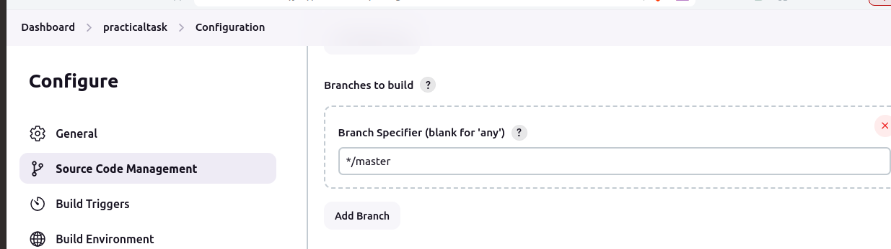

# Project 2 (Jenkins)

# SysOps System Monitoring and Reporting Script

## Step 1:
• Login to jenkins.

• From dashboard give name to project.

• Then select Freestyle project and click ok.

## step 2:
In Source code management select Git and add your repository link which contain java code.


 
Make sure your repository is public if private then need to give credentials.

Select Branch name.



## Step 3:

• For periodically trigger pipeline we need to define period

• In Build Triggers select option Build periodically and add following line which trigger pipeline every 5 minutes.

```
*/2 * * * *
```


## Step 4:

• To run the java code we need to provide commands we provide that in Execute shell.

• For that In Build Steps select Execute shell and add commands in this case add following lines.

```
javac Sample.java
java Sample
```


and click save.

## Step 5:

• To build project click on Build

• Then First build will create ,click on it.


then click on Console output we can see the output of your java code.


