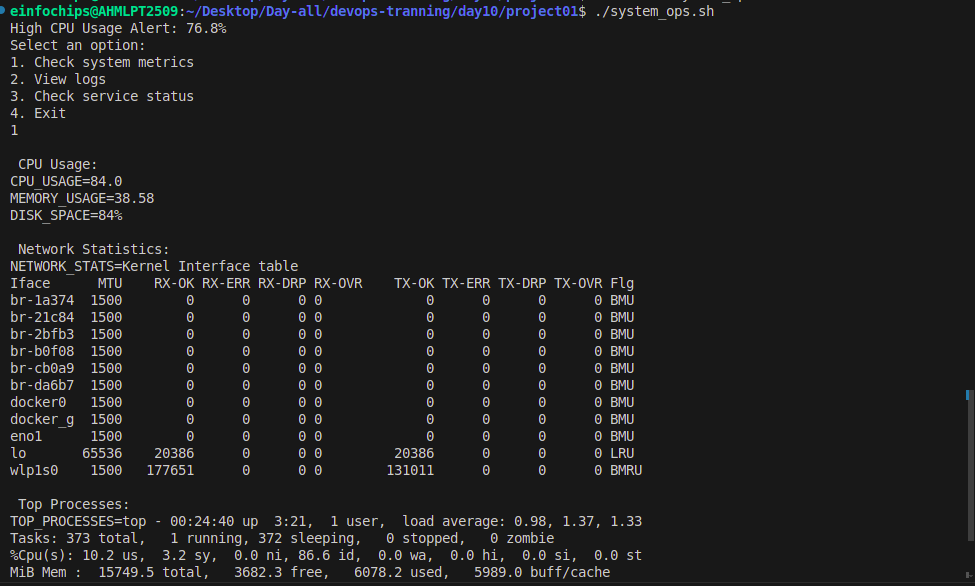
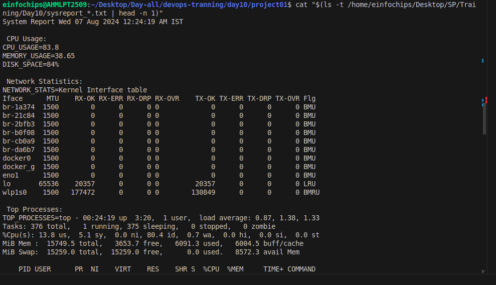

## Project 1

## SysOps System Monitoring and Reporting Script

## Project Overview

This comprehensive shell script is designed for sysops to automate system monitoring and generate detailed reports. The script leverages advanced Linux shell scripting techniques to monitor system metrics, capture logs, and provide actionable insights for system administrators.
Script Features

## 1. Script Initialization

Initialize the script with necessary variables and configurations.

Validate the availability of required commands and utilities.

## 2. System Metrics Collection

Monitor CPU usage, memory utilization, disk space, and network statistics.

```
top -bn1 | grep "Cpu(s)" | sed "s/.*, *\([0-9.]*\)%* id.*/\1/" | awk '{print 100 - $1}'
df -h | awk '$NF=="/"{printf "%s", $5}'
free | grep Mem | awk '{print $3/$2 * 100.0}'
```

## 3. Log Analysis

Parse system logs (e.g., syslog) for critical events and errors.

```
tail -n 200 /var/log/syslog | grep -iE 'error|critical'
```

Generate summaries of recent log entries based on severity.

```
tail -n 20 /var/log/syslog
```

## 4. Health Checks

Check the status of essential services (e.g., Nginx, MySQL).

```
systemctl status nginx
```

Verify connectivity to external services or databases.

## 5. Alerting Mechanism

Implement thresholds for critical metrics (CPU, memory) triggering alerts.

Send email notifications to sysadmins with critical alerts.

## 6. Report Generation

Compile all collected data into a detailed report.

Include graphs or visual representations where applicable.

## 7. Automation and Scheduling

Configure the script to run periodically via cron for automated monitoring.

```
crontab -e
```

Add the following content to the crontab file:

```
* */1 * * * /path/to/system_ops.sh
```

Check the list of cron jobs:

```
crontab -l
```

## 8. User Interaction

Provide options for interactive mode to allow sysadmins to manually trigger checks or view specific metrics.

Ensure the script is user-friendly with clear prompts and outputs.

## 9. Documentation

Create a README file detailing script usage, prerequisites, and customization options.

Include examples of typical outputs and how to interpret them.

## Solution
Create Script File

Create and edit the script file:

```
nano system_ops.sh
```

Add the following code in the script file:

```bash
#!/bin/bash

REPORTDIR="/path/to/report/directory"
ALERT_THRESHOLD_CPU=75
ALERT_THRESHOLD_MEM=40
SERVICE_STATUS=("nginx" "mysql")
EXTERNAL_SERVICES=("google.com" "mysql://db.test.com")

CPU_USAGE=$(top -bn1 | grep "Cpu(s)" | sed "s/.*, *\([0-9.]*\)%* id.*/\1/")
MEMORY_USAGE=$(free | awk '/Mem/{printf("%.2f"), $3/$2*100}')

System_Metrics() {
    echo -e "\n CPU Usage: "
    echo "CPU_USAGE=$(top -bn1 | grep "Cpu(s)" | sed "s/.*, *\([0-9.]*\)%* id.*/\1/")"
    echo "MEMORY_USAGE=$(free | awk '/Mem/{printf("%.2f"), $3/$2*100}')"
    echo "DISK_SPACE=$(df -h / | awk '/\//{print $(NF-1)}')"

    echo -e "\n Network Statistics: "
    echo "NETWORK_STATS=$(netstat -i)"

    echo -e "\n Top Processes: "
    echo "TOP_PROCESSES=$(top -bn 1 | head -n 10)"
}

Log_analysis() {
    echo -e "\n Recent Critical Events: "
    echo "CRITICAL_EVENTS=$(tail -n 200 /var/log/syslog | grep -iE 'error|critical')"

    echo -e "\n Recent Logs: "
    echo "RECENT_LOGS=$(tail -n 20 /var/log/syslog)"
}

Health_check() {
    echo -e "\n Service Status: "
    for service in "${SERVICE_STATUS[@]}"; do
        systemctl is-active --quiet "$service"
        if [ $? -eq 0 ]; then
            echo "   $service is running."
        else
            echo "   Alert: $service is not running."
        fi
    done

    echo -e "\n Connectivity Check: "
    for service in "${EXTERNAL_SERVICES[@]}"; do
        ping -c 1 "$service" >/dev/null 2>&1
        if [ $? -eq 0 ]; then
            echo "   Connectivity to $service is okay."
        else
            echo "   Alert: Unable to connect to $service."
        fi
    done
}

if (( $(echo "$CPU_USAGE >= $ALERT_THRESHOLD_CPU" | bc -l) )); then
    echo "High CPU Usage Alert: $CPU_USAGE%"
fi

if (( $(echo "$MEMORY_USAGE >= $ALERT_THRESHOLD_MEM" | bc -l) )); then
    echo "High Memory Usage Alert: $MEMORY_USAGE%"
fi

mkdir -p "$REPORTDIR"
REPORTFILE="$REPORTDIR/sysreport_$(date +'%Y-%m-%d_%H-%M-%S').txt"
echo "System Report $(date)" >> "$REPORTFILE"
System_Metrics >> "$REPORTFILE"
Log_analysis >> "$REPORTFILE"
Health_check >> "$REPORTFILE"

echo "Select an option:
1. Check system metrics
2. View logs
3. Check service status
4. Exit"

read choice

case $choice in
    1) System_Metrics ;;
    2) Log_analysis ;;
    3) Health_check ;;
    4) exit ;;
    *) echo "Invalid option";;
esac
```

Make the Script Executable

Grant necessary permissions to the file for execution:

```bash
chmod 755 system_ops.sh
```

Run the Script
Execute the script using the following command:

```bash
./system_ops.sh
```

After running the script, it will create a report file storing all information like CPU usage, memory usage, and other system metrics.



 