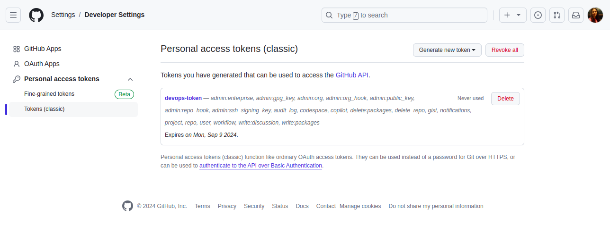
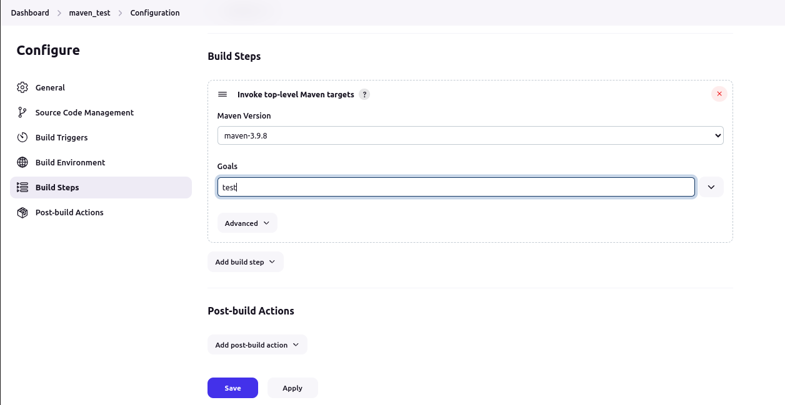

# Maven Project with Jenkins Freestyle Jobs and Pipeline View

## Project Overview

This project involves setting up a private Git repository containing a Maven project, and creating two Jenkins freestyle `jobs`: one for compiling the Maven project and the other for testing it. Additionally, a pipeline view is configured in Jenkins to visualize the build process.

### Steps

## Step 1: Private Git Repo

Create a Private Git Repository:

Set up a new private Git repository to store the Maven project code.


    Generate a Personal Access Token:
        Create a personal access token to enable Jenkins to securely access the private repository.



## Step 2: Compile Maven Project

Create a New Freestyle Project in Jenkins:
    Set up a Jenkins freestyle project to compile the Maven code.


Set Up Git Credentials in Jenkins:
    Configure Jenkins with your Git credentials (username, personal access token) to access the private repository.


Configure the Freestyle Project:
    Link the Jenkins project to the private Git repository.
    Set up the project to trigger builds based on changes to the repository.


Setup Maven Installation in Jenkins:
    Ensure that Maven is installed and configured in Jenkins.


Set Up Maven Build Steps for Compilation:
    Add a build step to run the Maven command:


```bash
mvn clean compile
```
Build the "Maven Compile" Project:
    Run the Jenkins job to compile the Maven project.


## Step 3: Test Maven Project

Create a New Freestyle Project in Jenkins:
    Set up another Jenkins freestyle project to test the Maven code.

    

Configure the Freestyle Project:
    Link this Jenkins project to the private Git repository, similar to the compile project.

    

Set Up Maven Build Steps for Testing:
    Add a build step to run the Maven command:

```bash
mvn test
```



Build the "Maven Test" Project:
    Run the Jenkins job to execute the tests on the Maven project.

    

## Step 4: Pipeline View

Create a Pipeline View in Jenkins:


Set up a new "Build Pipeline" view in Jenkins to visualize the sequence of jobs (compilation and testing) for the Maven project.

Configure the Pipeline View:


Link the pipeline view to the "Maven Compile" and "Maven Test" projects to provide a comprehensive view of the build process.