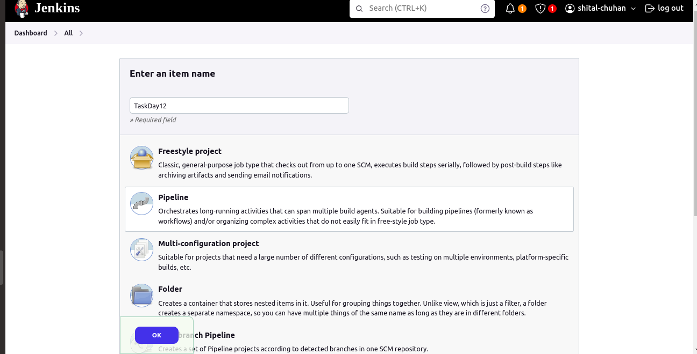
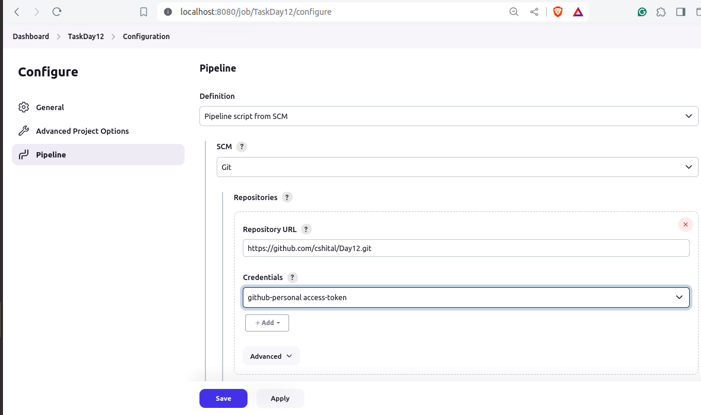
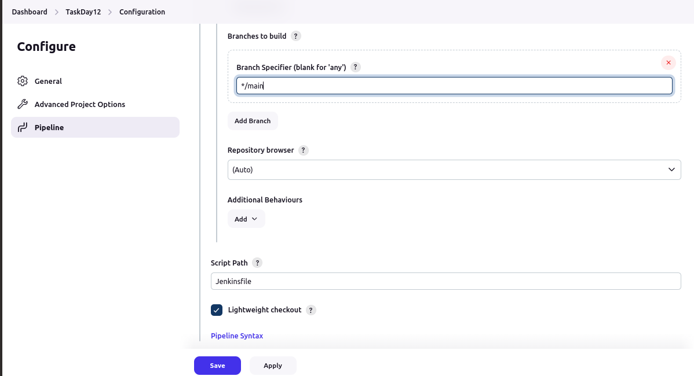
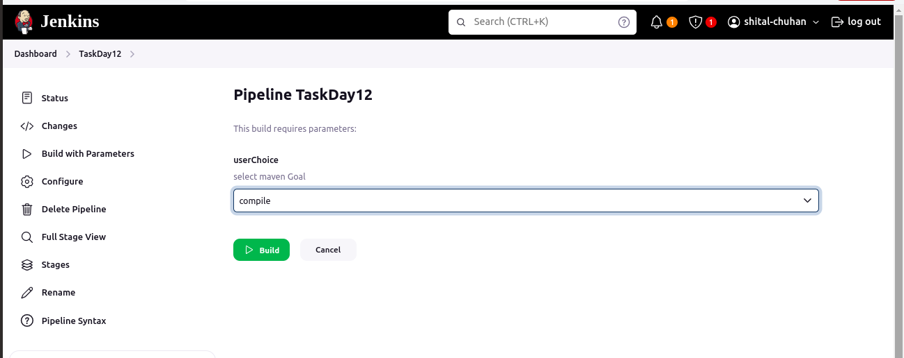
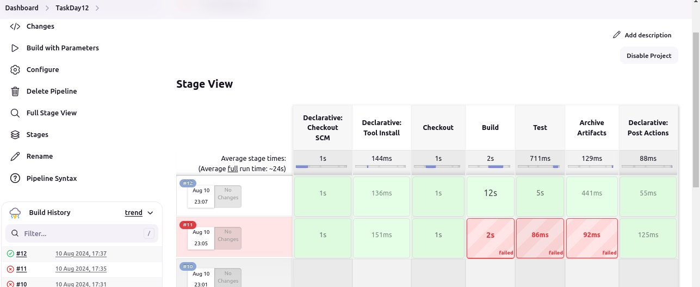
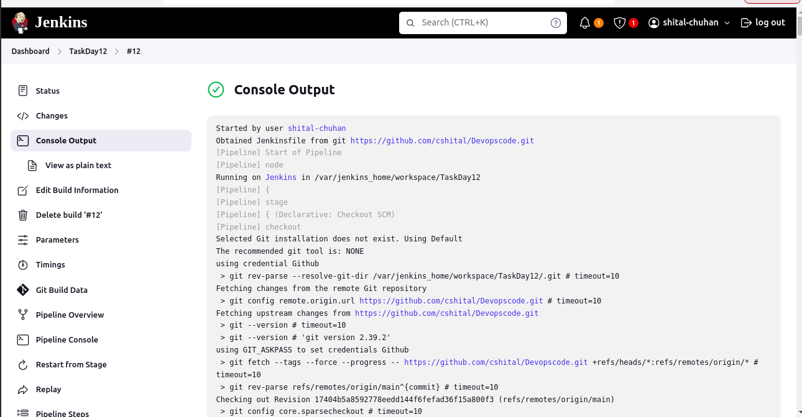
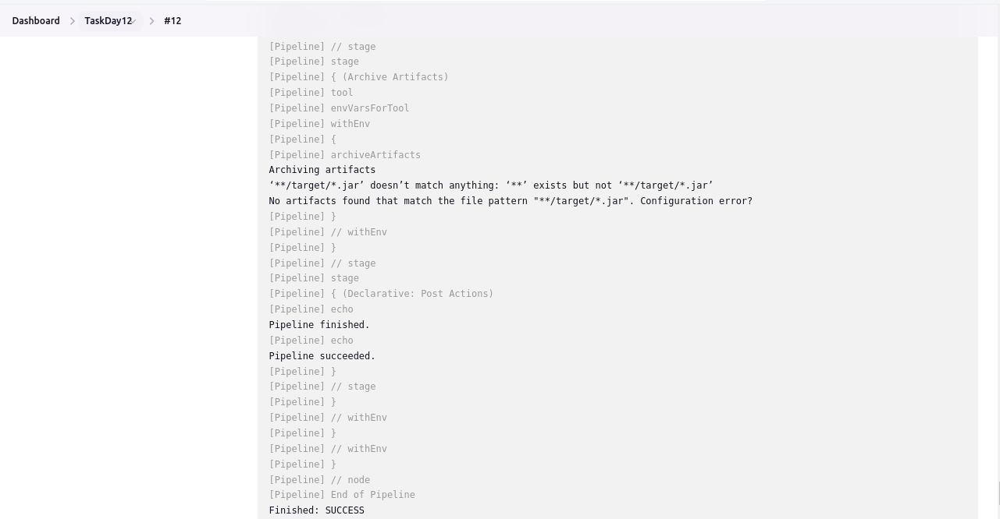

# Day 12 

# Project 01

## Project Overview

Your organization is implementing continuous integration (CI) practices to streamline the software development lifecycle. As part of this initiative, you will create a Jenkins declarative pipeline for building a simple Maven project hosted on GitHub. This project aims to automate the build process, ensure code quality, and facilitate continuous delivery (CD).

## Setup Jenkins Job
    • Create a new Jenkins pipeline job.
    • Configure the job to pull the Jenkinsfile from the GitHub repository.

    


## Create Jenkinsfile
    
    • Write a declarative pipeline script (Jenkinsfile) that includes the following stages:
    • Clone Repository: Clone the Maven project from the GitHub repository.
    • Build: Execute the Maven build process (mvn clean install).
    • Test: Run unit tests as part of the Maven build.
    • Archive Artifacts: Archive the build artifacts for future use.

`Jenkinsfile`    

```
pipeline {
    agent any
 
    tools {
        maven 'maven-3.9.8' 
    }
    parameters{
        choice(choices:['test','compile','package'], description:"select maven Goal", name:"userChoice")
    }
 
    stages {
        stage('Checkout') {
            steps {
                script {
                    git branch: 'main',
                        credentialsId: 'Github', 
                        url: ' https://github.com/cshital/Devopscode.git '
                }
 
                
            }
        }
 
        stage('Build') {
            steps {
    
                sh 'mvn clean install'
                
            }
        }
        stage('Test'){
            steps{
                sh "mvn ${params.userChoice}"
            }
        }
 
        stage('Archive Artifacts') {
            steps {
        
                archiveArtifacts artifacts: '**/target/*.jar', allowEmptyArchive: true
            }
        }
    }
 
    post {
        always {
            echo 'Pipeline finished.'
        }
        success {
            echo 'Pipeline succeeded.'
        }
        failure {
            echo 'Pipeline failed.'
        }
    }
}
```

## Configure Pipeline Parameters
    • Allow the pipeline to accept parameters such as Maven goals and options for flexibility.
    • Ensure the pipeline can be easily modified for different build configurations.




## Run the Pipeline
• Trigger the Jenkins pipeline job manually or set up a webhook for automatic triggering on GitHub repository changes.

• Monitor the build process through Jenkins' UI and console output.






