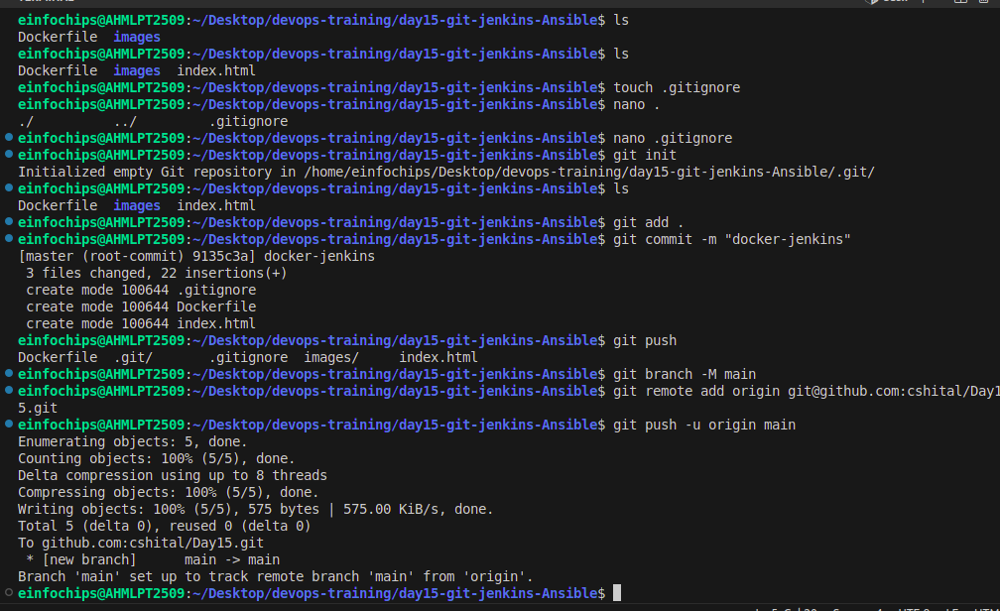
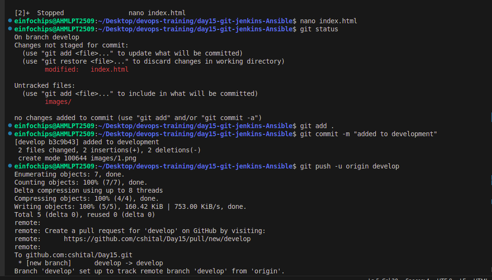
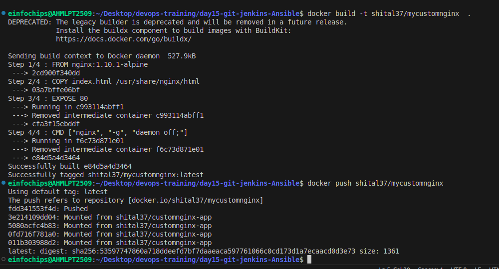
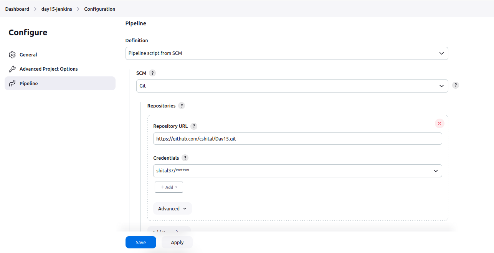
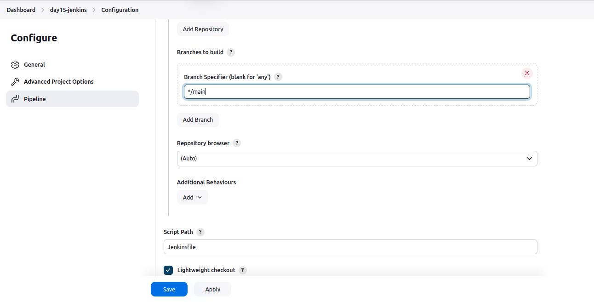
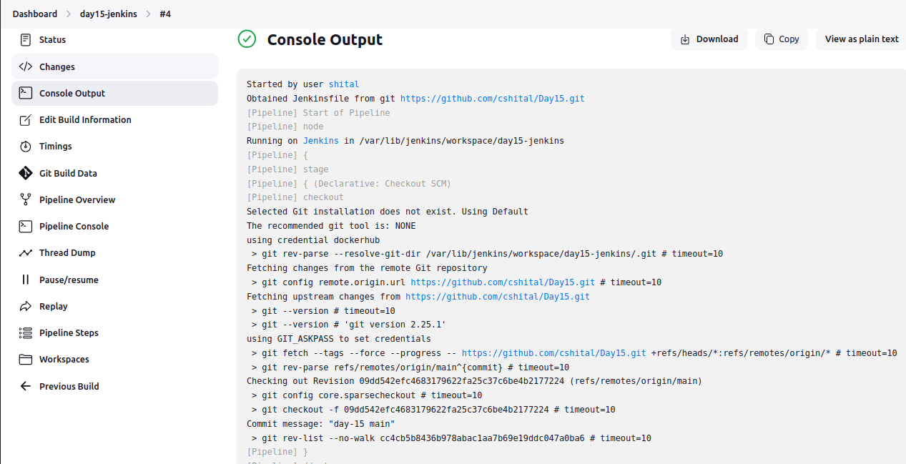
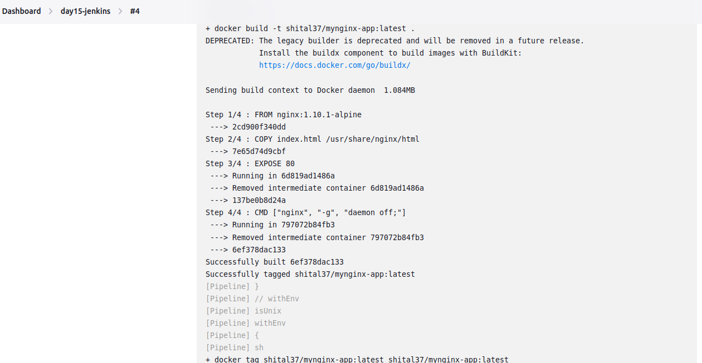
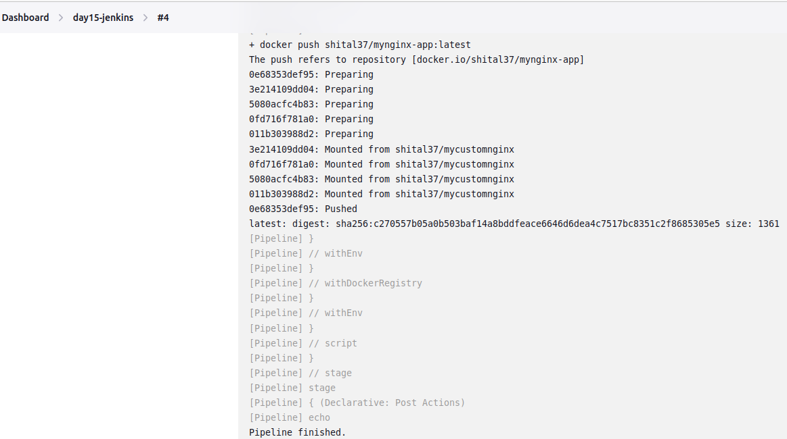
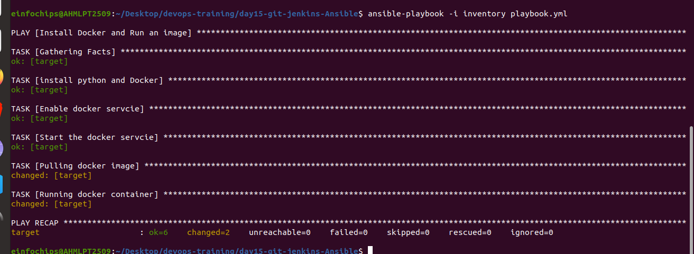
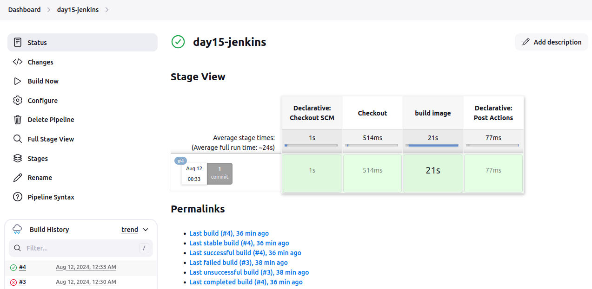

# Day-15

# Project Problem Statement

A development team needs to establish a basic CI/CD pipeline for a web application. The goal is to automate version control, containerization, building, testing, and deployment processes.

### Deliverables

## 1.Git Repository:

• Create a Git repository: Initialize a new repository for the web application.

• Branching Strategy: Set up main and develop branches. Create a feature branch for a new feature or bug fix.

• Add Configuration Files: Create a .gitignore file to exclude files like logs, temporary files, etc. Create a README.md file with a project description, setup instructions, and contribution guidelines.




## 2.Docker Configuration:

• Dockerfile: Write a Dockerfile to define how to build the Docker image for the web application.

```

FROM nginx:1.10.1-alpine
COPY index.html /usr/share/nginx/html
EXPOSE 80
CMD ["nginx", "-g", "daemon off;"]
```


• Docker Ignore File: Create a .dockerignore file to exclude files and directories from the Docker build context.

• Image Management: Build a Docker image using the Dockerfile.

```
docker build -t shital37/mycustomnginx  .
```

Push the built Docker image to a container registry (e.g., Docker Hub).

```
docker push shital37/mycustomnginx
```



## 3.Jenkins Configuration:

• Jenkins Job Setup:

• Create a Jenkins job to pull code from the Git repository.





Configure Jenkins to build the Docker image using the Dockerfile.



Configure Jenkins to push the Docker image to the container registry after a successful build.




• Jenkins Pipeline:

• Create a Jenkinsfile to define the CI/CD pipeline stages, including build, test, and deploy.

**Jenkinsfile**

```
pipeline {
    agent any
    environment {
        // ANSIBLE_SUDO_PASSWORD = credentials('Ansible')
        registry = 'docker.io'  
        registryCredential = 'dockerhub' 
    }
 
    stages {
        stage('Checkout') {
            steps {
                git url: 'https://github.com/cshital/Day15.git', branch: 'main'
            }
        }
 
        stage('build image') {
            steps{
                script{
                    docker.withRegistry('', registryCredential){
                        def customImage = docker.build("shital37/mynginx-app:latest")
                        customImage.push()
                       
 
                    }
 
                }
            }
        }
    }
 
    post {
        always {
            echo 'Pipeline finished.'
        }
        success {
            echo 'Pipeline succeeded.'
        }
        failure {
            echo 'Pipeline failed.'
        }
    }
 
}
```

## 4.Ansible Playbook:

• Basic Playbook Creation: Develop an Ansible playbook to automate the deployment of the Docker container.

• Playbook Tasks: Install Docker on the target server (if Docker is not already installed). Pull the Docker image from the container registry. Run the Docker container with the required configurations.

**Playbook.yml**

```
---
- name: Install Docker and Run an image
  hosts: target
  become: true
  tasks: 
    - name: install python and Docker
      apt:
        name:
          - python3
          - python3-pip
          - docker.io
        state: present
 
    - name: Enable docker servcie
      systemd:
        name: docker
        enabled: yes
 
    - name: Start the docker servcie
      systemd:
        name: docker
        state: started
 
    - name: Pulling docker image
      docker_image:
        name: shital37/mynginx-app
        tag: latest
        source: pull
 
    - name: Running docker container
      docker_container:
        name: my_test_container
        image: shital37/mynginx-app:latest
        state: started
        restart_policy: always
        ports:
          - "81:80"
```




**• Inventory File:** Create an inventory file specifying the target server(s) for deployment.

target ansible_host=target_ip ansible_connection=ssh ansible_user=User ansible_ssh_pass=User_Pass


