# Day-16

## Project 1: Deploying Ansible

Problem Statement: You are tasked with deploying Ansible in a multi-node environment consisting of multiple Linux servers. The goal is to set up Ansible on a control node and configure it to manage several managed nodes. This setup will be used for automating system administration tasks across the network.

## Deliverables:

## Control Node Setup:
Install Ansible on the control node.

```
sudo apt update
sudo apt install software-properties-common
sudo add-apt-repository --yes --update ppa:ansible/ansible
sudo apt install ansible
ansible --version
```

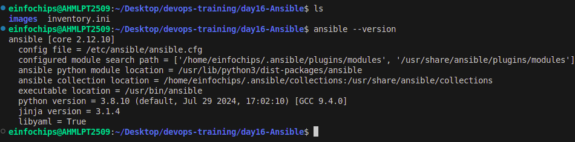

Configure SSH key-based authentication between the control node and managed nodes.

```
ssh-agent bash
ssh-add ~/.ssh/keypair.pem
```

## Managed Nodes Configuration:

• Ensure all managed nodes are properly configured to be controlled by Ansible.

• Verify connectivity and proper setup between the control node and managed nodes.

```
ansible -i inventory -m ping all
```

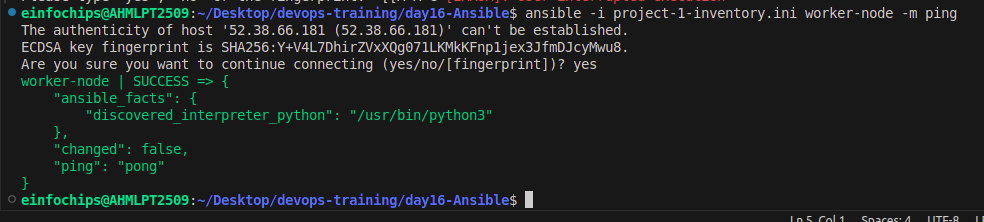


# Project 2: Ad-Hoc Ansible Commands

Problem Statement: Your organization needs to perform frequent, one-off administrative tasks across a fleet of servers. These tasks include checking disk usage, restarting services, and updating packages. You are required to use Ansible ad-hoc commands to accomplish these tasks efficiently.

### Deliverables:

### Task Execution: 
• Execute commands to check disk usage across all managed nodes.

```
ansible -i project-1-inventory.ini worker-node -m command -a "df -h"
```
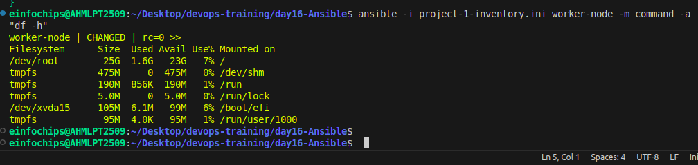

• Restart a specific service on all managed nodes.

```
ansible -i project-1-inventory.ini  worker-node -m service -a "name=nginx state=restarted" -b
```
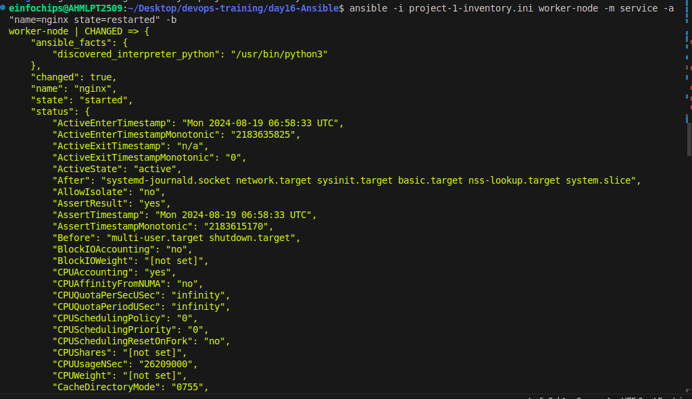

• Update all packages on a subset of managed nodes.

```
ansible -i project-1-inventory.ini worker-node -b -m apt -a "update_cache=yes"
```
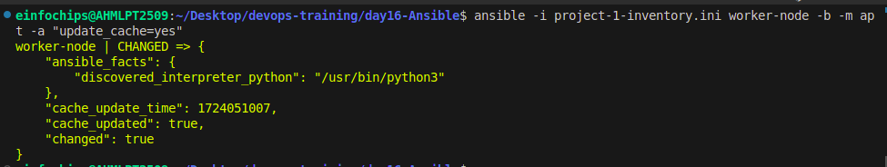

in above command we use '-b' to provide sudo permission.

# Project 3: Working with Ansible Inventories

**Problem Statement:** 

You need to manage a dynamic and diverse set of servers, which requires an organized and flexible inventory system. 

The project involves creating static and dynamic inventories in Ansible to categorize servers based on different attributes such as environment (development, staging, production) and roles (web servers, database servers).

### Deliverables:

### Static Inventory:
• Create a static inventory file with different groups for various environments and roles.


• Verify that the inventory is correctly structured and accessible by Ansible.

```
ansible -i project-3-inventory.ini all -m ping
```
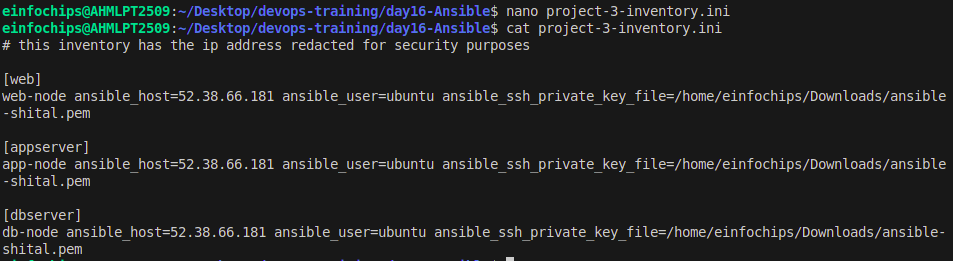

### 2.Dynamic Inventory:
• Implement a dynamic inventory script or use a dynamic inventory plugin.

• Configure the dynamic inventory to categorize servers automatically based on predefined criteria.
      

# Project 4: Ansible Playbooks: The Basics
Problem Statement: Your team needs to automate repetitive tasks such as installing packages, configuring services, and managing files on multiple servers. The project involves writing basic Ansible playbooks to automate these tasks, ensuring consistency and efficiency in the operations.

### Deliverables:

### Playbook Creation:

• Write a playbook to install a specific package on all managed nodes.

```
---
- name: Installing specific package
  hosts: workers
  become: yes
  tasks: 
    - name: install nginx
      package:
        name: nginx
        state: present
```

```
ansible -i project-1-inventory.ini worker-node -m command -a "nginx -v"
```

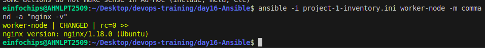


```
ansible-playbook -i project-1-inventory.ini project-4-install.yml
```
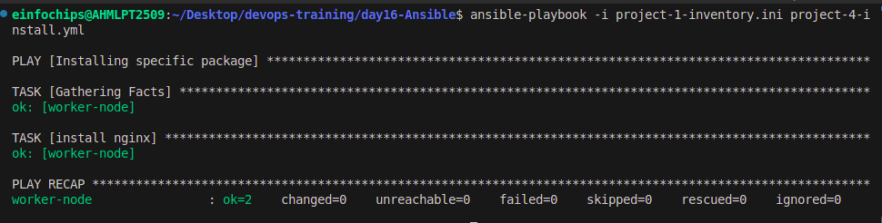


• Create a playbook to configure a service with specific parameters.

```
---
- name: Configure Nginx with specific parameters
  hosts: workers
  become: yes
  tasks:
    - name: Start Nginx
      service:
        name: nginx
        state: started
        enabled: yes
 
    - name: Add custom nginx.conf
      copy:
        src: nginx.conf
        dest: /etc/nginx/nginx.conf
        owner: root
        group: root
        mode: '0644'
```

```
ansible-playbook -i project-1-inventory.ini project-4-configure.yml
```
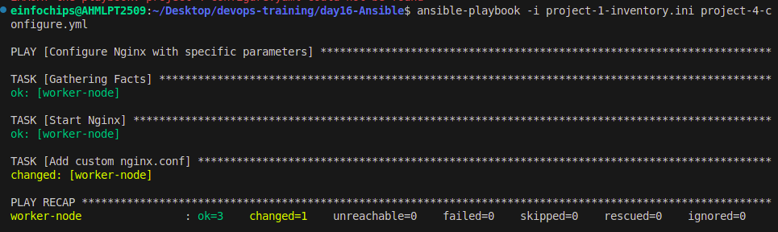


• Develop a playbook to manage files, such as creating, deleting, and modifying files on managed nodes.

```
---
- name: Manage Nginx files
  hosts: workers
  become: yes
  tasks:
    - name: Create a new file for Nginx
      file:
        path: /tmp/nginx_info.txt
        state: touch
```

```
ansible-playbook -i project-1-inventory.ini project-4-modify.yml
```
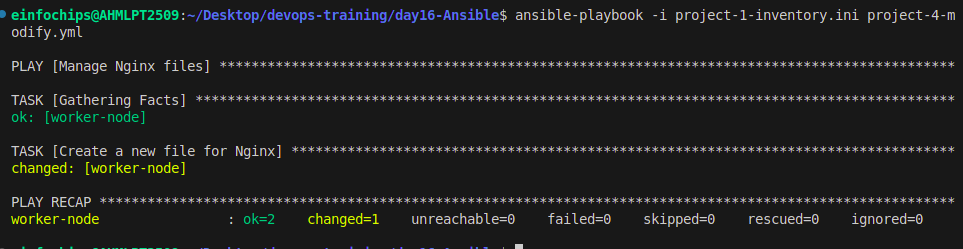


### Documentation:
• Detailed explanation of each playbook, including the tasks and modules used.

• Guide on how to run the playbooks and interpret the results.

# Project 5: Ansible Playbooks - Error Handling


Problem Statement: In a complex IT environment, tasks automated by Ansible playbooks may encounter errors due to various reasons such as incorrect configurations, unavailable resources, or network issues. The project focuses on implementing error handling in Ansible playbooks to ensure resilience and proper reporting of issues.

### Deliverables:

### Playbook with Error Handling:

• Write a playbook that includes tasks likely to fail, such as starting a non-existent service or accessing a - non-existent file. Implement error handling strategies using modules like block, rescue, and always.

#### Logging and Notifications:

• Configure the playbook to log errors and notify administrators of any issues encountered during execution.

• Use Ansible modules to send notifications via email or other communication channels.

```
---
- name: Error Handling Example
  hosts: workers
  tasks:
    - name: install software
      block:
        - name: install ngnix
          service:
            name: ngnix
            state: started
 
      rescue:
        - name: Log error
          debug:
            msg: "An error occurred"
 
      always:
        - name: Tasks Completed
          debug:
            msg: "The playbook execution has completed."
```

```
ansible-playbook -i project-1-inventory.ini project-5.yml
```

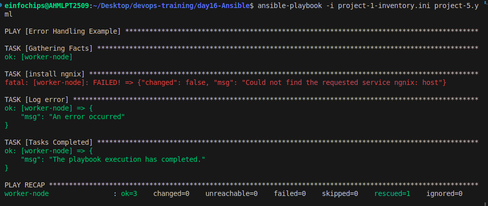

### Documentation:
• Comprehensive guide on error handling in Ansible playbooks, including examples of common scenarios and solutions.
    
• Detailed instructions on setting up logging and notifications for error handling.


