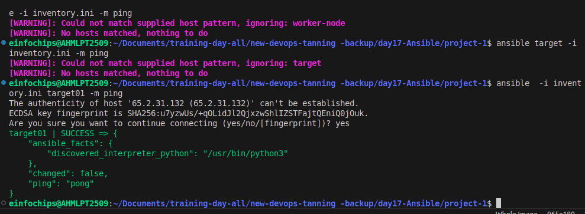
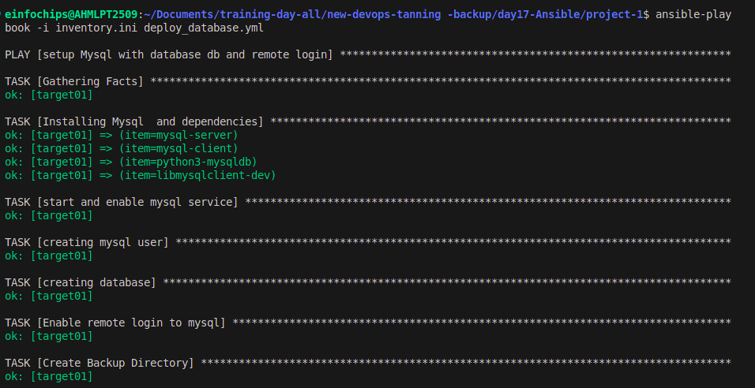
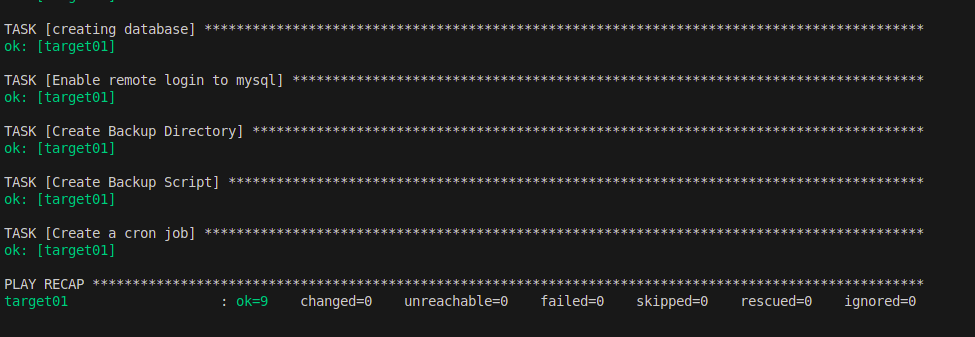
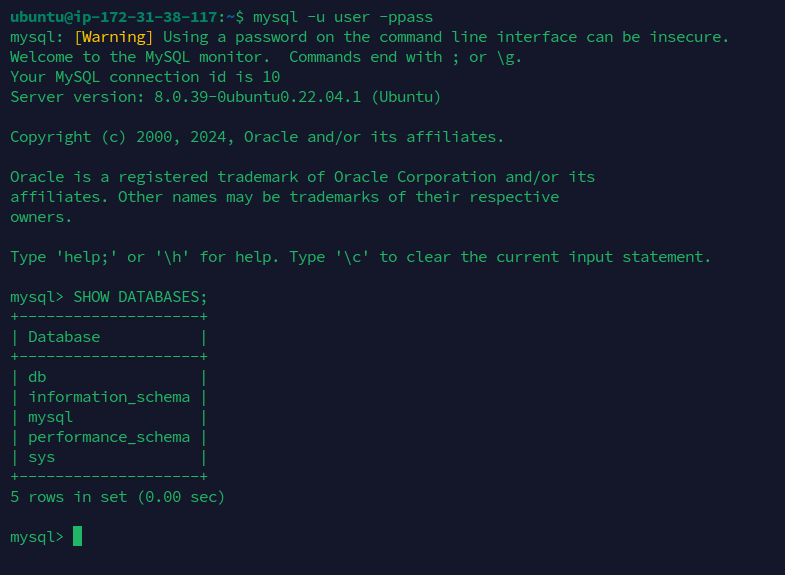

# Day 17 

# Project 01
Deploy a Database Server with Backup Automation

Objective: Automate the deployment and configuration of a PostgreSQL database server on an Ubuntu instance hosted on AWS, and set up regular backups.

## Requirements:

AWS Ubuntu Instance: You have an Ubuntu server instance running on AWS.

Database Server Deployment: Deploy and configure PostgreSQL on the Ubuntu instance.

Database Initialization: Create a database and a user with specific permissions.

Backup Automation: Set up a cron job for regular database backups and ensure that backups are stored in a specified directory.

Configuration Management: Use Ansible to handle the deployment and configuration, including managing sensitive data like database passwords.

## Deliverables

### Ansible Inventory File

Filename: inventory.ini

Content: Defines the AWS Ubuntu instance and connection details for Ansible.

```
[workers]
target01 ansible_host=65.2.31.132 ansible_user=ubuntu ansible_ssh_private_key_file=/home/einfochips/Downloads/training.pem
```


### Ansible Playbook

Filename: deploy_database.yml

Content: Automates the installation of PostgreSQL, sets up the database, creates a user, and configures a cron job for backups. It also includes variables for database configuration and backup settings.

```
- name: setup Mysql with database db and remote login
  become: yes
  hosts: target01

  vars_files: 
    - vars.yml
  
  tasks:
    - name: Installing Mysql  and dependencies
      package:
       name: "{{item}}"
       state: present
       update_cache: yes
      loop:
       - mysql-server
       - mysql-client 
       - python3-mysqldb
       - libmysqlclient-dev
      become: yes

    - name: start and enable mysql service
      service:
        name: mysql
        state: started
        enabled: yes

    - name: creating mysql user
      mysql_user:
        name: "{{db_user}}"
        password: "{{db_pass}}"
        priv: '*.*:ALL'
        host: '%'
        state: present

    - name: creating database
      mysql_db:
        name: "{{db_name}}"
        state: present

    - name: Enable remote login to mysql
      lineinfile:
         path: /etc/mysql/mysql.conf.d/mysqld.cnf
         regexp: '^bind-address'
         line: 'bind-address = 0.0.0.0'
         backup: yes
      notify:
         - Restart mysql 

    - name: Create Backup Directory
      file: 
        path: /var/backups/mysql
        state: directory

    - name: Create Backup Script
      copy:
        src: scripts/backup.sh
        dest: ~/
        mode: 0755

    - name: Create a cron job
      cron:
        name: "MySQL Backup"
        minute: "2"
        hour: "0"
        job: "~/backup.sh"  

  handlers:
    - name: Restart mysql
      service:
        name: mysql
        state: restarted
```




### Backup Script

Filename: scripts/backup.sh

Content: A script to perform the backup of the PostgreSQL database. This script should be referenced in the cron job defined in the playbook.

```
#!/bin/bash

DB_NAME="db"
DB_USER="user"
DB_PASSWORD="pass"
BACKUP_DIR="/var/backups/mysql"

DATE=$(date +\%F_\%T)

# Perform the backup
mysqldump -u $DB_USER -p$DB_PASSWORD $DB_NAME > $BACKUP_DIR/backup_$DATE.sql
```
### Database Created




