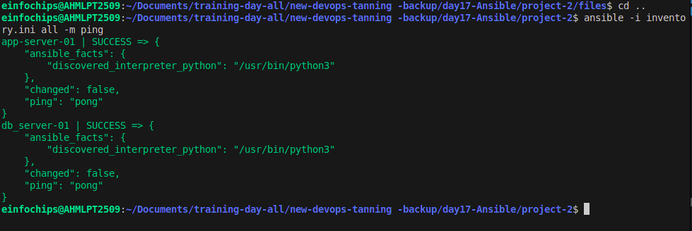
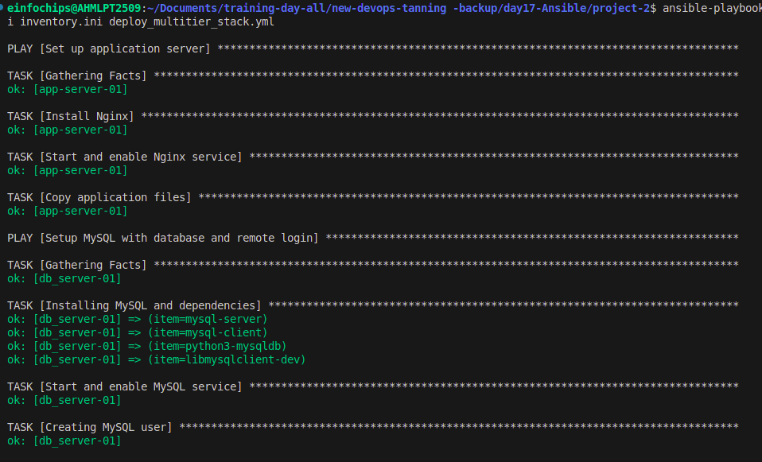
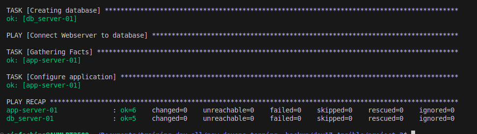
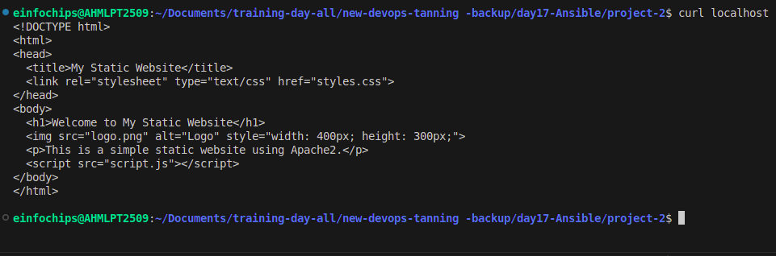
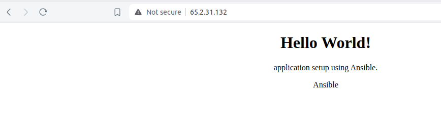

# Day 17

## Project 02

### Deliverables

### 1.Ansible Inventory File

Content: Defines the database server and application server instances, including their IP addresses and connection details.

`Filename: inventory.ini`

```
[database]
db_server-01 ansible_host=65.2.31.132 ansible_user=ubuntu ansible_ssh_private_key_file=/home/einfochips/Downloads/training.pem

[app]
app-server-01 ansible_host=65.2.31.132 ansible_user=ubuntu ansible_ssh_private_key_file=/home/einfochips/Downloads/training.pem
```


### 2.Ansible Playbook

Content: Automates:

The deployment and configuration of the Mysql database server.

The setup and configuration of the web server.

The deployment of the web application and its configuration to connect to the database.

`Filename: deploy_multitier_stack.yml`

```
- name: Set up application server
  hosts: app
  become: yes

  tasks:
    - name: Install Nginx
      apt:
        name: nginx
        state: present

    - name: Start and enable Nginx service
      systemd:
        name: nginx
        state: started
        enabled: yes

    - name: Copy application files
      copy:
        src: files/index.html
        dest: /var/www/html/index.html

  handlers:
    - name: Reload Nginx
      service:
        name: nginx
        state: reloaded

# -----------------------------------------------------

- name: Setup MySQL with database and remote login
  hosts: database
  become: yes

  vars: 
    db_user: user
    db_pass: pass
    db_name: my_db
  
  tasks:
    - name: Installing MySQL and dependencies
      package:
        name: "{{ item }}"
        state: present
        update_cache: yes
      loop:
        - mysql-server
        - mysql-client 
        - python3-mysqldb
        - libmysqlclient-dev

    - name: Start and enable MySQL service
      service:
        name: mysql
        state: started
        enabled: yes

    - name: Creating MySQL user
      mysql_user:
        name: "{{ db_user }}"
        password: "{{ db_pass }}"
        priv: '*.*:ALL'
        host: '%'
        state: present

    - name: Creating database
      mysql_db:
        name: "{{ db_name }}"
        state: present

# -----------------------------------------------------

- name: Connect Webserver to database
  hosts: app
  become: yes
  vars:
    db_host: "db_server-01"  
    db_name: "my_db"
    db_user: "user"
    db_pass: "pass"

  tasks:
    - name: Configure application
      template:
        src: templates/app_config.php.j2
        dest: /var/www/html/app_config.php
```




### 3.Jinja2 Template

Content: Defines a configuration file for the web application that includes placeholders for dynamic values such as database connection details.

`Filename: templates/app_config.php.j2`

```
<?php
$db_host = "{{ db_host }}";
$db_name = "{{ db_name }}";
$db_user = "{{ db_user }}";
$db_pass = "{{ db_pass }}";

$conn = new mysqli($db_host, $db_user, $db_pass, $db_name);

if ($conn->connect_error) {
    die("Connection failed: " . $conn->connect_error);
}

echo "Connected successfully";
?>
```

### 4.Application Files

Content: Static or basic dynamic content served by the web application

`Filename: files/index.html`

```
<!DOCTYPE html>
<html>
<head>
    <title>Welcome to My Web Application</title>
</head>
<body>
    <center>
        <h1>Hello World!</h1>
        <p>application setup using Ansible.</p>
        <p>Ansible</p>
    </center>
</body>
</html>
```

### Output:



