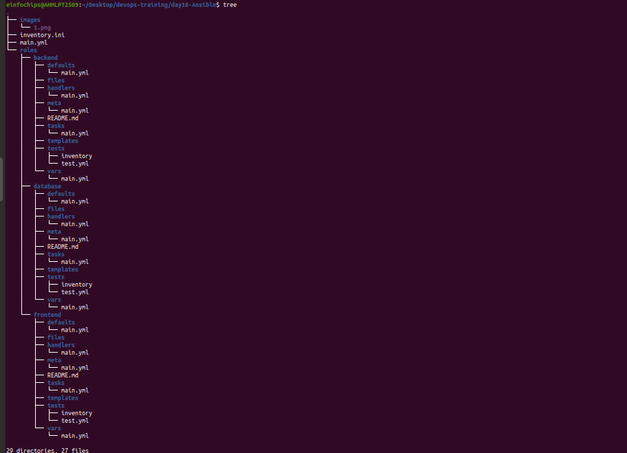
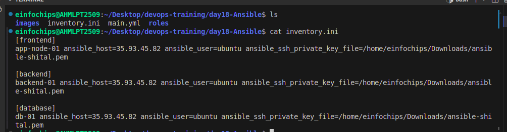
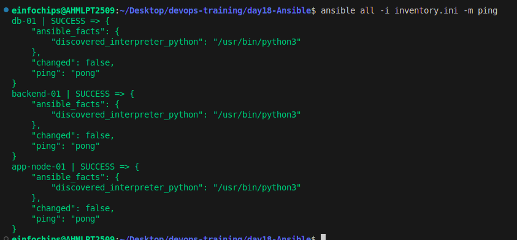
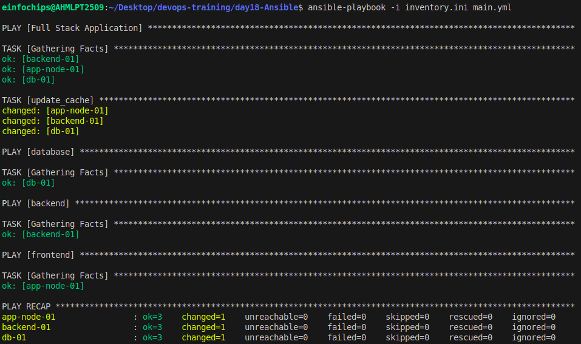

# Day 18 Task

## Project Overview

This project automates the deployment of a three-tier web application consisting of a frontend (Nginx web server), a backend (Node.js application), and a database (MySQL server) using Ansible roles. The solution leverages Ansible Galaxy roles for efficient configuration and deployment.

## Deliverables

## Directory Structure
### The project is organized in the following directory structure:

```
Day18/
├── roles/
│   ├── frontend/               
│   │   ├── tasks/
│   │   ├── templates/
│   │   └── meta/
│   │       └── main.yml
│   ├── backend/                
│   │   ├── tasks/
│   │   ├── templates/
│   │   └── meta/
│   │       └── main.yml
│   └── database/                
│       ├── tasks/
│       ├── templates/
│       └── meta/
│           └── main.yml
├── inventory.ini
│                
├── deploy.yml
├── test.yml
│                                
└── README.md          
```

## 1. Ansible Project Directory Structure 
Organized directory structure with roles, playbooks, inventory, and configuration files.


## 2. Role Definitions and Dependencies
meta/main.yml files for each role defining dependencies. Customized roles with necessary configurations.



## 3. Inventory File 
Inventory file defining groups and hosts for frontend, backend, and database tiers.

```
[frontend]
app-node-01 ansible_host=35.93.45.82 ansible_user=ubuntu ansible_ssh_private_key_file=/home/einfochips/Downloads/ansible-shital.pem
 
[backend]
backend-01 ansible_host=35.93.45.82 ansible_user=ubuntu ansible_ssh_private_key_file=/home/einfochips/Downloads/ansible-shital.pem
 
[database]
db-01 ansible_host=35.93.45.82 ansible_user=ubuntu ansible_ssh_private_key_file=/home/einfochips/Downloads/ansible-shital.pem
```




## 4. Playbook for Deployment (main.yml)
Playbook that orchestrates the deployment of the three-tier application.

```
---
- name: Full Stack Application
  hosts: app
  become: yes
  tasks:
    - name: update_cache
      apt:
        update_cache: yes
  
- hosts: app
  become: true
  roles: 
    - frontend
 
- hosts: backend
  become: true
  roles: 
    - backend
 
- hosts: database
  become: true
  roles: 
    - database
```

## 5. Playbook for Testing (test.yml)
Playbook that verifies the deployment and functionality of each tier.

