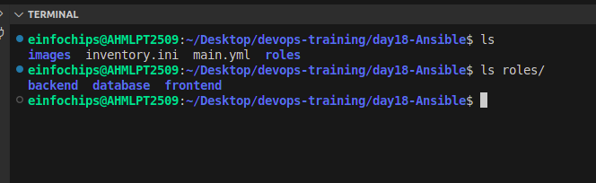

# Day 18 Task

## Project Overview

This project automates the deployment of a three-tier web application consisting of a frontend (Nginx web server), a backend (Node.js application), and a database (MySQL server) using Ansible roles. The solution leverages Ansible Galaxy roles for efficient configuration and deployment.

## Deliverables

## Directory Structure
### The project is organized in the following directory structure:

```
Day18/
├── roles/
│   ├── frontend/               
│   │   ├── tasks/
│   │   ├── templates/
│   │   └── meta/
│   │       └── main.yml
│   ├── backend/                
│   │   ├── tasks/
│   │   ├── templates/
│   │   └── meta/
│   │       └── main.yml
│   └── database/                
│       ├── tasks/
│       ├── templates/
│       └── meta/
│           └── main.yml
├── inventory.ini
│                
├── deploy.yml
├── test.yml
│                                
└── README.md          
```

## 1. Ansible Project Directory Structure 
Organized directory structure with roles, playbooks, inventory, and configuration files.


