# day - 2 Git

## Install Git:

First, you need to install Git on your system.
1. Install Git: Ensure Git is installed on your system.

sudo apt-get install git

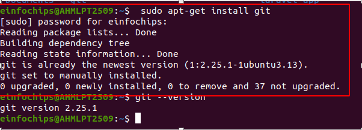

2. Verify with:
-  Verify the installation by typing

git --version


3. Set Up Git: Configure your Git username and email: used for your commits.

git config --global user.name "Your Name"
git config --global user.email your.email@example.com

git config --global user.name "cshital"
git config --global user.email  shitalchauhan549@gmail.com

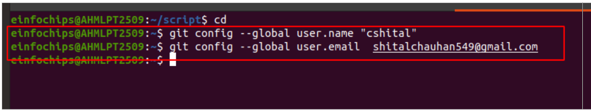


4. Create a GitHub Repository:

- Go to GitHub and create a new repository named website-project.
- Go to GitHub and create a new repository named website-proj.
- Clone the repository to your local machine:

git clone https://github.com/your-username/website-project.git
git clone https://github.com/cshital/website-proj.git

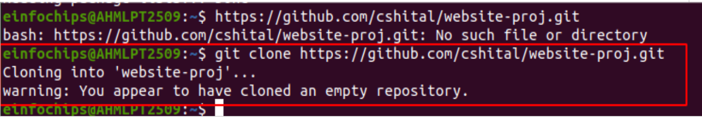


5. Initialize the Project:
 - Navigate to the project directory:

cd website-project
cd website-proj

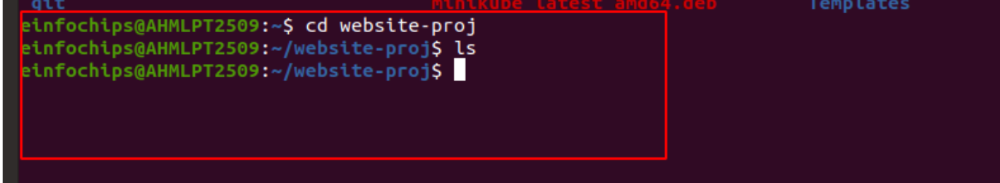

6. Create initial project structure:
1. Create a Directory for the Source Files:
mkdir src

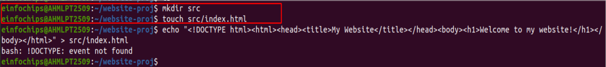


2. Create an HTML File:
touch src/index.html

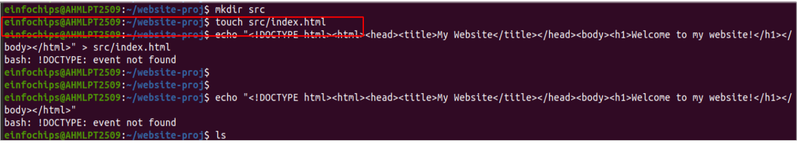

3. Add Initial HTML Content:
echo '<!DOCTYPE html><html><head><title>My Website</title></head><body><h1>Welcome to my website!</h1></body></html>' > src/index.html

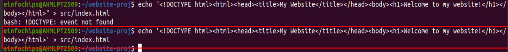

Using Single Quotes:

Single quotes will prevent the shell from interpreting the exclamation mark.
encountering is due to the exclamation mark ! being interpreted as a special character in the shell. 

```
your-project/
└── src/
    └── index.html
```

4. Commit and push the initial project structure:
1 . Stage the Changes: Staging Area (Local):
git add .

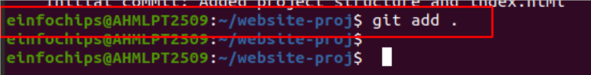

You move changes from the working directory to the staging area using the git add command.
git add . stages all changes in the current directory.

2. Commit the Changes: Local Repository (Local):
git commit -m "Initial commit: Added project structure and index.html"

This is where committed changes are stored. When you create a commit, the changes in the staging area are saved in the local repository.
creates a commit with the staged changes.

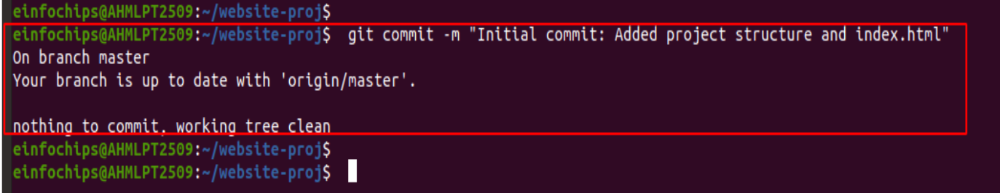


### check first branch for repository:

Step 1: Verify Branch Name:
    • check which branch you are currently on.
git branch
    • list all branches and highlight the current branch with an asterisk *. If your branch is named master, you need to push to master instead of main.

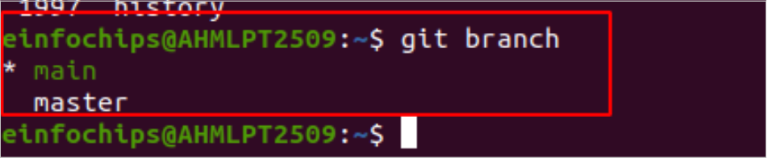


Step 2: Push to the Correct Branch:
    • branch is named master, push to master.

git push origin master

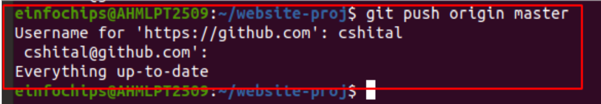

Step 3: Rename Branch to main (Optional):
    • If you want to use main as your branch name instead of master, you can rename the branch.
       -      Rename the local branch from master to main:

1. Rename the Local Branch:
git branch -m master main
2. Push the Renamed Branch and Set the Remote Tracking Branch:
git push -u origin main

3. Delete the Old master Branch on the Remote:

git push origin --delete master


4.Push the Changes to GitHub: Remote Repository (Remote):
git push origin main
git push origin master

    • You push changes from your local repository to the remote repository using the git push command.
    • git push origin main pushes the committed changes from your local repository to the remote repository's main branch.


# 1. Working Directory:
    • Local: The place where you make changes to your project files.
    • Actions: Creating directories and files, modifying code.

Example:
mkdir src
touch src/index.html
echo '<!DOCTYPE html><html><head><title>My Website</title></head><body><h1>Welcome to my website!</h1></body></html>' > src/index.html

2. Staging Area:
    • Local: A temporary area where you group changes before committing them.
    • Action: Using git add to add changes to the staging area.

    • Example:
git add .

3. Local Repository:
    • Local: The place where Git stores your committed changes.
    • Action: Using git commit to save changes from the staging area to the local repository.

Example:
git commit -m "Initial commit: Added project structure and index.html"

4. Remote Repository:
    • Remote: The place where you push your local commits so others can access and collaborate.
    • Action: Using git push to send commits from the local repository to the remote repository.

Example:
git push origin main

4. after push check git status:
 git status

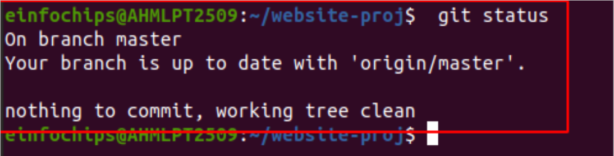

5. check git log:
git log 

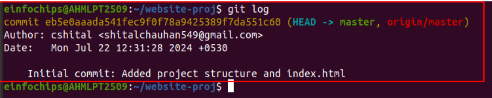

# Exercise 1: Branching and Basic Operations (10 minutes):

1. Create a New Branch:
git checkout -b feature/add-about-page

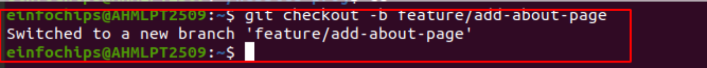

    • git checkout -b: This command is used to create a new branch and switch to it immediately.
    • feature/add-about-page: This is the name of the new branch. It's a good practice to use descriptive names for branches to indicate their purpose.

    1. Create a new branch named feature/add-about-page.
    2. Switch to this new branch, making it the current working branch.

2. Add a New Page:
Create about.html:

    1. Navigate to Your Project Directory:
cd  website-proj

    2. Verify the src Directory Exists:
mkdir -p src

    3. Create the about.html File:
    • create the about.html file inside the src directory:

cd website-proj
 cd src/
touch src/about.html

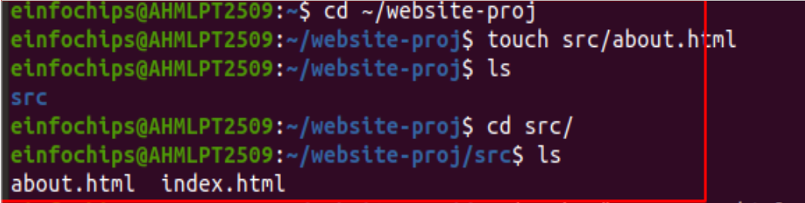

3. Add Content to about.html:

echo '<!DOCTYPE html><html><head><title>About Us</title></head><body><h1>About Us</h1></body></html>' > about.html

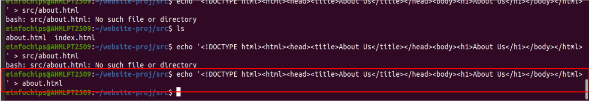

4. Commit and push changes:

Step 1: Stage the New File: Staging Area (Local):
git add src/about.html

  - if already src directory then run above command:

 git add about.html

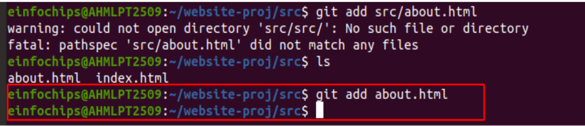

- git add: This command adds changes from the working directory to the staging area. The staging area is where you prepare changes before committing them to the local repository.
- src/about.html: This specifies the file to be added to the staging area. In this case, it's the about.html file in the src directory.
- about.html file will be added to the staging area, meaning it is ready to be committed.

Step 2: Commit the Changes: Local Repository (Local):
git commit -m "Added about page"

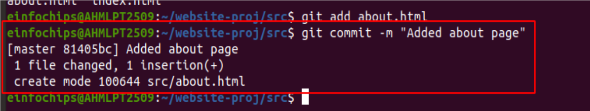

git commit: This command records the changes from the staging area in the local repository.
-m "Added about page": This flag allows you to include a commit message directly in the command. The commit message should be a brief description of the changes you made. In this case, the message is "Added about page".

Verify the Current Branch:

git branch
- list all local branches and highlight the current branch with an asterisk *. If feature/add-about-page is not listed, you need to create and switch to it.

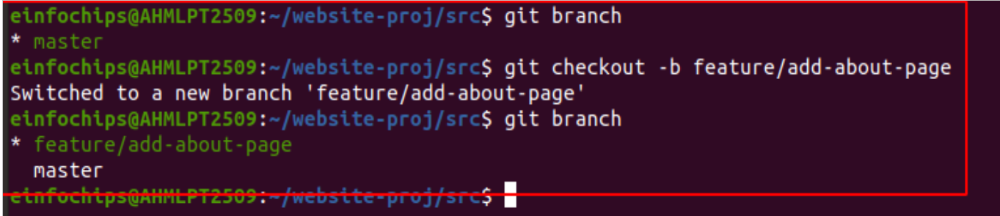


Create and Switch to the Branch:
- If you haven't created the branch.
- or if you are not on the correct branch
- create and switch to it:

git checkout -b feature/add-about-page

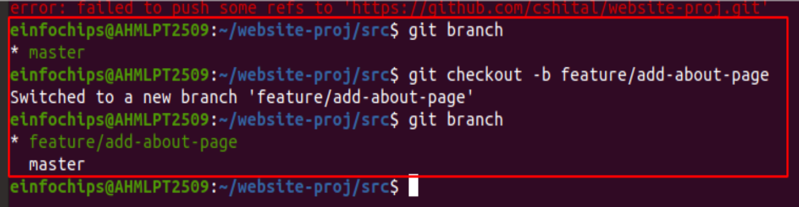

Step 3: Push the Changes to the Remote Repository:  Remote Repository (Remote):
git push origin feature/add-about-page

    • git push: This command uploads local repository content to a remote repository.
    • origin: This specifies the remote repository to which you are pushing the changes. 
    • origin is the default name given to the remote repository when you clone it.
    • feature/add-about-page: This specifies the branch in the remote repository to which you are pushing the changes. In this case, it's the feature/add-about-page branch.

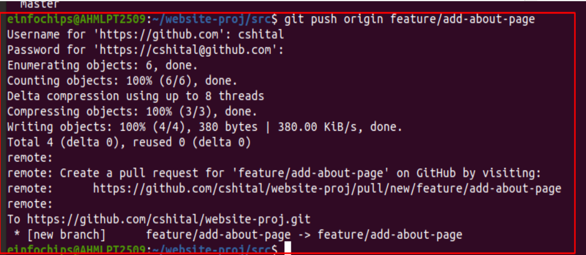

## Exercise 2: Merging and Handling Merge Conflicts (15 minutes):

1. Create Another Branch:
Step 1: Ensure You Are on the main Branch:
git checkout main

- Before creating a new branch, you should ensure you are on the main branch. 
- This is necessary because the new branch will be created based on the main branch.
- git checkout: This command is used to switch branches.
- main: This specifies the branch you want to switch to. In this case, it's the main branch.
- switch your working directory to the main branch.

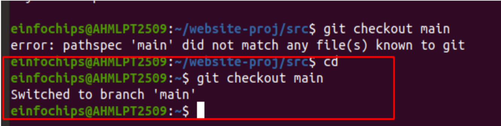


Step 2: Create and Switch to the New Branch:
git checkout -b feature/update-homepage

- Now that you are on the main branch, you can create a new branch and switch to it in one command.
- git checkout -b: This command is used to create a new branch and switch to it immediately.
- feature/update-homepage: This is the name of the new branch. It's a good practice to use descriptive names for branches to indicate their purpose.

1. Create a new branch named feature/update-homepage.
2.Switch to this new branch, making it the current working branch.

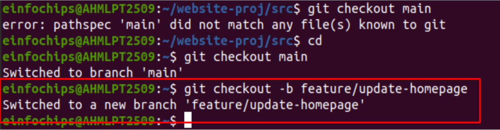


2. Update the Homepage:
 Modify index.html:

```html
cd website-proj
ls
src
cd src/
ls
about.html  index.html
```

```
echo "<p>Updated homepage content</p>" >> src/index.html
```

- If you are in src directory:

```
echo "<p>Updated homepage content</p>" >> index.html
```

```
echo "<p>Updated homepage content</p>"
```

This command outputs the string 

```
"<p>Updated homepage content</p>" >> src/index.html
```

This appends the output of the echo command to the end of the src/index.html file. The >> operator appends text to a file, whereas > would overwrite the file.

- will add a new paragraph with the text "Updated homepage content" to the index.html file.

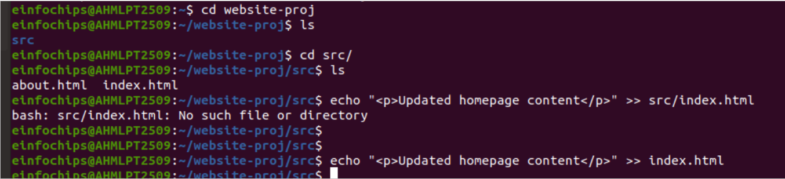


3. Commit and push changes:

1.Staging the Changes: Staging Area (Local):
git add src/index.html
 - if you are in src directory:
git add index.html

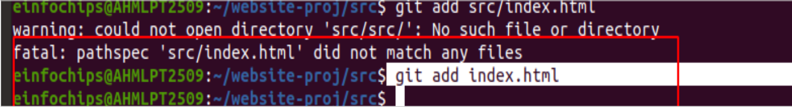

- Add the modified file to the staging area.
- This command stages the modified index.html file, preparing it for commit.

2. Committing the Changes: Local Repository (Local):

git commit -m "Updated homepage content"
-   Commit the staged changes to the local repository.
-  This command commits the staged changes with a descriptive message, creating a new commit in the local repository.

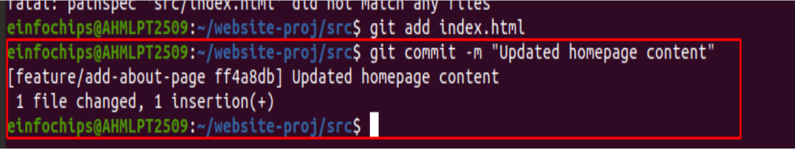

3. Push the changes: Remote Repository (Remote):
git push origin feature/add-about-page

- remote repository on the feature/add-about-page branch.
- Push the committed changes to the remote repository.

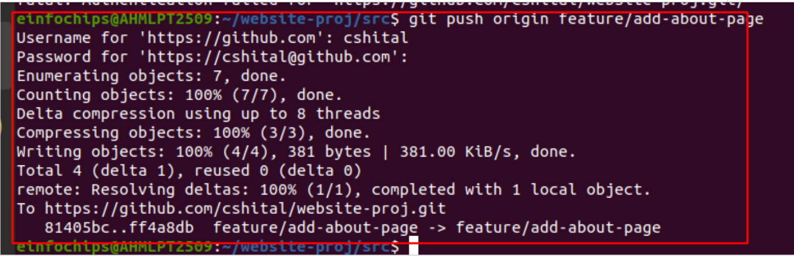

4. Create a Merge Conflict:
Modify index.html on the feature/add-about-page branch:
    1. Switch to the feature/add-about-page branch: Stage: Working Directory
git checkout feature/add-about-page
    • switches your current working branch to feature/add-about-page.

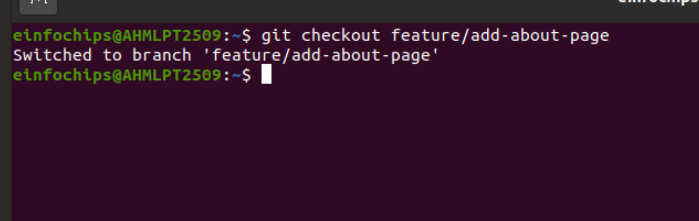


2. Add conflicting content to src/index.html: Stage: Working Directory
echo "<p>Conflict content</p>" >> src/index.html
    • if already in src directory:

echo "<p>Conflict content</p>" >> index.html

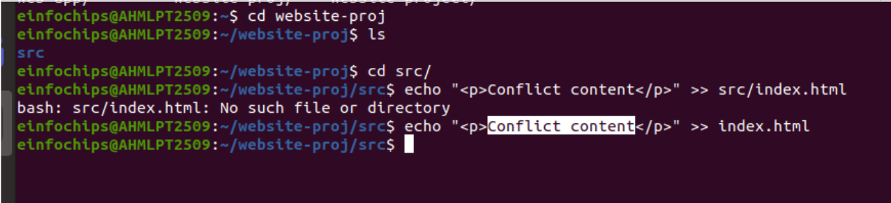

    • This command appends the text <p>Conflict content</p> to the end of the src/index.html file. This change is intended to create a conflict when merging with another branch that has different changes to the same file.

 3. Stage the changes: Stage: Staging Area

```
cd website-proj
 ls
cd src/
ls
about.html  index.html
```

    • If you are in src directory then:

git add index.html
git add src/index.html

    • stages the changes to src/index.html, preparing them to be committed.

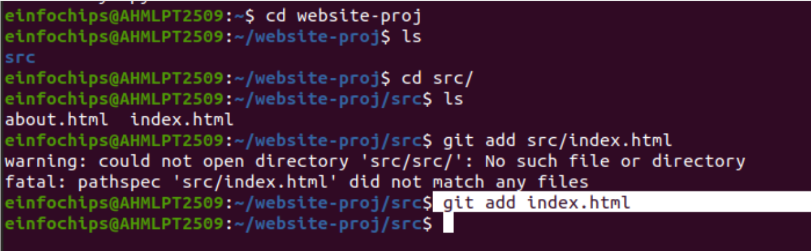

4. Commit the changes: Stage: Repository (Local)
git commit -m "Added conflicting content to homepage"
    • This command commits the staged changes with the commit message "Added conflicting content to homepage."

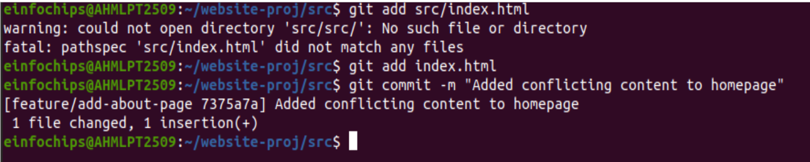

5. Push the changes to the remote repository: Stage: Remote Repository
git push origin feature/add-about-page
- This command pushes the committed changes to the remote repository on the feature/add-about-page branch.

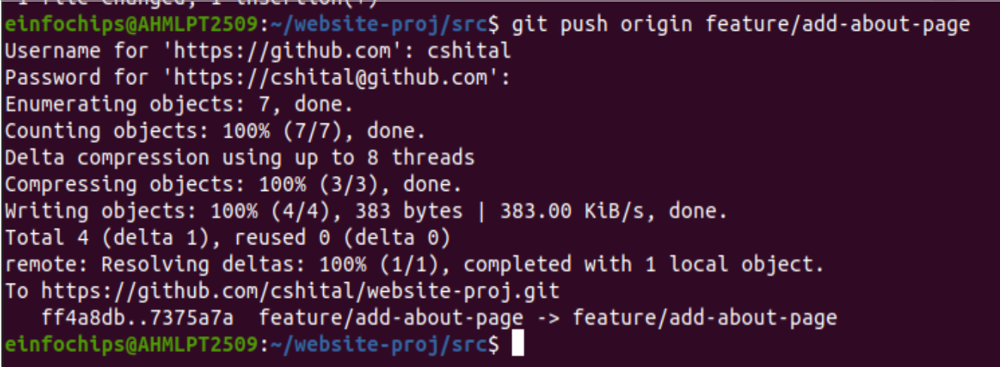


5. Merge and Resolve Conflict:
Attempt to merge feature/add-about-page into main:

Step 1: Checkout the main branch:
git checkout main

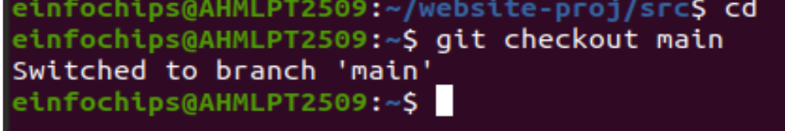

Step 2: Merge feature/add-about-page into main:
git merge feature/add-about-page

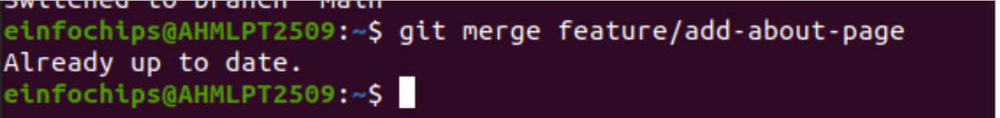

# Resolve the conflict in src/index.html, then:
1. Open the conflicted file: (src/index.html) in your text editor. You will see conflict markers indicating the conflicting sections:

```bash
<<<<<<< HEAD
// Code from the main branch
=======
// Code from feature/add-about-page branch
>>>>>>> feature/add-about-page
```

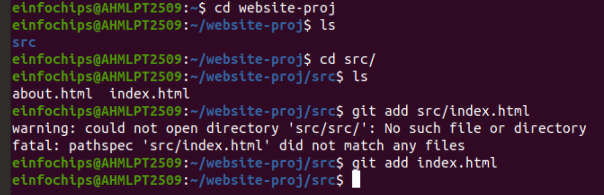


2. Manually resolve the conflict: by choosing which changes to keep or combining the necessary parts from both versions. After resolving, the file should look something like this without the conflict markers:
// Combined code as needed
Step 3: Stage the resolved file:

```
cd website-proj
ls
src
cd src/
 ls
about.html  index.html
git add src/index.html
```

- If you are in src directory:

git add index.html

Step 4: Commit the resolution:
git commit -m "Resolved merge conflict in homepage"

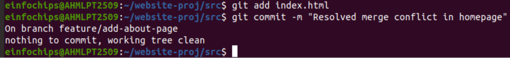

Step 5: Push the changes to the remote repository:
git push origin main
git push origin master
    •  After successfully rebasing the feature/update-homepage branch onto the main branch and resolving any conflicts, you will need to push the changes to the remote repository. Here are the detailed steps and explanations for the commands mentioned:
    • Check Which Branch You're On
    • First, confirm that you are on the correct branch (feature/update-homepage) before pushing the changes.
 git branch

To list remote branches, use:
git branch -r

To list both local and remote branches, use:
git branch -a

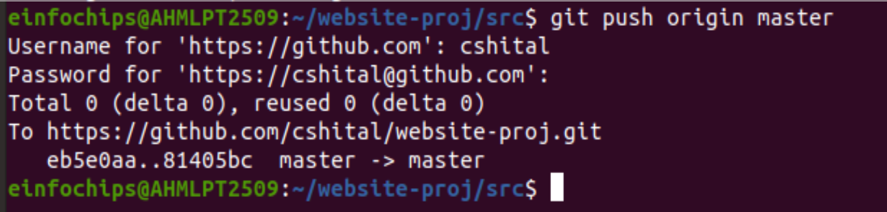


# Exercise 3: Rebasing:
1. Rebase a Branch:
Rebase feature/update-homepage onto main:
1. Check Out the Feature Branch:
git checkout feature/update-homepage
    • First, you need to switch to the branch you want to rebase. In this case, it's the feature/update-homepage branch.
    • This command changes the current working branch to feature/update-homepage.

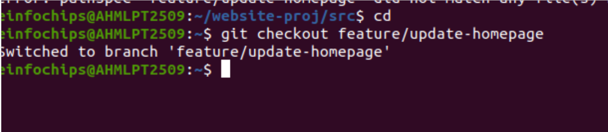

2. Start the Rebase:
git rebase main
- Next, you initiate the rebase operation.
- Resolve any conflicts that arise during rebase.
- This command replays the commits from the feature/update-homepage branch onto the main branch. Here's a detailed breakdown of what happens:
- Git Locates Common Ancestor: Git identifies the common base commit between the two branches (main and feature/update-homepage).
- Replays Commits: Git then takes each commit from the feature/update-homepage branch and replays them on top of the main branch. This effectively rewrites the history of the feature/update-homepage branch.

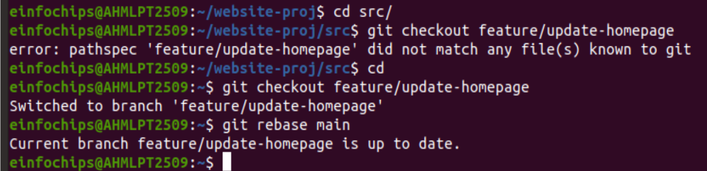

3. Push the Rebased Branch:

git push -f origin feature/update-homepage

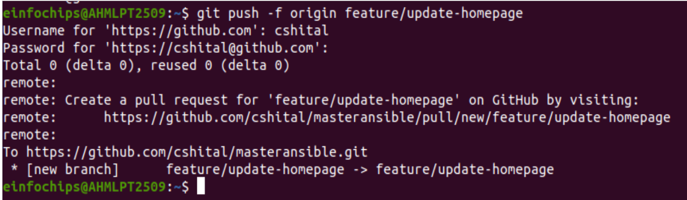

# Exercise 4: Pulling and Collaboration:

1. Pull Changes from Remote:
Ensure the main branch is up-to-date:

git checkout main

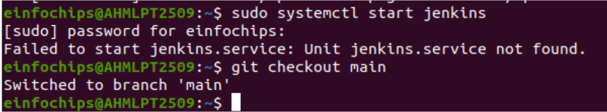

git pull origin main

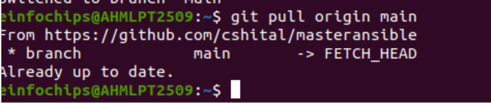

2. Simulate a Collaborator's Change:
        ◦ Make a change on GitHub directly (e.g., edit index.html).

3. Pull Collaborator's Changes:
Pull the changes made by the collaborator:

git pull origin main

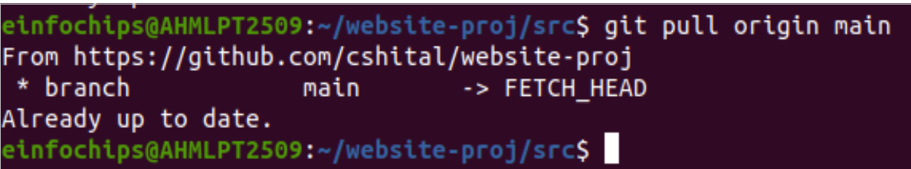

# Exercise 5: Versioning and Rollback:

1. Tagging a Version:

Tag the current commit as v1.0:
git tag -a v1.0 -m "Version 1.0: Initial release"

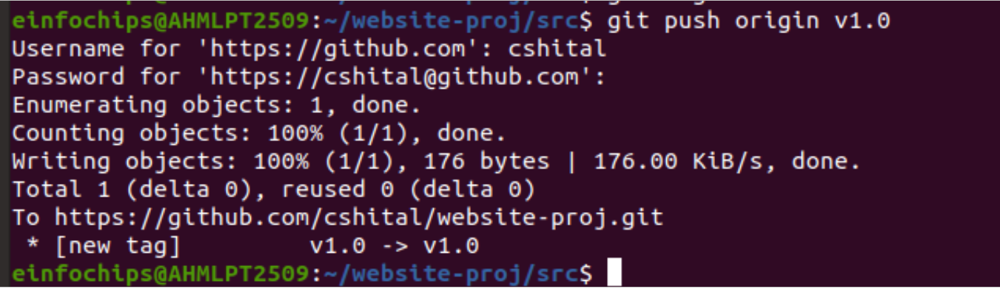

2. Make a Change that Needs Reversion:
Modify index.html:
echo "<p>Incorrect update</p>" >> src/index.html

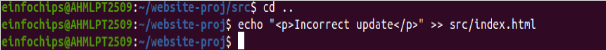

git add src/index.html


git commit -m "Incorrect update"

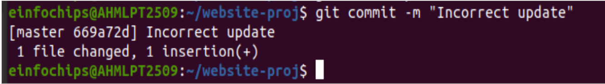

git push origin main

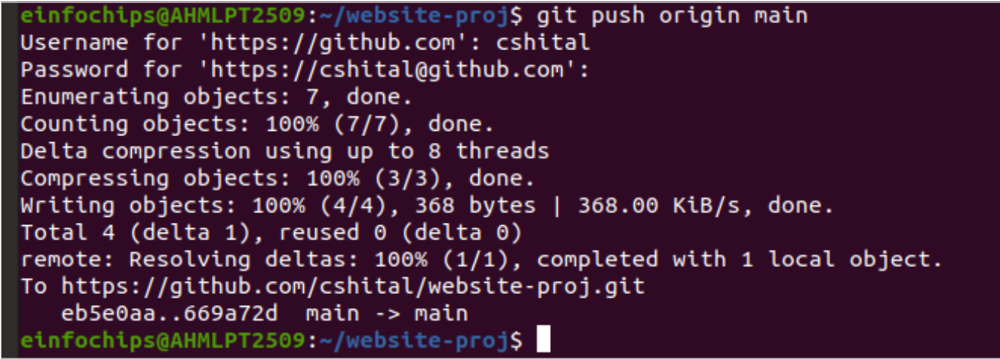

1. Check Your Local Branch Name:
git branch

2. Rename Your Local Branch to main:
git branch -m master main

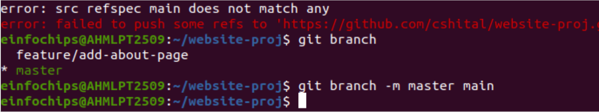

3. Revert to a Previous Version:
Use git revert to undo the last commit:

git revert HEAD

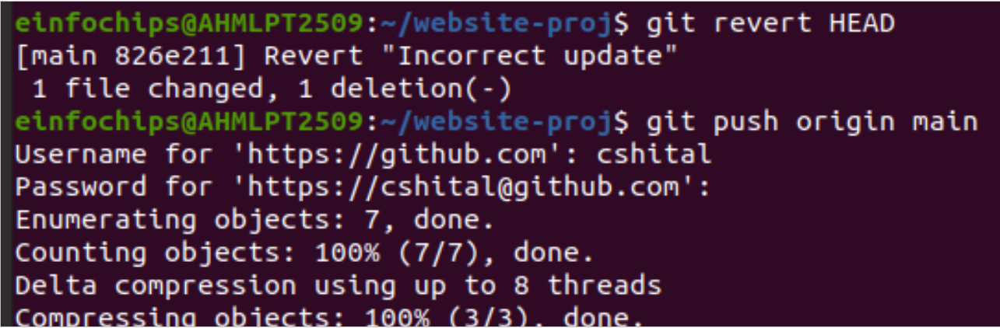

git push origin main

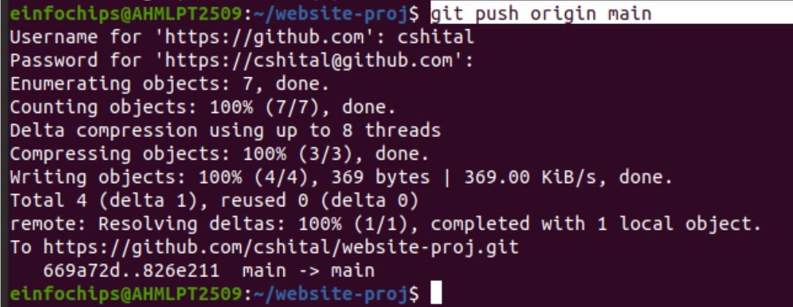

Alternatively, reset to a specific commit (use with caution):
sh
Copy code

git reset --hard v1.0

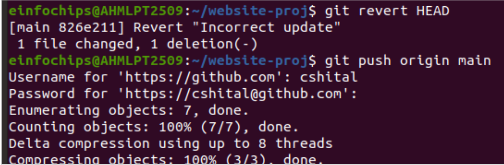

git pull origin main
From https://github.com/cshital/website-proj

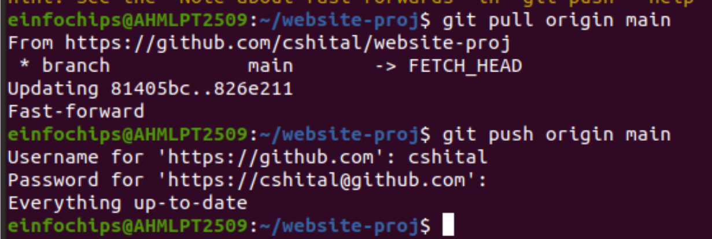

git push -f origin main

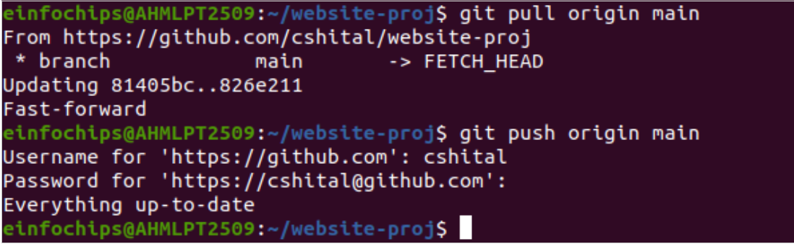

# Extra Activities:

1. Stashing Changes:
Make some local changes without committing:
echo "<p>Uncommitted changes</p>" >> src/index.html

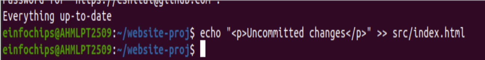

Stash the changes:

git stash

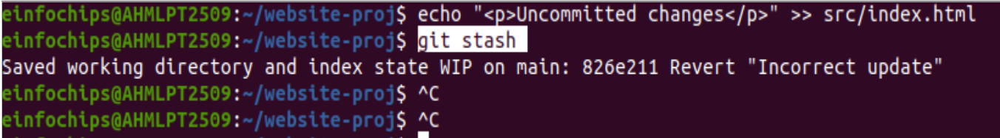

Apply the stashed changes:

git stash apply

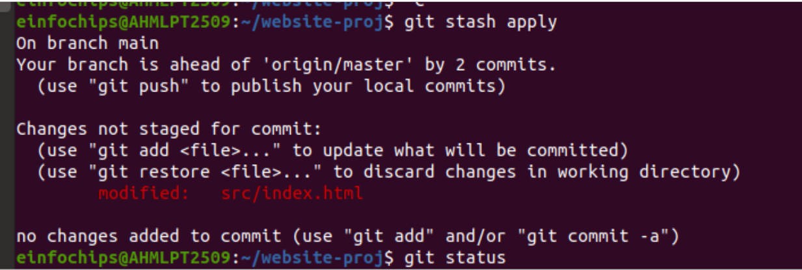

2. Viewing Commit History:
Use git log to view commit history:

git log –oneline

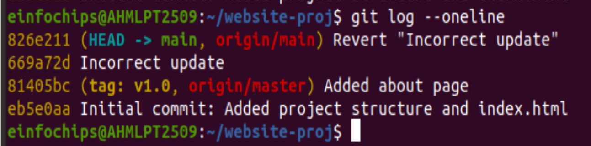

3. Cherry-Picking Commits:
Create a new branch and cherry-pick a commit from another branch:

git checkout -b feature/cherry-pick

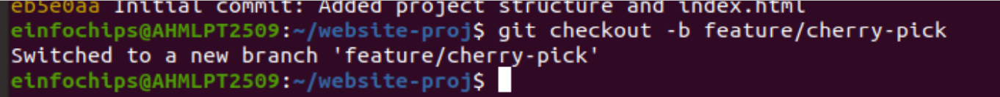

git cherry-pick <commit-hash>

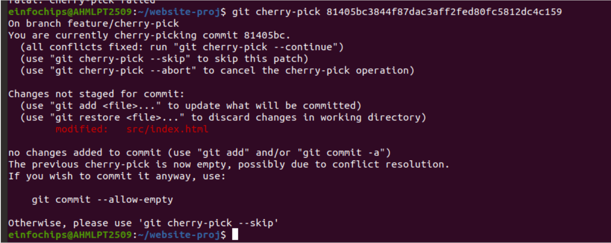

git push origin feature/cherry-pick

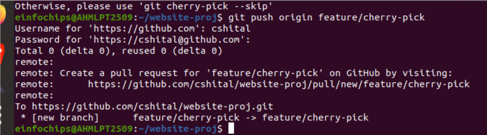

4. Interactive Rebase:
Use interactive rebase to squash commits:

git checkout main

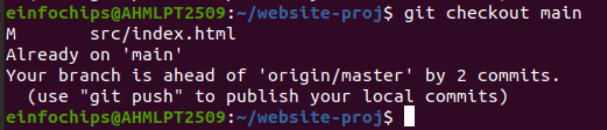

git rebase -i HEAD~3

## Collaborative Blogging Platform:
Objective:
You will work on a project to collaboratively develop a simple blogging platform. You will practice various Git concepts including branching, merging, handling merge conflicts, rebasing, pulling, versioning, rolling back changes, stashing, and cherry-picking commits. The project is designed to be completed in 1.5 Hours

1. Create a GitHub Repository:
- Go to GitHub and create a new repository named blogging-platform.
Clone the repository to your local machine:

git clone https://github.com/your-username/blogging-platform.git
2. Initialize the Project:

 1. initialize project:

mkdir blogging-platform
cd blogging-platform/
git init

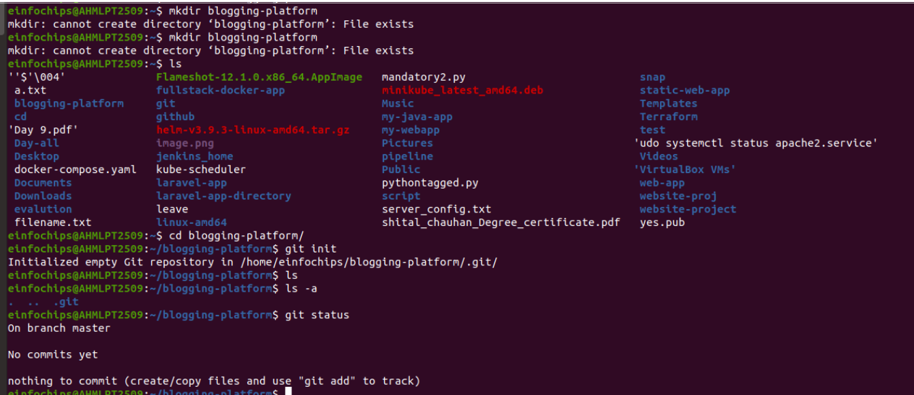


-  Navigate to the project directory:

```
cd blogging-platform
```

Create initial project structure:

```
mkdir src
touch src/index.html
echo "<!DOCTYPE html><html><head><title>Blogging Platform</title></head><body><h1>Welcome to the Blogging Platform!</h1></body></html>" > src/index.html
```

If this code is notworking then use this code:

```
echo '<!DOCTYPE html><html><head><title>Blogging Platform</title></head><body><h1>Welcome to the Blogging Platform!</h1></body></html>' > src/index.html
```

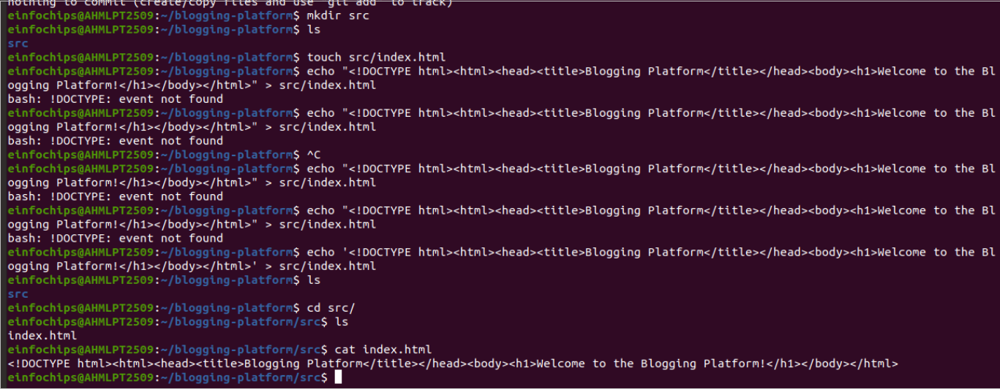

Commit and push the initial project structure:

git add .

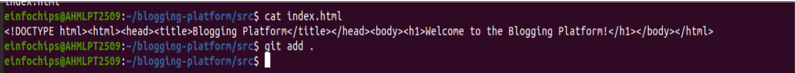

git commit -m "Initial commit: Added project structure and index.html"

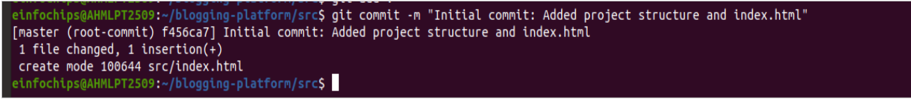

git push origin main

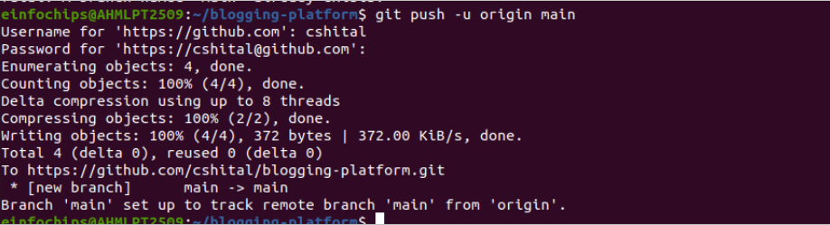


## Exercise 1: Branching and Adding Features (20 minutes):
Create a New Branch for Blog Post Feature:

git checkout -b feature/add-blog-post

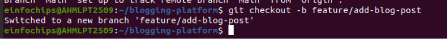

3. Add a Blog Post Page:
Create blog.html:

```
touch src/blog.html
echo "<!DOCTYPE html><html><head><title>Blog Post</title></head><body><h1>My First Blog Post</h1></body></html>" > src/blog.html
```

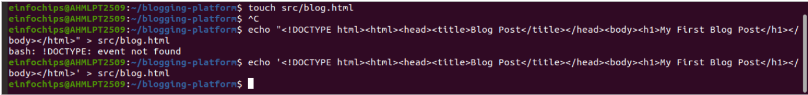

Commit and push changes:

git add src/blog.html

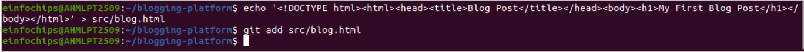

git commit -m "Added blog post page"

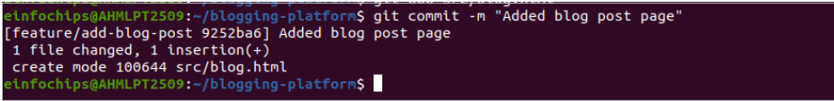

git push origin feature/add-blog-post

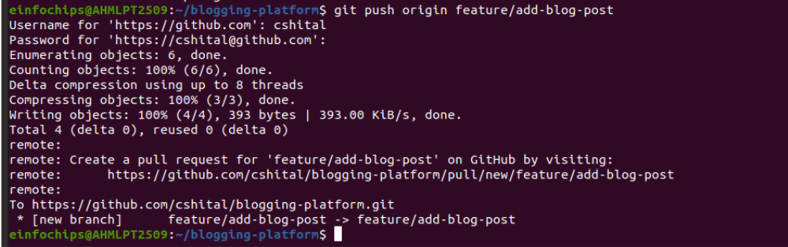


## Exercise 2: Collaborating with Merging and Handling Merge Conflicts (25 minutes)
Create Another Branch for Author Info:

git checkout main

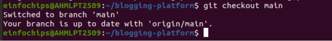

git checkout -b feature/add-author-info

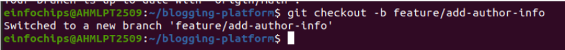

    4. Add Author Info to Blog Page:

Modify blog.html:

echo "<p>Author: John Doe</p>" >> src/blog.html

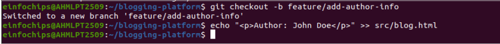

Commit and push changes:

git add src/blog.html

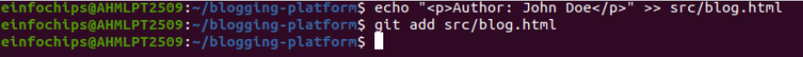

git commit -m "Added author info to blog post"

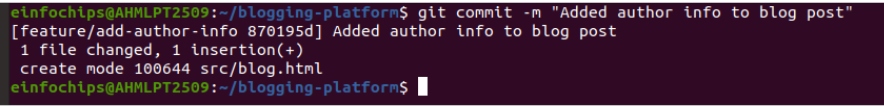

git push origin feature/add-author-info

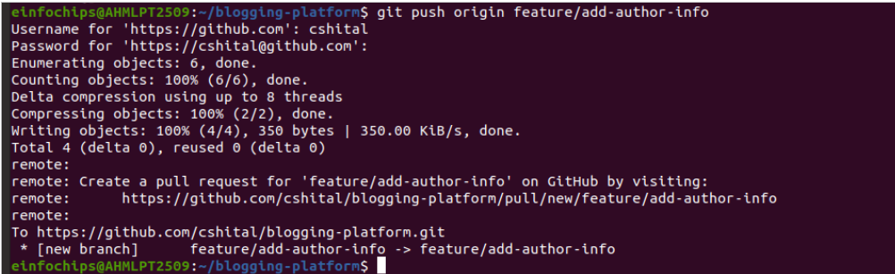

    5. Create a Merge Conflict:
Modify blog.html on the feature/add-blog-post branch:

git checkout feature/add-blog-post

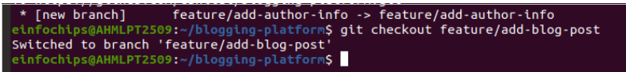

echo "<p>Published on: July 10, 2024</p>" >> src/blog.html


git add src/blog.html

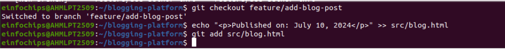

git commit -m "Added publish date to blog post"


git push origin feature/add-blog-post

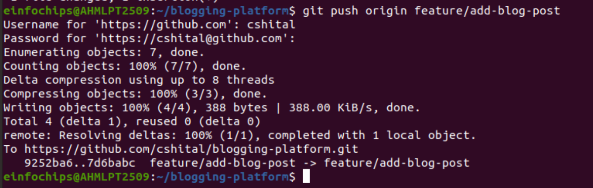

    6. Merge and Resolve Conflict:
Attempt to merge feature/add-blog-post into main:

git checkout main
git merge feature/add-blog-post

Resolve the conflict in src/blog.html, then:

git add src/blog.html
git commit -m "Resolved merge conflict in blog post"
git push origin main


# Exercise 3: Rebasing and Feature Enhancement (25 minutes)
    7. Rebase a Branch for Comment Feature:
Rebase feature/add-author-info onto main:

git checkout feature/add-author-info
git rebase main
    • Resolve any conflicts that arise during rebase.

    8. Add Comment Section:
Modify blog.html to add a comment section:

echo "<h2>Comments</h2><p>No comments yet.</p>" >> src/blog.html
git add src/blog.html
git commit -m "Added comment section"
git push origin feature/add-author-info

# Exercise 4: Pulling and Simulating Collaboration (20 minutes)
    9. Pull Changes from Remote:
Ensure the main branch is up-to-date:

git checkout main
git pull origin main
    • 
    10. Simulate a Collaborator's Change:
        ◦ Make a change on GitHub directly (e.g., edit blog.html to add a new comment).
    11. Pull Collaborator's Changes:
Pull the changes made by the collaborator:

git pull origin main

# Exercise 5: Versioning and Rollback (30 minutes)
    12. Tagging a Version:
Tag the current commit as v1.0:

git tag -a v1.0 -m "Version 1.0: Initial release"
git push origin v1.0
    • 
    13. Make a Change that Needs Reversion:
Modify blog.html:

echo "<p>Incorrect comment</p>" >> src/blog.html
git add src/blog.html
git commit -m "Incorrect comment update"
git push origin main

    14. Revert to a Previous Version:
Use git revert to undo the last commit:

git revert HEAD
git push origin main

Alternatively, reset to a specific commit (use with caution):

git reset --hard v1.0
git push -f origin main