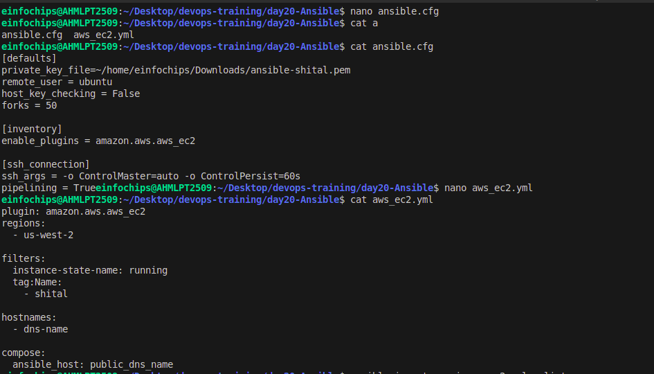

# Day 20 Task

## 1. Inventory Plugins

**• Activity:** Configure a dynamic inventory plugin to manage a growing number of web servers dynamically. Integrate the plugin with Ansible to automatically detect and configure servers in various environments.

**• Deliverable:**  Dynamic inventory configuration file or script, demonstrating the ability to automatically update the inventory based on real-time server data.

**ansible.cfg**
```
[defaults]
inventory = /home/einfochips/Desktop/devops-training/day20-Ansible/inventory.ini
private_key_file = /home/einfochips/Downloads/ansible-shital.pem
remote_user = ubuntu
host_key_checking = False
forks = 50
```

**aws_ec2.yml**
```
plugin: amazon.aws.aws_ec2
regions:
  - us-west-2
 
filters:
  instance-state-name: running
  tag:Name:
    - shital
 
hostnames:
  - dns-name
 
compose:
  ansible_host: public_dns_name
```

#### Commands:
```
# to get detailed information about running instances
ansible-inventory -i aws_ec2.yml --list
```

```
 
ansible-inventory -i aws_ec2.yml --graph
```


## 2. Performance Tuning

**• Activity:** Tune Ansible performance by adjusting settings such as parallel execution (forks), optimizing playbook tasks, and reducing playbook run time.

**• Deliverable:** Optimized ansible.cfg configuration file, performance benchmarks, and documentation detailing changes made for performance improvement.

```
[defaults]
forks = 50
 
[ssh_connection]
ssh_args = -o ControlMaster=auto -o ControlPersist=60s
pipelining = True
```


## 3. Debugging and Troubleshooting Playbooks

**• Activity:** Implement debugging strategies to identify and resolve issues in playbooks, including setting up verbose output and advanced error handling.

**• Deliverable:** Debugged playbooks with enhanced error handling and logging, including a troubleshooting guide with common issues and solutions.

#### Commands:

```
# -v -> task result
ansible-playbook -i inventory.ini docker-playbook.yml -v
 
# -vv -> task input and output
ansible-playbook -i inventory.ini docker-playbook.yml -vv
 
# -vvv -> task execution
ansible-playbook -i inventory.ini docker-playbook.yml -vvv
 
# -vvvv -> ansible internal details
ansible-playbook -i inventory.ini docker-playbook.yml -vvvv
```
