# Day 22 Task

# Prometheus Monitoring Setup and Configuration

## 1. Configuring Jobs and Targets

**Task:** Set up a Prometheus server to monitor multiple services running on different nodes.

**Deliverables:**
- Configure Prometheus with jobs for monitoring different services like web servers, databases, and system metrics.

**Configuration File: `prometheus.yml`**

```yaml
# Load rules once and periodically evaluate them according to the global 'evaluation_interval'.
rule_files:
  # - "first_rules.yml"
  # - "second_rules.yml"
  - "alert_rules.yml"

# A scrape configuration containing exactly one endpoint to scrape:
# Here it's Prometheus itself.
scrape_configs:
  # The job name is added as a label `job=<job_name>` to any timeseries scraped from this config.
  - job_name: "prometheus"
    # metrics_path defaults to '/metrics'
    # scheme defaults to 'http'.
    static_configs:
      - targets: ["localhost:9090"]

  - job_name: 'node_exporter'
    static_configs:
      - targets: ['13.235.78.105:9100']

  # Webserver target setup
  - job_name: "nginx"
    static_configs:
      - targets: ["13.235.78.105:80"]

  # Database target setup
  - job_name: "mysql"
    static_configs:
      - targets: ["13.235.78.105:9104"]

  # System metrics setup
  - job_name: "system_metrics"
    static_configs:
      - targets: ["13.235.78.105:9100"]
```
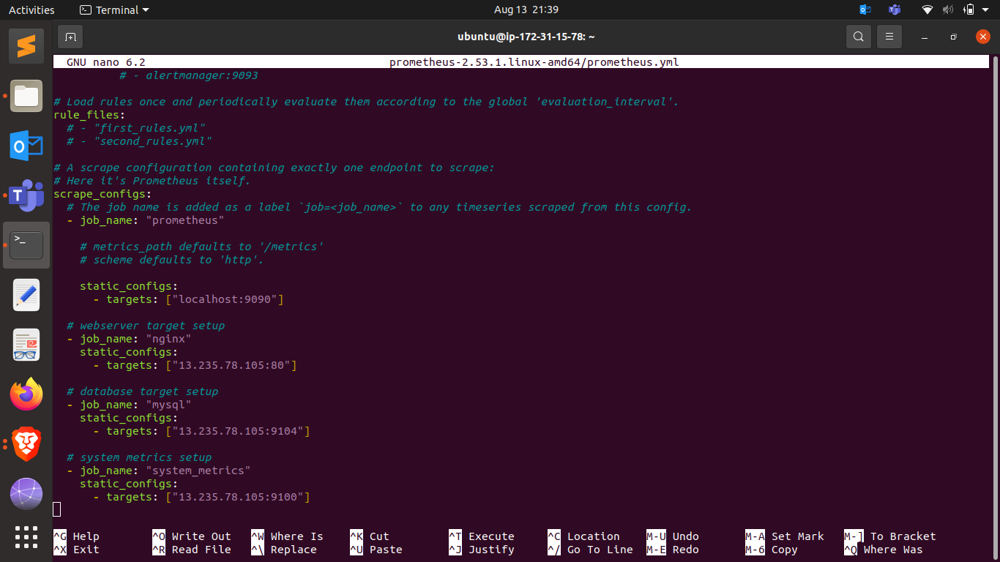

## 2. Using Exporters (Node Exporter)

### Task
Use Node Exporter to monitor system-level metrics like CPU, memory, disk usage, and network statistics.

### Deliverables

- **Install and Configure Node Exporter on All Nodes:**

  Follow these steps to install and configure Node Exporter:

  1. **Download Node Exporter:**
     ```bash
     wget https://github.com/prometheus/node_exporter/releases/download/v1.4.0/node_exporter-1.4.0.linux-amd64.tar.gz
     ```

  2. **Extract the Archive:**
     ```bash
     tar xvfz node_exporter-1.4.0.linux-amd64.tar.gz
     ```

  3. **Move the Binary to /usr/local/bin:**
     ```bash
     sudo mv node_exporter-1.4.0.linux-amd64/node_exporter /usr/local/bin
     ```

  4. **Create a Systemd Service File:**
     ```bash
     sudo tee /etc/systemd/system/node_exporter.service <<EOF
     [Unit]
     Description=Node Exporter
     After=network.target

     [Service]
     User=node_exporter
     Group=node_exporter
     ExecStart=/usr/local/bin/node_exporter

     [Install]
     WantedBy=default.target
     EOF
     ```

  5. **Create a Node Exporter User:**
     ```bash
     sudo useradd -rs /bin/false node_exporter
     ```

  6. **Start and Enable Node Exporter Service:**
     ```bash
     sudo systemctl daemon-reload
     sudo systemctl start node_exporter
     sudo systemctl enable node_exporter
     ```

- **Ensure Node Exporter Metrics are Being Correctly Scraped by Prometheus:**

  1. Verify that Node Exporter is running by accessing the metrics endpoint:
     ```
     http://<node-ip>:9100/metrics
     ```

  2. Check Prometheus targets to ensure Node Exporter endpoints are being scraped:
     - Open Prometheus UI: `http://<prometheus-ip>:9090/targets`
     - Verify that Node Exporter targets show as "UP".

  3. Optionally, create a basic dashboard in Prometheus or use built-in graphing tools to confirm that metrics are being collected.

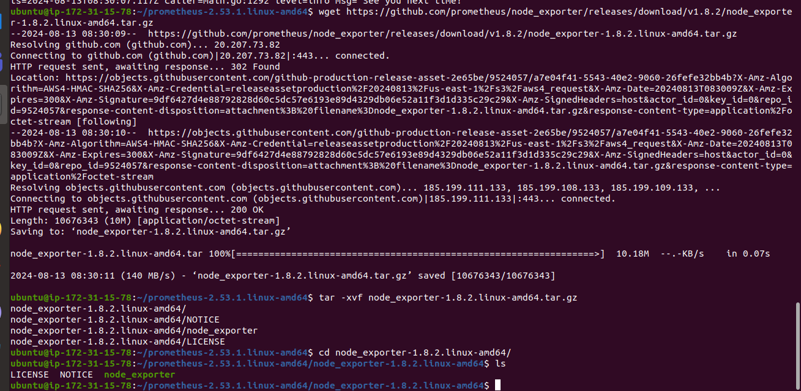

## 3. Hands-on Exercise: Setting Up Exporters

**Task:** Configure at least two different types of exporters (e.g., Node Exporter and MySQL Exporter) and integrate them with Prometheus.

**Deliverables:**
- Demonstrate successful data collection from both exporters.
- Create a basic Prometheus dashboard to visualize key metrics from these exporters.

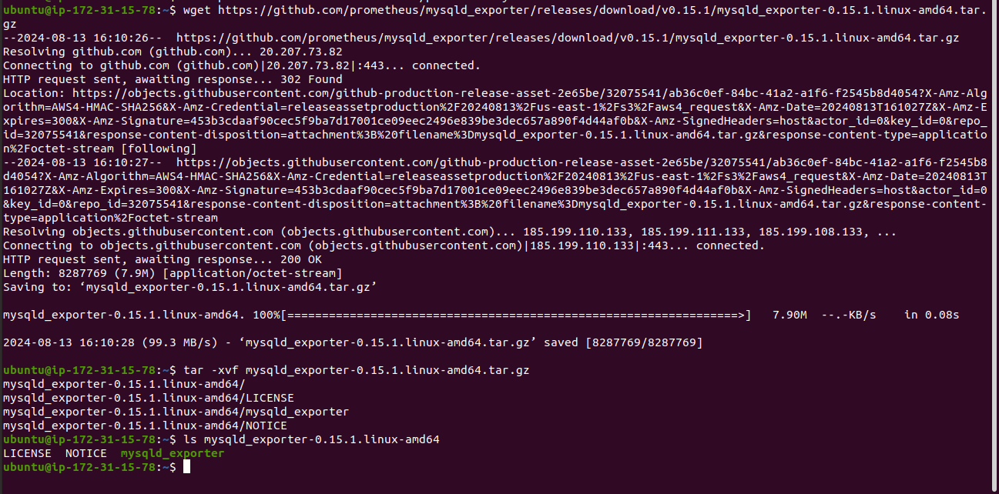

## 4. Introduction to PromQL

**Task:** Learn and implement basic PromQL queries to extract meaningful data from the metrics collected.

**Deliverables:**
- Write basic queries to retrieve metrics such as average CPU usage, memory consumption, and disk I/O over time.

- **Graph of Average CPU Usage:**

```
avg(rate(node_cpu_seconds_total{mode="user"}[5m])) by (instance)
```
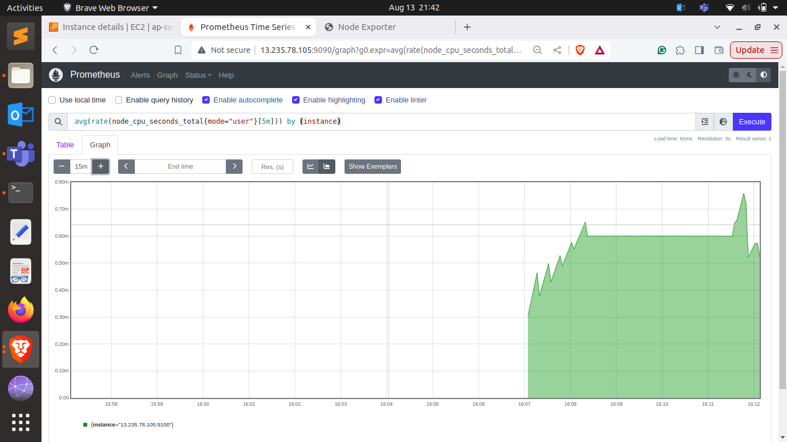

- **Graph of Memory Consumption:**

```
    node_memory_MemAvailable_bytes / node_memory_MemTotal_bytes * 100
```
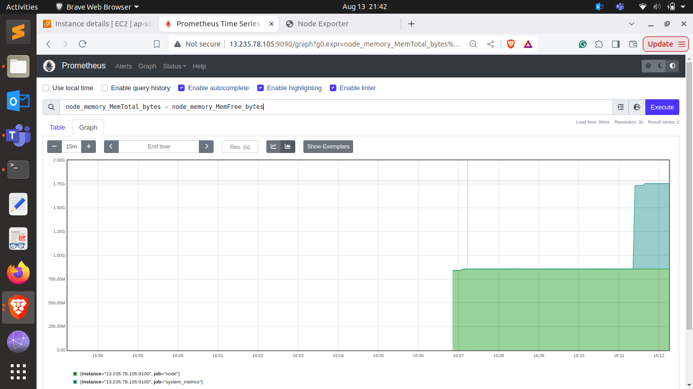

- **Graph of Disk I/O Over Time:**

```
    rate(node_disk_io_time_seconds_total[5m])
```
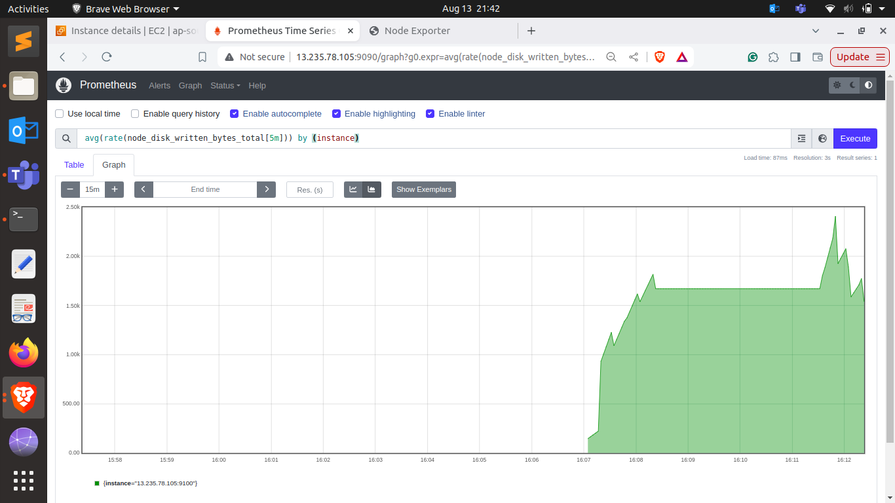

## 5. Basic Queries (Selectors, Functions, Operators)

**Task:** Create PromQL queries using selectors, functions, and operators to filter and manipulate time-series data.

**Deliverables:**
- Write PromQL queries to calculate the 95th percentile of CPU usage.
- Use functions like `rate()`, `increase()`, and `histogram_quantile()` to perform more complex analysis.


## 6. Advanced Queries and Aggregations

### Task
Perform advanced data aggregation using PromQL.

### Deliverables
- Write queries to calculate the total memory usage across all nodes.
- Aggregate data to find the maximum disk space usage among all nodes.

- **Graph of Total Memory Usage Across All Nodes:**

    ```
    sum(node_memory_MemTotal_bytes - node_memory_MemFree_bytes)
    ```

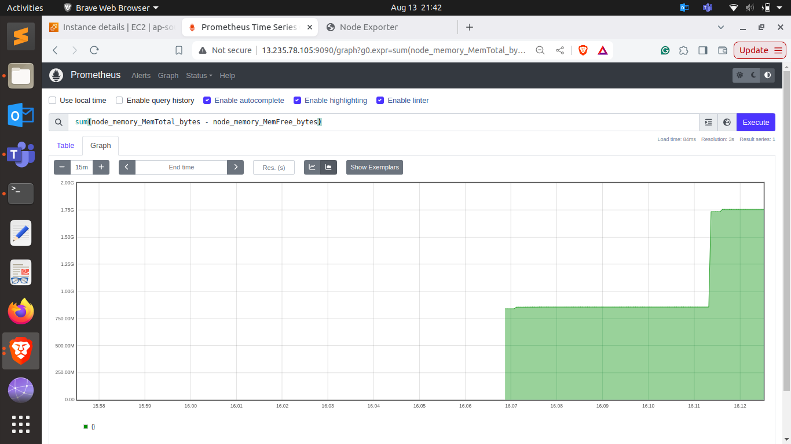

- **Graph of Maximum Disk Space Usage Among All Nodes:**

    ```
    max(node_filesystem_size_bytes - node_filesystem_free_bytes)
    ```

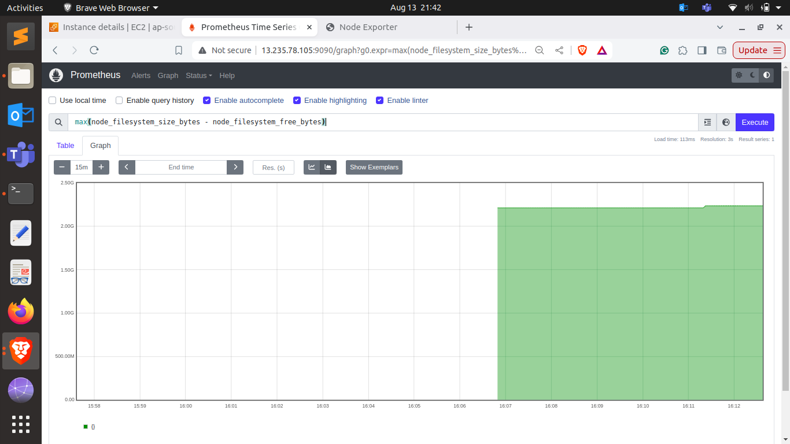

## 7. Configuring Alertmanager

### Task
Set up Alertmanager to handle alerts generated by Prometheus.

### Deliverables
- Configure Alertmanager with Prometheus.
- Create routing rules to manage alert notifications based on severity and service type.

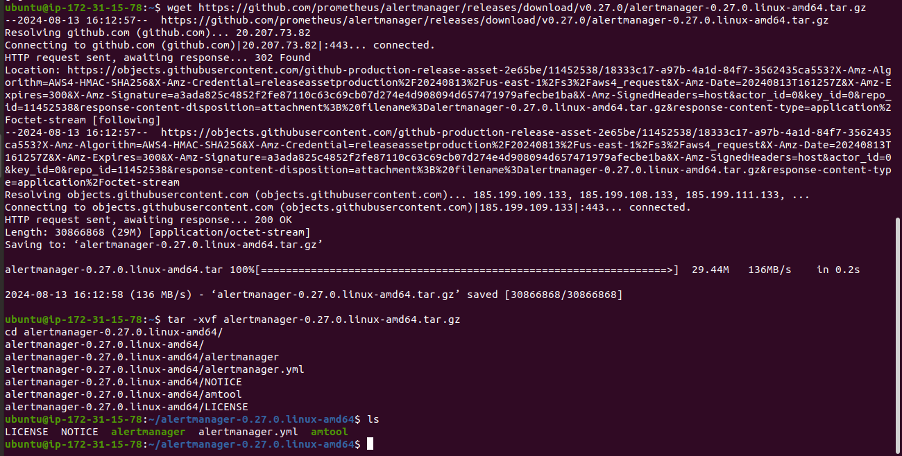

## 8. Writing Alerting Rules

### Task
Create and manage alerting rules in Prometheus to monitor important metrics and notify when thresholds are breached.

### Deliverables
- Define alerting rules for critical metrics such as high CPU usage, low memory availability, and high disk usage.
- Test and validate the alerting rules to ensure proper notifications.

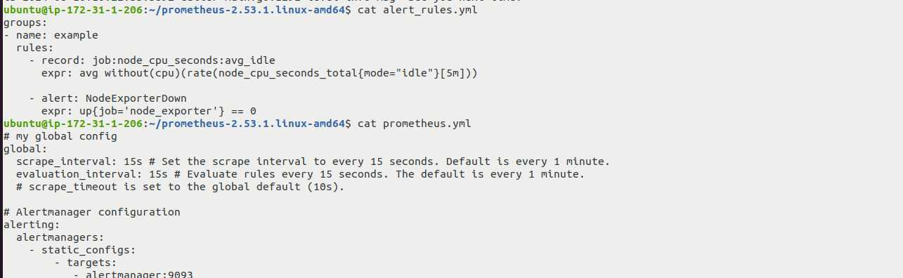


## 9. Setting Up Notification Channels (Email, Slack, etc.)

## Task
Integrate Alertmanager with multiple notification channels and Slack.

### Deliverables
    Set up Email notifications for critical alerts.
    Integrate Slack for real-time alerts and notifications.

### Creating Prometheus Channel on Slack Adding Incoming webhooks

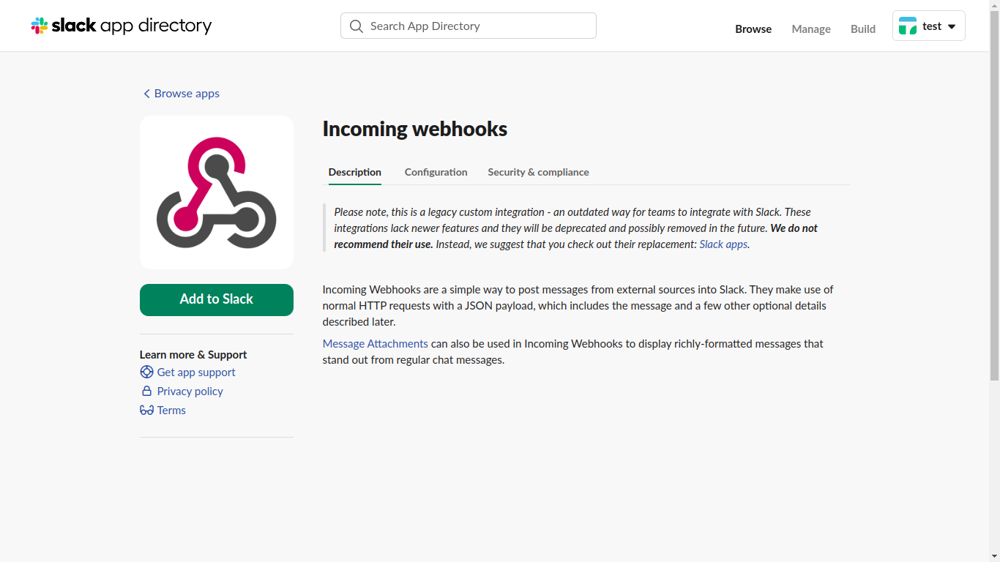
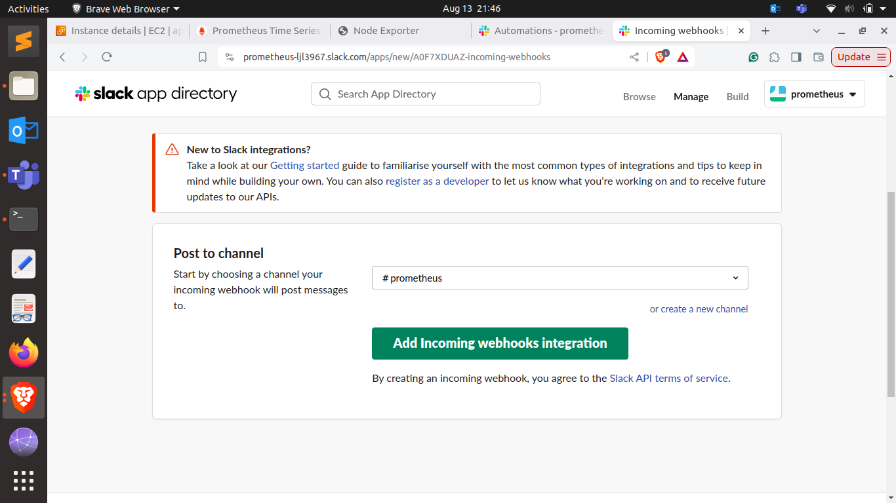

**Setting up `alertmanager.yml`**

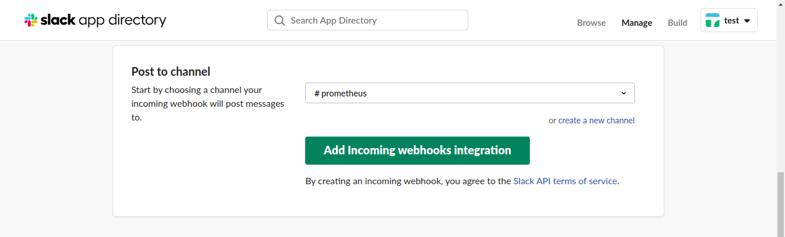
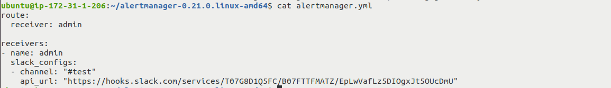

## 10. Hands-on Exercise: Creating Alerts

 ## Task
 Test the entire alerting pipeline by creating and triggering custom alerts.

 ### Deliverables
    Simulate a scenario where a node exceeds 90% CPU usage and ensure alerts are triggered and sent to both Email and Slack.
    Validate the alerts in both notification channels.
 **Alert recieved on Alert Manager and forwarder to slack**

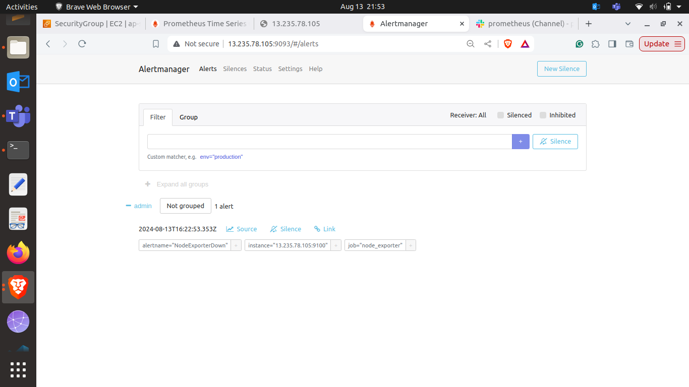

**Alert shown in slack on prometheus channel**

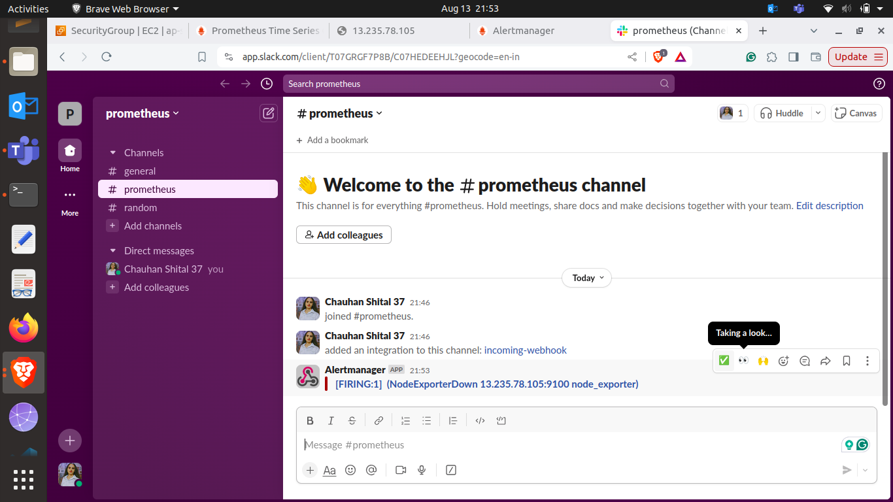
