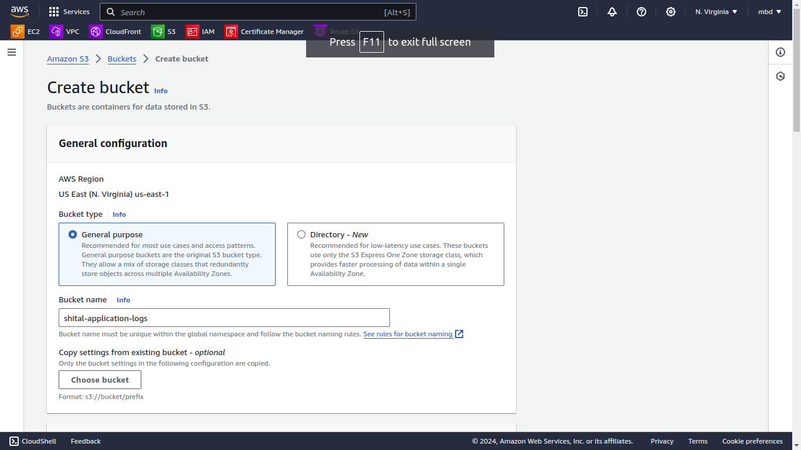
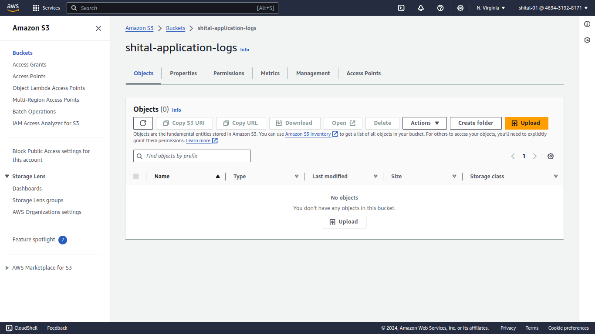
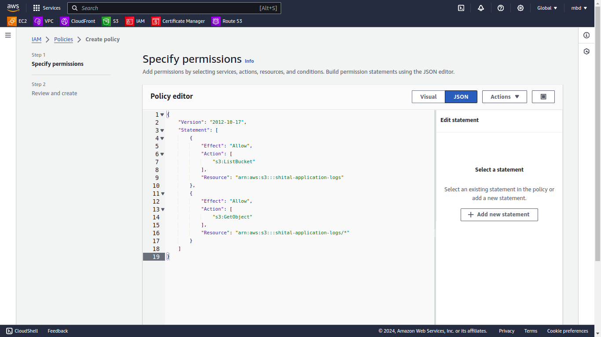
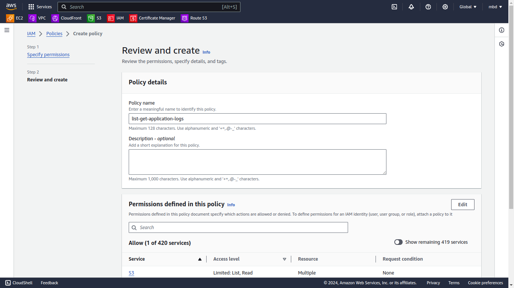
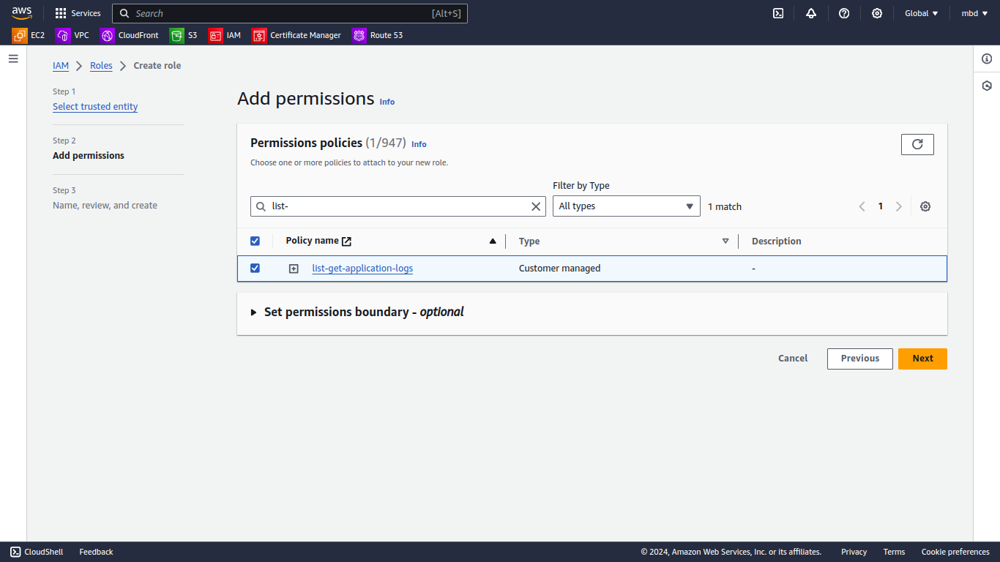
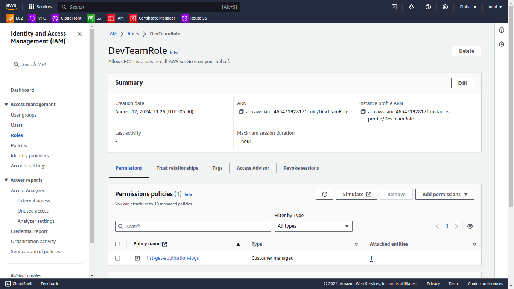

# Day 23 Task: Implementing a Custom IAM Policy for S3 Access

## Objective
Participants will create a custom AWS IAM policy that allows access to a designated S3 bucket only for a particular IAM role, without including conditions. They will then estimate the cost for deploying a multi-tier architecture solution using AWS Pricing Calculator.

## Part 1: Implementing a Custom IAM Policy for S3 Access

### Scenario
In this scenario, a development team needs access to an S3 bucket containing logs generated by an application. Only a specific IAM role, `DevTeamRole`, should have permission to list and read objects in this bucket, while no other actions should be allowed. Participants will implement this policy to meet this requirement.

### Steps

#### 1. Understand the Requirements
- Review the scenario where only the `DevTeamRole` is allowed to access the S3 bucket named `shital-application-logs`.
- The policy should only permit `s3:ListBucket` and `s3:GetObject` actions on this bucket.

#### 2. Create the S3 Bucket
- **Bucket Name**: `shital-application-logs`






#### 3. Create a New IAM Policy
- Navigate to the IAM console and create a new custom policy.
- Define the policy to allow `s3:ListBucket` and `s3:GetObject` actions.
- Specify the ARN of the `shital-application-logs` bucket and any specific objects within the bucket as resources.

- **IAM Policy JSON**:

    ```json
    {
        "Version": "2012-10-17",
        "Statement": [
            {
                "Effect": "Allow",
                "Action": [
                    "s3:ListBucket"
                ],
                "Resource": "arn:aws:s3:::shital-application-logs"
            },
            {
                "Effect": "Allow",
                "Action": [
                    "s3:GetObject"
                ],
                "Resource": "arn:aws:s3:::shital-application-logs/*"
            }
        ]
    }
    ```




#### 4. Attach the Policy to the IAM Role
- Attach the custom policy to the `DevTeamRole` role.
- Ensure that no other users or roles are granted access to this bucket by this policy.

- **Actions Taken**:
  - Created a new IAM Role `DevTeamRole`.
  - Attached the policy to the `DevTeamRole`.

  
  


#### 5. Test the Policy
- Attempt to access the S3 bucket using the `DevTeamRole` to ensure only the allowed actions (list and read) are permitted.
- Document the results of the test, ensuring that actions outside of the allowed scope (e.g., delete, write) are correctly denied.

### **Able to list and read the S3 Bucket**
- **Able to list** the S3 bucket.
- **Able to read** objects from the S3 bucket.


### **Unable to delete and write to the S3 Bucket**
- **Unable to delete** objects from the S3 bucket.
- **Unable to write** objects to the S3 bucket.

