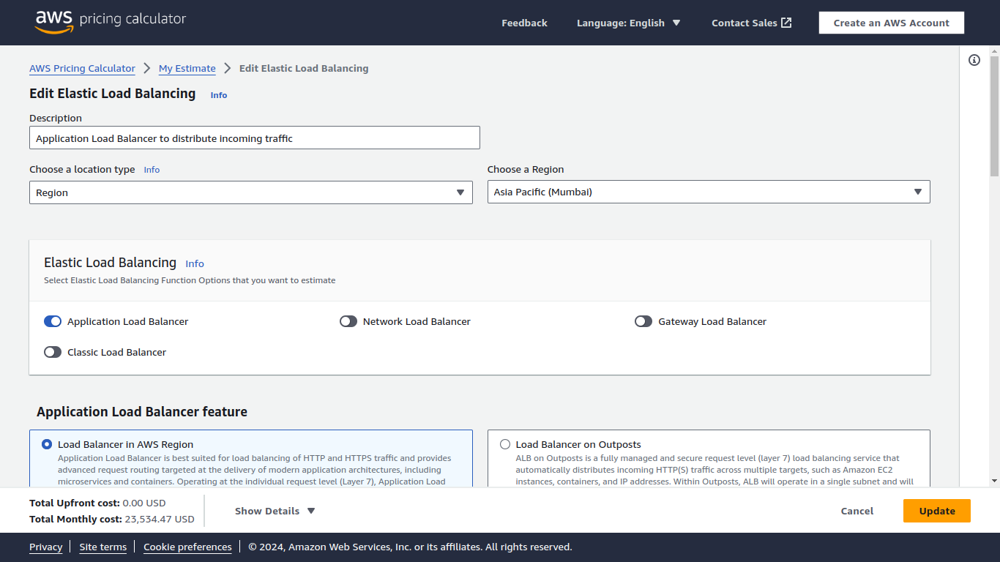
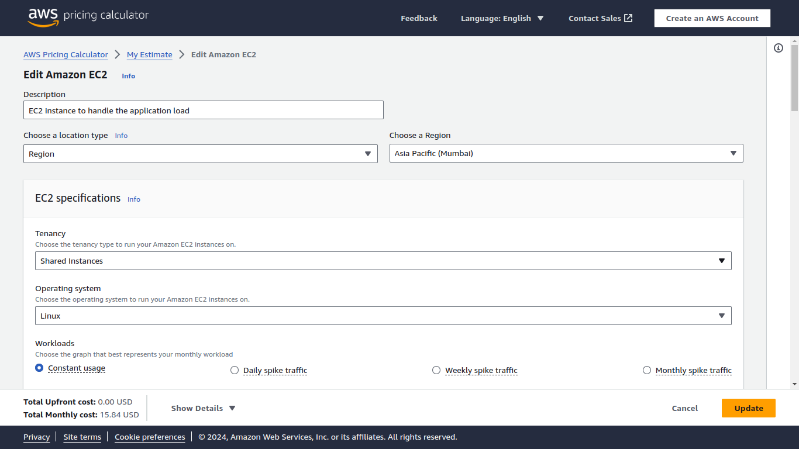
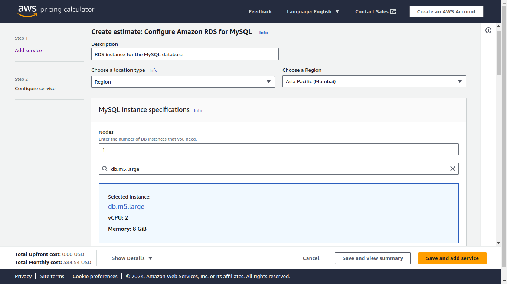
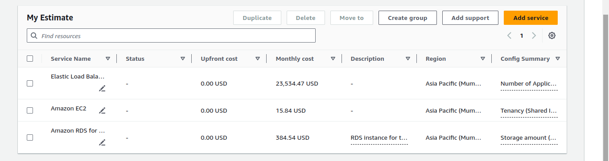

# Part 2: Estimating a Multi-Tier Architecture Solution on AWS

This document outlines the steps to design and estimate the cost of a scalable web application on AWS. The solution includes a load balancer, a set of EC2 instances for the application tier, and an RDS database for the data tier. The architecture is designed to support a user base of up to 100,000 concurrent users.

## Steps

### 1. Define the Architecture

To design the architecture, follow these steps:

- **Identify the components required:**
  - An **Application Load Balancer** to distribute incoming traffic.
  - **EC2 instances** for the application servers.
  - An **RDS instance** for the database.

- **Consider the expected traffic:**
  - Choose appropriate **EC2 instance types** based on the anticipated application load (e.g., `t3.medium`).
  - Select **RDS configurations** that align with the database's performance and storage requirements (e.g., `db.m5.large`).

### 2. Select AWS Services

Based on the architecture requirements, choose the following AWS services:

- **Application Load Balancer (ALB):** To efficiently distribute incoming traffic across multiple application servers.
- **EC2 Instances:** Select instance types like `t3.medium` that can handle the expected load of the application.
- **RDS Instance:** Choose an instance type such as `db.m5.large` to support the database needs.

### 3. Estimate Costs Using AWS Pricing Calculator

To estimate the costs of the architecture, use the AWS Pricing Calculator:

1. **Navigate to the AWS Pricing Calculator:** Open the AWS Pricing Calculator on your web browser.
2. **Add the Application Load Balancer:** Configure the ALB by adding it to your estimate and specifying the expected traffic and data transfer rates.
3. **Add EC2 Instances:** 
   - Select the appropriate EC2 instance types and quantity.
   - Configure storage, data transfer, and other relevant specifications based on the application's requirements.
4. **Add an RDS Instance:** 
   - Choose the appropriate RDS instance type (e.g., `db.m5.large`).
   - Specify storage capacity, backup retention, and any additional settings required.
5. **Configure Each Service:** Ensure all services are configured to handle the expected load and meet the necessary specifications.
6. **View the Cost Estimate:** Review the total estimated monthly cost for all services.

### 4. Document and Analyze the Estimate

After creating the estimate, perform the following steps:

- **Review the Total Estimated Monthly Cost:** Analyze the total cost to ensure it aligns with the budget and requirements.
- **Identify Cost-Saving Measures:**
  - Consider using **Reserved Instances** to save costs on EC2 and RDS instances.
  - Implement **Auto Scaling** to adjust the number of EC2 instances based on demand, optimizing resource usage and reducing costs during low-traffic periods.

### 5. Prepare a Report

To finalize the task, compile a comprehensive report that includes:

- **Architecture Design:** Provide an overview of the architecture, detailing each component and its role.
- **Cost Estimate:** Present a detailed breakdown of the estimated costs for the Application Load Balancer, EC2 instances, and RDS instance.
- **Recommendations:** Offer suggestions on maintaining performance while optimizing costs, such as scaling strategies and potential savings with reserved instances.
- **Scalability Considerations:** Discuss the scalability of the architecture, ensuring it can accommodate future growth and evolving application needs.

## Output:

### **Application Load Balancer:** 
Configured to distribute traffic across multiple EC2 instances.

### **EC2 Instances for Application Servers:** 
Selected to handle the anticipated application load effectively.

### **RDS Instance for the Database:** 
Configured to provide a scalable and reliable database solution.

### **Final Budget:**
Estimated using the AWS Pricing Calculator with potential cost optimizations identified.

By following these steps, you can design a scalable and cost-effective web application architecture on AWS that meets both performance and budget requirements.
