# S3 Bucket Configuration and Management Project

## Project Overview

This project involves creating and configuring an Amazon S3 bucket to host a static website, implementing storage classes and lifecycle management, configuring bucket policies and ACLs, and validating the configuration. The goal is to ensure the static website is properly hosted, efficiently managed, and securely accessible.

## Project Steps and Deliverables

### 1. Create and Configure an S3 Bucket

#### 1.1 Create an S3 Bucket
- **Bucket Name**: `shital-portfolio`
- **Steps**:
  - a. Log in to the AWS Management Console.
  - b. Navigate to the S3 service.
  - c. Click “Create bucket.”
  - d. Enter the bucket name and choose a region.
  - e. Click “Create bucket.”

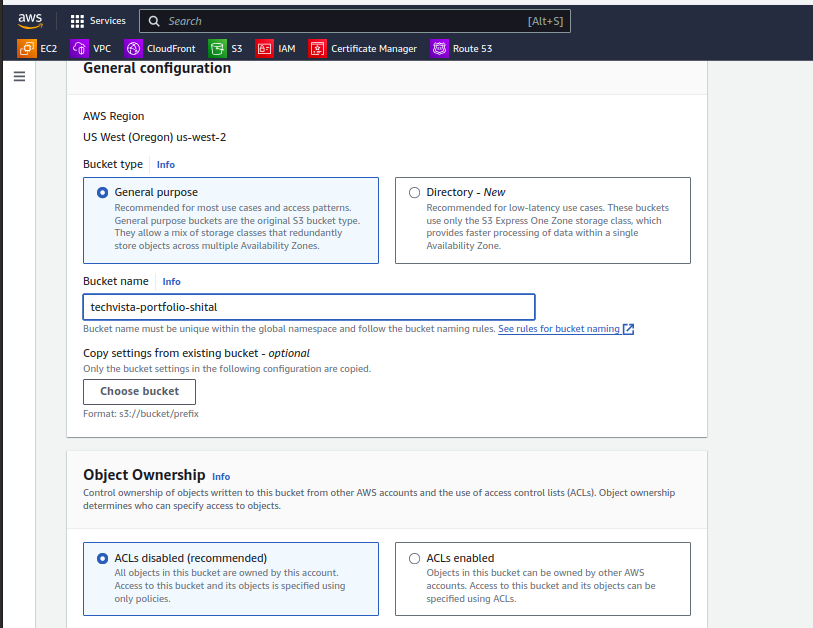

#### 1.2 Enable Versioning
- Navigate to the bucket properties.
- Enable versioning to keep track of object versions.

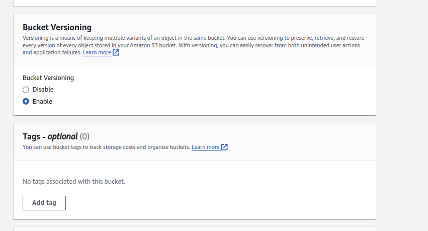


#### 1.3 Set Up Static Website Hosting
- In the bucket properties, enable static website hosting.
- Specify `index.html` as the index document.

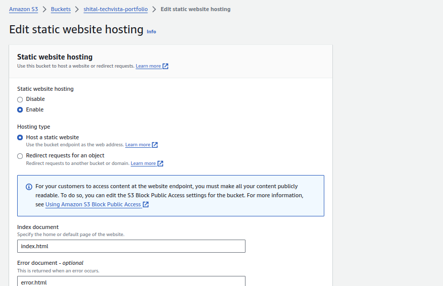

#### 1.4 Upload Static Website Files
- Upload HTML, CSS, and image files to the bucket.

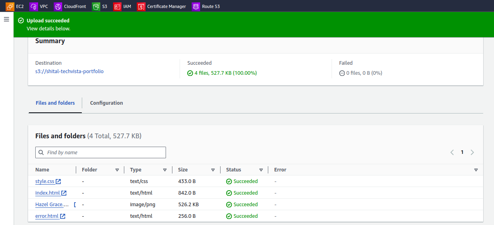


#### 1.5 Ensure Website Accessibility
- Verify the website is accessible using the S3 static website URL.
  - **URL**: [http://shital-portfolio.s3-website-us-west-2.amazonaws.com/](http://shital-portfolio.s3-website-us-west-2.amazonaws.com/)

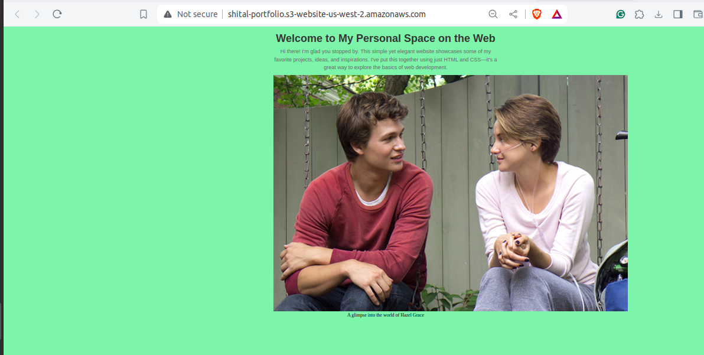


### 2. Implement S3 Storage Classes

#### 2.1 Classify Content
- **HTML/CSS Files**: Use STANDARD storage class.
- **Images**: Use STANDARD, INTELLIGENT-TIERING, or GLACIER based on access frequency.

#### 2.2 Change Storage Class
- Navigate to the “Objects” tab.
- Select files and change their storage class as needed.

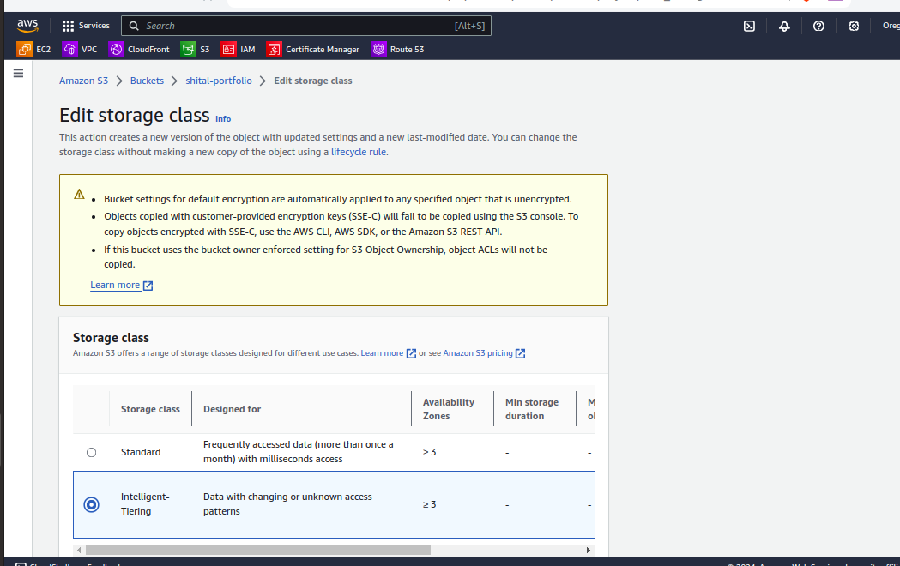

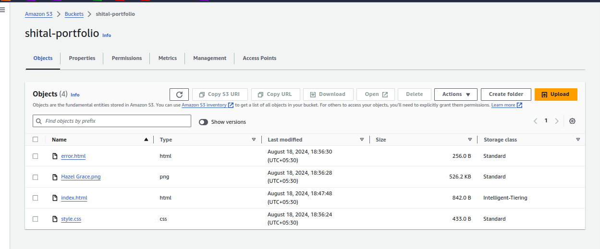


#### 2.3 Justification for Storage Class Choices
- I have set the HTML and CSS pages to the STANDARD storage class since they will be accessed regularly whenever a user visits the website.
- For images, I have used the INTELLIGENT-TIERING storage class since they are meant to be updated regularly and display new features.

### 3. Lifecycle Management

#### 3.1 Create Lifecycle Policy
- Transition older versions of objects to GLACIER after a specified period.
- Set up a policy to delete non-current versions after 60 days.

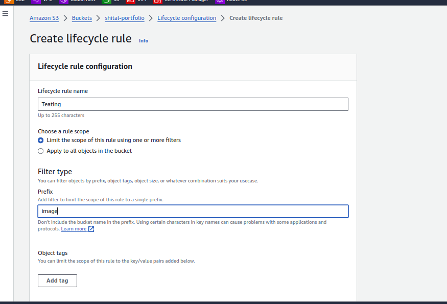


- Set up a policy to delete non-current versions of objects after 90 days.

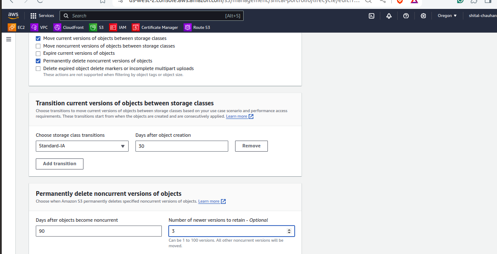

- Verify that the lifecycle rules are correctly applied.

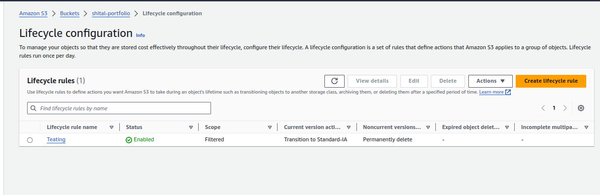


### 4. Configure Bucket Policies and ACLs

#### 4.1 Create Bucket Policy
- Create and attach a bucket policy that allows read access to everyone for the static website content.

```json
{
  "Version": "2012-10-17",
  "Statement": [
    {
      "Effect": "Allow",
      "Principal": "*",
      "Action": "s3:GetObject",
      "Resource": "arn:aws:s3:::shital-portfolio/*"
    }
  ]
}
```

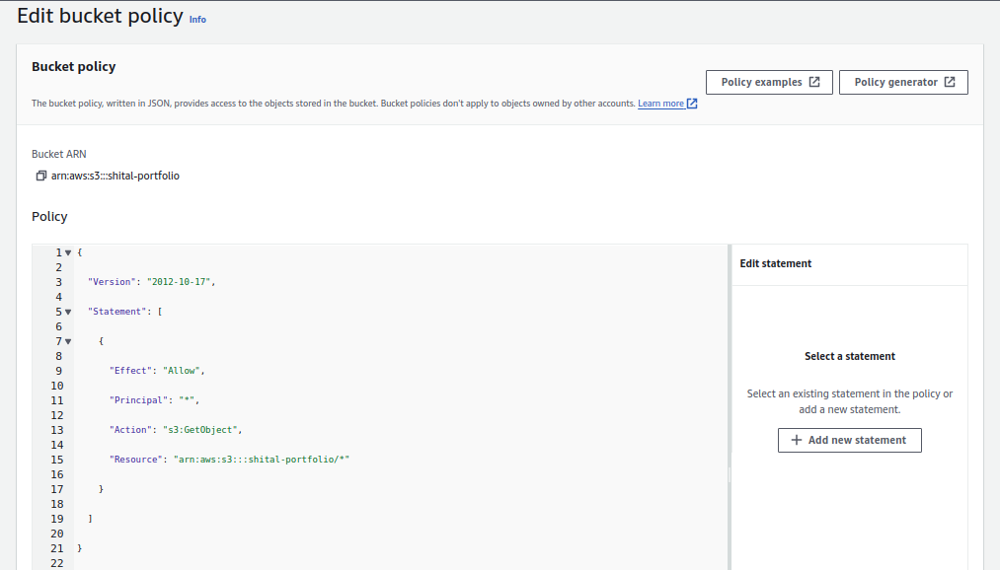

4.2 Set Up ACL
Configure ACLs to provide access to a specific folder for an external user.


#### 5. Test and Validate the Configuration
5.1 Test Static Website URL
Ensure the website is accessible via the S3 endpoint: http://shital-portfolio.s3-website-us-west-2.amazonaws.com/

5.2 Validate Storage Class Transitions
Confirm objects transition between storage classes based on lifecycle policies.

