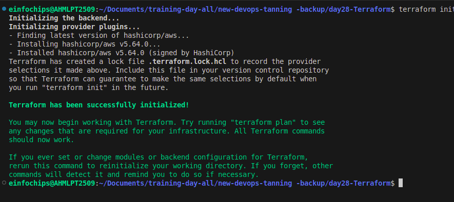
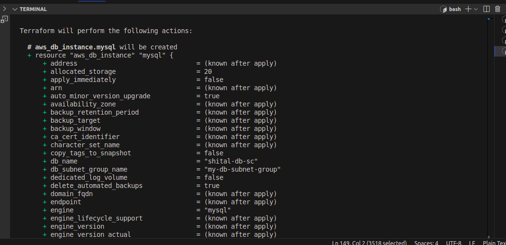
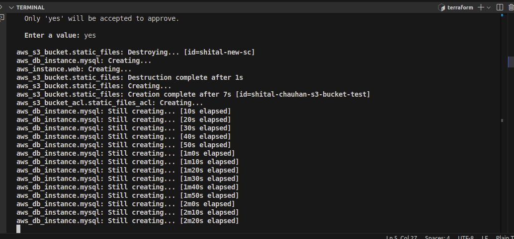
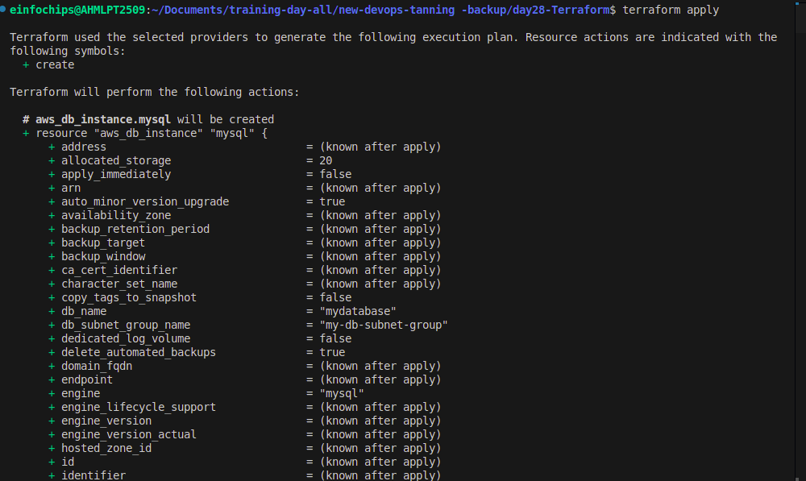
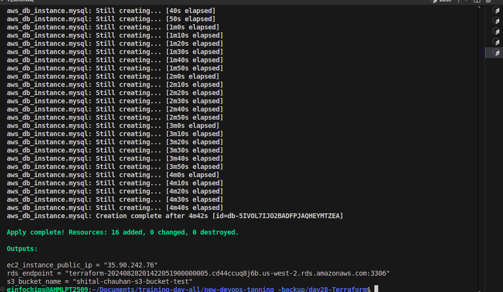
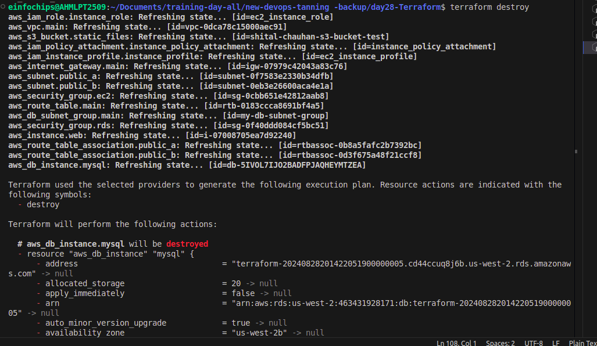
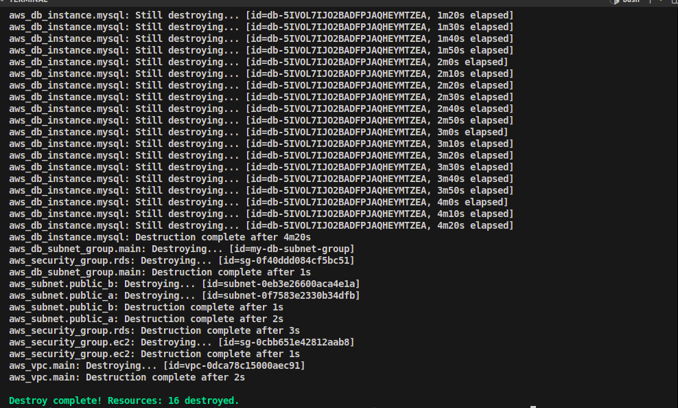

## 1. Setup Terraform Configuration

### Provider Configuration

**AWS Provider:** Configure the AWS provider to specify the region for deployment.

**Region Parameterization:** Ensure the region is parameterized using a Terraform variable for flexibility.

`provider.tf`

```
provider "aws" {
  region = var.region
}
```
## VPC and Security Groups

- **VPC Creation:** Create a Virtual Private Cloud (VPC) with a public subnet for the EC2 instance.

- **Security Groups:** Define security groups to:
   - Allow HTTP (port 80) and SSH (port 22) access to the EC2 instance.
   - Allow MySQL (port 3306) access to the RDS instance from the EC2 instance.

```
resource "aws_security_group" "ec2" {
  vpc_id = aws_vpc.main.id

  egress {
    from_port   = 0
    to_port     = 0
    protocol    = "-1"
    cidr_blocks = ["0.0.0.0/0"]
  }

  ingress {
    from_port   = 22
    to_port     = 22
    protocol    = "tcp"
    cidr_blocks = ["0.0.0.0/0"]
  }

  ingress {
    from_port   = 80
    to_port     = 80
    protocol    = "tcp"
    cidr_blocks = ["0.0.0.0/0"]
  }
}
```
## EC2 Instance

- **Instance Type:** Define an EC2 instance using the t2.micro instance type.
- **Configuration:** Configure the instance to allow SSH and HTTP access.
- **Variables:** Use Terraform variables to define instance parameters like AMI ID and instance type.

```
resource "aws_instance" "web" {
  ami                  = var.ami_id
  instance_type        = var.instance_type
  subnet_id            = aws_subnet.public_a.id
  vpc_security_group_ids = [aws_security_group.ec2.id]  
  iam_instance_profile = aws_iam_instance_profile.instance_profile.name
  key_name             = "terraform"

  tags = {
    Name = "web-instance"
  }
}
```
## RDS MySQL DB Instance

- **Instance Type:** Create a `t3.micro` MySQL DB instance within the same VPC.
- **Parameters:** Use Terraform variables to define database parameters such as DB name, username, and password.
- **Accessibility:** Ensure the DB instance is publicly accessible and configure security groups to allow access from the EC2 instance.

## S3 Bucket

- **Bucket Creation:** Create an S3 bucket for storing static files or configurations.

```
resource "aws_s3_bucket" "static_files" {
  bucket = var.bucket_name
}
```

- **IAM Role and Policy:** Allow the EC2 instance to access the S3 bucket by assigning the appropriate IAM role and policy.

```
resource "aws_iam_role" "instance_role" {
  name = "ec2_instance_role"

  assume_role_policy = jsonencode({
    Version = "2012-10-17"
    Statement = [
      {
        Effect = "Allow"
        Principal = {
          Service = "ec2.amazonaws.com"
        }
        Action = "sts:AssumeRole"
      },
    ]
  })
}
```
## Outputs

- **Terraform Outputs:** Define Terraform outputs to display:

    - The EC2 instance’s public IP address.
    - The RDS instance’s endpoint.
    - The S3 bucket name.

`Output.tf`

```
output "ec2_instance_public_ip" {
  value = aws_instance.web.public_ip
}

output "rds_endpoint" {
  value = aws_db_instance.mysql.endpoint
}

output "s3_bucket_name" {
  value = aws_s3_bucket.static_files.bucket
}
```
## 2. Apply and Manage Infrastructure

## Initial Deployment

**Initialize Configuration:** Run `terraform init` to initialize the Terraform configuration.



**2.Review Changes:** Use `terraform plan` to review the infrastructure changes before applying.




**3.Deploy Infrastructure:** Deploy the infrastructure using `terraform apply`. Ensure that the application server, database, and S3 bucket are set up correctly.




### 4. Resource Termination

**Destroy Resources** Once the deployment is complete and validated, run `terraform destroy` to tear down all resources created by Terraform.


