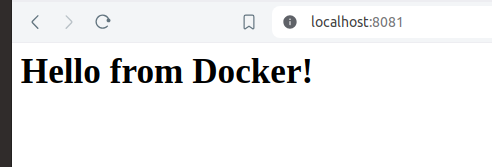

**Docker Project 01**

**Project Overview**

In this project, you\'ll go through all three lifecycles of Docker:
pulling an image and creating a container, modifying the container and
creating a new image, and finally, creating a Dockerfile to build and
deploy a web application.

**\# Part 1: Creating a Container from a Pulled Image:**

**Objective:** Pull the official Nginx image from Docker Hub and run it
as a container.

**Steps:**

**1. Pull the Nginx Image:**

docker pull nginx

-   pull the latest Nginx image from Docker Hub.

-   This command will download the latest Nginx image from the Docker
    Hub repository to your local machine.


-   After the image is downloaded, you can proceed to run the Nginx
    container.

**2. Run the Nginx Container:**

docker run \--name my-nginx -d -p 8080:80 nginx


-   \--name my-nginx: Assigns a name to the container.

-   -d: Runs the container in detached mode.

-   -p 8080:80: Maps port 8080 on your host to port 80 in the container.

-   Nginx : \<image-name\>

\- Start the container in detached mode, running Nginx in the
background.

**3. Verify the Container is Running:**\
\
docker ps

\- list all running containers:


**4. Visit the Nginx Welcome Page:**

**-** Visit <http://localhost:8080> in your browser. You should see the
Nginx welcome page.

\- indicating that the Nginx container is running successfully.


### **\# Part 2: Modifying the Container and Creating a New Image:**

-   **Objective:** Modify the running Nginx container to serve a custom
    HTML page and create a new image from this modified container.

**Steps:**

1.  **Access the Running Container:**

-   docker exec -it my-nginx /bin/bash

-   access your running container named my-nginx:

> 
-   is used to access a running Docker container and start a Bash shell
    within it.

-   **docker exec**: This is the Docker command used to run a command in
    a running container.

-   **-it**: This is a combination of two flags:

-   -i (interactive): Keeps STDIN open even if not attached.

-   -t (tty): Allocates a pseudo-TTY, which allows you to interact with
    the shell.

-   **my-nginx**: This is the name or ID of the running Docker container
    you want to access.

-   **/bin/bash**: This is the command that will be executed inside the
    container. In this case, it starts with a Bash shell, allowing you
    to interact with the container\'s filesystem and execute commands.

```{=html}
<!-- -->
```
-   docker exec: Execute a command in a running Docker container.

-   -it: Run the command in an interactive terminal session.

-   my-nginx: The name of the container where the command should be
    executed.

-   /bin/bash: Start a Bash shell inside the container.

```{=html}
<!-- -->
```
-   This allows you to interact with the container as if you were logged
    into a Linux system, making it easier to perform administrative
    tasks, debugging, and development.

**2. Create a Custom HTML Page:**

echo '\<html\>\<body\>\<h1\>Hello from Docker!
\</h1\>\</body\>\</html\>' \> /usr/share/nginx/html/index.html

echo \"\<html\>\<body\>\<h1\>Hello from Docker!
\</h1\>\</body\>\</html\>\" \> /usr/share/nginx/html/index.html


\- echo is used to output the string enclosed in quotes.

-   \>: This is the redirection operator, which directs the output of
    the echo command into a file.

-   /usr/share/nginx/html/index.html: This is the path to the file where
    the HTML content will be saved. In this case, it's the default
    location for the main HTML file served by Nginx.

```{=html}
<!-- -->
```
-   When executed, this command will create a new file called index.html
    (or overwrite the existing one) with the specified HTML content.

**\# After making this change, I was able to get this text \"Hello from
Docker\" on my webpage as shown in the below image:**


**3.Exit the Container:**

Exit

-   terminates your session within the container, returning you to your
    host machine\'s terminal.


**4. Commit the Changes to Create a New Image:**

docker commit my-nginx custom-nginx

-   committing the changes to create a new Docker image and running a
    container from the new image.

```{=html}
<!-- -->
```
-   After creating the custom HTML page, commit the changes to create a
    new image. The docker commit command is used to create a new image
    from a container\'s changes.

```{=html}
<!-- -->
```
-   my-nginx: The name or ID of the container you want to commit.

-   custom-nginx: The name you want to give to the new image.


**5. Run a Container from the New Image:**

docker run \--name my-custom-nginx -d -p 8081:80 custom-nginx

-   Once the new image is created, you can run a new container from this
    image using the docker run command.

-   \--name my-custom-nginx: Assigns the name my-custom-nginx to the new
    container.

-   -d: Runs the container in detached mode (in the background).

-   -p 8081:80: Maps port 8081 on the host to port 80 in the container.

-   custom-nginx: The name of the image from which to create the
    container.


**6. Verify the New Container:**

\- Visit <http://localhost:8081> in your browser. You should see your
custom HTML page.


### 

### 

### **\# Part 3: Creating a Dockerfile to Build and Deploy a Web Application:**

**Objective:** Write a Dockerfile to create an image for a simple web
application and run it as a container.

**Steps:**

**1. Create a Project Directory:**

mkdir my-webapp

\- Use the mkdir command to create a new directory named my-webapp.

**2. Navigate into the Project Directory:**

cd my-webapp

-   Use the cd command to change your current directory to the new
    project directory.


**3. Create a Simple Web Application:**

\- create a simple web application by creating an index.html file within
the my-webapp directory

\- Create an index.html file:

\- nano index.html

\<!DOCTYPE html\>

\<html\>

\<body\>

\<h1\>Hello from My Web App!\</h1\>

\</body\>

\</html\>

-   Save this file in the my-webapp directory.


**4. Write the Dockerfile:**

\- Create a Dockerfile in the my-webapp directory with the following
content:

-   nano Dockerfile

\# Use the official Nginx base image

FROM nginx:latest

\# Copy the custom HTML file to the appropriate location

COPY index.html /usr/share/nginx/html/

\# Expose port 80

EXPOSE 80

**FROM nginx:**

: This line specifies that you want to use the latest version of the
official Nginx Docker image as the base image for your custom Docker
image.

**COPY index.html /usr/share/nginx/html/**: This line copies your
index.html file from the build context (in this case, your my-webapp
directory) into the Nginx server\'s default HTML directory
(/usr/share/nginx/html/).

**EXPOSE 80**: This line informs Docker that the container will listen
on port 80 at runtime. It does not actually publish the port; it serves
as documentation.


**5. Build the Docker Image:**

docker build -t my-webapp-image .

-   -t my-webapp-image: Tags the built image with the name
    my-webapp-image.

-   located in the current directory (.).

```{=html}
<!-- -->
```
-   docker build: Initiates the process of building a Docker image.

-   -t my-webapp-image: Tags the built image with the name
    my-webapp-image.

-   Specifies the build context, which is the path to the directory
    containing the Dockerfile. In this case, . represents the current
    directory where the Dockerfile is located.

```{=html}
<!-- -->
```
-   the directory containing your Dockerfile when you execute this
    command, as Docker uses the Dockerfile found in the current
    directory by default.


**6. Run a Container from the Built Image:**

docker run \--name my-webapp-container -d -p 8082:80 my-webapp-image

-   Running the Docker container with the command docker run \--name
    my-webapp-container -d -p 8082:80 my-webapp-image

-   \--name my-webapp-container: Assigns the name my-webapp-container to
    the running container.

\- -d: Detaches the container and runs it in the background (daemon
mode).

-   -p 8082:80: Maps port 8082 on your host machine to port 80 inside
    the container.

-   my-webapp-image: Specifies the Docker image from which to create the
    container (my-webapp-image in this case).

```{=html}
<!-- -->
```
-   Docker will start a container named my-webapp-container based on the
    my-webapp-image image. The container\'s port 80 (inside the
    container) is mapped to port 8082 on your host machine, allowing you
    to access the web application running inside the container via
    http://localhost:8082 or http://\<your_host_ip\>:8082 depending on
    your setup.

> 
**7. Verify the Web Application:**

Visit <http://localhost:8082> in your browser. You should see your
custom web application.

-   : This indicates that the protocol being used is HTTP.

```{=html}
<!-- -->
```
-   localhost: Refers to the local machine where Docker is running.

-   8082: This is the port on your host machine that you mapped to port
    80 inside the Docker container.


### **Part 4: Cleaning Up**

**Objective:** Remove all created containers and images to clean up your
environment.

**Steps:**

1.  **Stop and Remove the Containers:**\
    docker stop my-nginx my-custom-nginx my-webapp-container

-   Stop the container named my-webapp-container

> 
docker rm my-nginx my-custom-nginx my-webapp-container

\- Remove the container named my-webapp-container


2.  **Remove the Images:**

docker rmi nginx custom-nginx my-webapp-image

-   nginx: The official Nginx image you used as the base image.

-   custom-nginx: Any custom Nginx image you might have built.

-   my-webapp-image: The custom image you built for your web
    application.

-   **Stopping Containers:** docker stop stops running containers. You
    can list multiple container names to stop them all at once.

-   **Removing Containers:** docker rm removes stopped containers.
    Again, you can list multiple container names to remove them all at
    once.

-   **Removing Images:** docker rmi removes Docker images. Make sure no
    containers are using the images you want to remove; otherwise,
    Docker will refuse to delete them unless you force it using -f flag.

-   Ensure that no containers are using these images. If any containers
    are running or stopped but still exist, Docker will refuse to remove
    the images.

-   If you encounter any issues where the images are not being removed
    due to dependencies, you can use the -f (force) option with docker
    rmi to forcibly remove the images, although this is not recommended
    unless you are certain it won't cause issues.


**\# with Force Option (if needed):**

-   docker rmi -f nginx custom-nginx my-webapp-image

**Docker Project 02**

#### **Project Overview**

In this advanced project, you\'ll build a full-stack application using
Docker. The application will consist of a front-end web server (Nginx),
a back-end application server (Node.js with Express), and a PostgreSQL
database. You will also set up a persistent volume for the database and
handle inter-container communication. This project will take more time
and involve more detailed steps to ensure thorough understanding.

### **Part 1: Setting Up the Project Structure**

**Objective:** Create a structured project directory with necessary
configuration files.

**Steps:**

**1. Create the Project Directory:**\
mkdir fullstack-docker-app

cd fullstack-docker-app


**2. Create Subdirectories for Each Service:**

\- creates three new directories named frontend, backend, and database\
mkdir frontend backend database


**3. Create Shared Network and Volume:**

\- Docker allows communication between containers through a shared
network.

\- Docker allows containers to communicate with each other through
shared networks and to persist data using shared volumes. Here, we\'ll
go through the process of creating a shared network and volume
step-by-step.

**1. Creating a Shared Network:**

docker network create fullstack-network

-   A Docker network allows multiple containers to communicate with each
    other.

```{=html}
<!-- -->
```
-   docker network create: This command tells Docker to create a new
    network.

-   fullstack-network: This is the name of the network being created.
    You can choose any name you prefer.


**4. Create a volume for the PostgreSQL database:**

docker volume create pgdata


-   To create a Docker volume specifically for PostgreSQL data storage,
    you can use the docker volume create.

```{=html}
<!-- -->
```
-   docker volume create pgdata: This command creates a Docker volume
    named pgdata

### **Purpose:**

-   ### *This volume is intended to be used by PostgreSQL containers to persist their data. When you run a PostgreSQL container, you can mount this volume into the container to ensure that the database data is stored persistently even if the container is stopped or removed.*

```{=html}
<!-- -->
```
-   Creating a volume for a PostgreSQL database in Docker involves
    setting up a persistent storage solution that allows the database to
    store its data outside the

-   container. This ensures that the data persists even if the container
    is stopped or removed. Here's a detailed explanation of each step:

```{=html}
<!-- -->
```
-   docker volume create pgdata: This command instructs Docker to create
    a new volume with the name pgdata.

#### **\# Purpose of the Volume:**

\- The pgdata volume is intended to be used specifically for storing
data from PostgreSQL. This approach has several advantages.

-   **Persistence**: Data stored in a volume persists beyond the
    lifecycle of any container that uses the volume. If a container is
    removed or stopped, the data remains intact in the volume.

-   **Separation of Concerns**: By storing data in a volume, you
    separate it from the container itself. This makes it easier to
    manage backups, upgrades, and migrations of your PostgreSQL
    database.

-   **Scalability**: Volumes can be easily shared among multiple
    containers, allowing you to scale your application horizontally if
    needed.

### **\# Part 2: Setting Up the Database:**

**Objective:** Set up a PostgreSQL database with Docker.

**Steps:**

**1. Create a Dockerfile for PostgreSQL:**

\- In the database directory, create a file named Dockerfile with the
following content:

\- To create a Dockerfile for PostgreSQL in the database directory.

FROM postgres:latest

ENV POSTGRES_USER=user

ENV POSTGRES_PASSWORD=password

ENV POSTGRES_DB=mydatabase

**2. Navigate to the database Directory**:

\- mkdir -p fullstack-docker-app/database

\- cd fullstack-docker-app/database


**3. Create the Dockerfile**:

\- Create a new file named Dockerfile in the database directory.

FROM postgres:latest

ENV POSTGRES_USER=user

ENV POSTGRES_PASSWORD=password

ENV POSTGRES_DB=mydatabase

-   FROM postgres:latest: This line specifies the base image for the
    Docker container, which is the latest version of the official
    PostgreSQL image from Docker Hub.

-   ENV POSTGRES_USER=user: This sets the environment variable
    POSTGRES_USER to user. This variable specifies the username for the
    PostgreSQL superuser.

-   ENV POSTGRES_PASSWORD=password: This sets the environment variable
    POSTGRES_PASSWORD to password. This variable specifies the password
    for the PostgreSQL superuser.

-   ENV POSTGRES_DB=mydatabase: This sets the environment variable
    POSTGRES_DB to mydatabase. This variable specifies the name of the
    default database to be created.


**4. Build the PostgreSQL Image:**

**5. Navigate to the database Directory**:

cd fullstack-docker-app/database


**6. Build the Docker Image**:

\- Use the docker build command to build the PostgreSQL image and tag it
as my-postgres-db:

docker build -t my-postgres-db .

-t my-postgres-db tags the image with the name my-postgres-db, and the .
indicates the current directory (which contains the Dockerfile)

-   (.) indicates the current directory which contains the Dockerfile


**7. Navigate Back to the Root Directory**:

cd ..

-   Once the image is built, navigate back to the root directory of your
    project.

**8. Run the PostgreSQL Container:**

docker run \--name postgres-container \--network fullstack-network -v
pgdata:/var/lib/postgresql/data -d my-postgres-db

-   run the PostgreSQL container using the newly built image.

*OR*

**1. Ensure the Network and Volume Are Created**: (optional)

\- Make sure the fullstack-network and pgdata volume are created. If
not, create them using.

-   docker network create fullstack-network

```{=html}
<!-- -->
```
-   docker volume create pgdata

**2. Run the PostgreSQL Container**:

docker run \--name postgres-container \--network fullstack-network -v
pgdata:/var/lib/postgresql/data -d my-postgres-db

-   docker run command to start a new container using the my-postgres-db
    image.

```{=html}
<!-- -->
```
-   docker run: Command to create and start a new container.

-   \--name postgres-container: Assigns the name postgres-container to
    the container.

```{=html}
<!-- -->
```
-   \--network fullstack-network: Connects the container to the
    fullstack-network network.

\- -v pgdata:/var/lib/postgresql/data: Mounts the pgdata volume to the
container\'s /var/lib/postgresql/data directory to persist database
data.

-   -d: Runs the container in detached mode (in the background).

-   my-postgres-db: The name of the image to use for creating the
    container.


3.  **Verification:**

-   verify that the container is running.

> docker ps
>
> 

-   This confirms that the PostgreSQL container named postgres-container
    is running using the my-postgres-db image, connected to the
    fullstack-network network, and using the pgdata volume for
    persistent storage.

### **\# Part 3: Setting Up the Backend (Node.js with Express):**

**Objective:** Create a Node.js application with Express and set it up
with Docker.

**Steps:**

-   Node.js and npm are not installed on your system. Here are the steps
    to install Node.js and npm on Ubuntu:

**1. Update Package Index:**

**sudo apt update**

**2. Install Node.js and npm:**

\- You can install Node.js and npm from the NodeSource repository.
First, install the NodeSource PPA (Personal Package Archive):

-   For Node.js 14 (LTS version):

> curl -fsSL https://deb.nodesource.com/setup_14.x \| sudo -E bash -

-   For Node.js 16 (current LTS version as of July 2024):

> curl -fsSL https://deb.nodesource.com/setup_16.x \| sudo -E bash -

**3. Then, install Node.js and npm:**

**sudo apt install -y nodejs**

**-** Verify that Node.js and npm were installed correctly:

node --v

npm --v


**2 . Initialize the Node.js Application:**

**1. navigate to the backend directory:**

**cd backend**

**cd fullstack-docker-app/backend**


**3.initialize a new Node.js application:**

npm init --y


initializes a new Node.js project by creating a package.json file with
default values where -y flag automatically answers \"yes\" to all the
prompts.

**4. Install Express and pg (PostgreSQL client for Node.js):**

npm install express pg

-   install both Express and the PostgreSQL client for Node.js.


-   After installing the pg package, you can set up a connection to a
    PostgreSQL database.

**5. Create the Application Code:**

\- In the backend directory, create a file named index.js with the
following content:

**1. Create index.js:**

**cd fullstack-docker-app/backend**

**nano index.js**

const express = require(\'express\');

const { Pool } = require(\'pg\');

const app = express();

const port = 3000;

const pool = new Pool({

user: \'user\',

host: \'postgres-container\',

database: \'mydatabase\',

password: \'password\',

port: 5432,

});

app.get(\'/\', (req, res) =\> {

res.send(\'Hello from Node.js and Docker!\');

});

app.get(\'/data\', async (req, res) =\> {

const client = await pool.connect();

const result = await client.query(\'SELECT NOW()\');

client.release();

res.send(result.rows);

});

app.listen(port, () =\> {

console.log(\`App running on http://localhost:\${port}\`);

});


**6. Create a Dockerfile for the Backend:**

\- In the backend directory, create a file named Dockerfile with the
following content:

cd fullstack-docker-app/backend

nano Dockerfile

\# Use the official Node.js image

FROM node:latest

\# Create and set the application directory

WORKDIR /usr/src/app

\# Copy package.json and package-lock.json

COPY package\*.json ./

\# Install dependencies

RUN npm install

\# Copy the rest of the application code

COPY . .

\# Expose the port the app runs on

EXPOSE 3000

\# Command to run the application

CMD \[\"node\", \"index.js\"\]


-   FROM node:latest: This specifies the base image to use, which is the
    latest version of Node.js.

```{=html}
<!-- -->
```
-   WORKDIR /usr/src/app: This sets the working directory inside the
    Docker container to /usr/src/app.

```{=html}
<!-- -->
```
-   COPY package\*.json ./: This copies package.json and
    package-lock.json files to the working directory.

-   RUN npm install: This runs npm install to install dependencies
    defined in the package.json.

-   COPY . .: This copies all files from the current directory to the
    working directory in the container.

-   EXPOSE 3000: This exposes port 3000 on the container, which is the
    port our Node.js app listens on.

```{=html}
<!-- -->
```
-   CMD \[\"node\", \"index.js\"\]: This specifies the command to run
    the application, which is node index.js.

**7. Build the Backend Image:**

docker build -t my-node-app .

cd ..

-   build the Docker image with the tag my-node-app based on the
    Dockerfile in the backend directory.

-   build the Docker image with a custom tag ( my-node-app).

```{=html}
<!-- -->
```
-   used to build a Docker image from a Dockerfile.

```{=html}
<!-- -->
```
-   -t my-node-app: This tags the image with the name my-node-app. You
    can use this tag to reference the image later.

```{=html}
<!-- -->
```
-   The dot signifies the current directory, which is where the
    Dockerfile is located.

```{=html}
<!-- -->
```
-   During the build process, Docker will execute the instructions in
    the Dockerfile step by step, creating an image that contains your
    Node.js application and all its dependencies.


**8. Navigate Back to the Root Directory:**

cd ..

-   taking you back to the root directory of your project.

-   moves you up one directory level.

**9. Run the Backend Container:**

docker run \--name backend-container \--network fullstack-network -d
my-node-app


**docker run**:

-   This is the command used to create and start a new container from a
    specified Docker image.

**\--name backend-container**:

-   The \--name flag assigns a custom name to the container. In this
    case, the container will be named backend-container. This makes it
    easier to manage and reference the container later on.

**\--network fullstack-network**:

-   The \--network flag specifies the network to which the container
    should be connected. Here, fullstack-network is the name of the
    Docker network that the container will join. Docker networks allow
    containers to communicate with each other.

**-d**:

-   The -d flag stands for \"detached mode\". When used, it runs the
    container in the background and returns the control to the terminal.
    This is useful for long-running services and applications.

**my-node-app**:

-   This is the name of the Docker image from which the container will
    be created. Docker will look for an image named my-node-app in the
    local Docker repository. If it doesn\'t find it locally, it will try
    to pull it from Docker Hub or another configured registry.

```{=html}
<!-- -->
```
-   ### **Putting It All Together:**

The full command creates and starts a new container named
backend-container from the my-node-app image. The container is attached
to the fullstack-network Docker network, allowing it to communicate with
other containers on the same network. The -d flag ensures that the
container runs in the background.

-   Imagine you are working on a full-stack application with separate
    containers for the frontend, backend, and database services. You
    might have the following setup:

```{=html}
<!-- -->
```
-   **Frontend container**: Runs the frontend application.

-   **Backend container**: Runs the backend application ( Express.js or
    Node.js app).

-   **Database container**: Runs the database service ( MySQL or
    MongoDB).

All these containers are connected to the same fullstack-network,
allowing them to interact seamlessly.

To sum up, the provided Docker command is a convenient way to deploy
your backend service in a containerized environment, ensuring it can
communicate with other parts of your application stack while running
independently in the background.

### **\# Part 4: Setting Up the Frontend (Nginx):**

**Objective:** Create a simple static front-end and set it up with
Docker.

**Steps:**

**1. Create a Simple HTML Page:**

\- In the frontend directory, create a file named index.html with the
following content:\
\
\<!DOCTYPE html\>

\<html\>

\<body\>

\<h1\>Hello from Nginx and Docker!\</h1\>

\<p\>This is a simple static front-end served by Nginx.\</p\>

\</body\>

\</html\>

**1. Navigate to the frontend Directory:**

cd /fullstack-docker-app/frontend


**2. Create the index.html File:**

nano index.html

\<!DOCTYPE html\>

\<html\>

\<body\>

\<h1\>Hello from Nginx and Docker!\</h1\>

\<p\>This is a simple static front-end served by Nginx.\</p\>

\</body\>

\</html\>

#### **\<!DOCTYPE html\>**

-   This declaration defines the document type and version of HTML. It
    tells the browser that this is an HTML5 document.

#### **\<html\>**

-   This is the root element of an HTML document. All other HTML
    elements are contained within this tag.

#### **\<body\>**

-   This element represents the content of an HTML document. All the
    visible content of the webpage is placed inside this tag.

#### **\<h1\>Hello from Nginx and Docker!\</h1\>**

-   The \<h1\> tag defines the largest heading. In this case, it
    displays the text \"Hello from Nginx and Docker!\" as the main
    heading of the page.

#### **\<p\>This is a simple static front-end served by Nginx.\</p\>**

-   The \<p\> tag defines a paragraph. Here, it displays the text \"This
    is a simple static front-end served by Nginx.\"


**3. Create a Dockerfile for the Frontend:**

In the frontend directory, create a file named Dockerfile with the
following content:

FROM nginx:latest

COPY index.html /usr/share/nginx/html/index.html

**1. Navigate to the frontend Directory:**

cd fullstack-docker-app/frontend

**2. create docker file under frontend directory:**

nano Dockerfile

FROM nginx:latest

COPY index.html /usr/share/nginx/html/index.html


**FROM nginx:latest:**

-   This line specifies the base image for the Docker image you are
    building.

-   nginx:latest indicates that you want to use the latest version of
    the official Nginx image from Docker Hub.

-   Nginx is a web server that will serve your static HTML file.

**COPY index.html /usr/share/nginx/html/index.html:**

-   This line copies the index.html file from your local directory to
    the specified path in the Docker container.

-   /usr/share/nginx/html/ is the default directory where Nginx serves
    its content from.

-   By copying index.html to this location, Nginx will serve your HTML
    file when you access the server.

**4. Build the Frontend Image:**

**1. Navigate to the frontend Directory:**

-   frontend is the target directory where the Dockerfile and index.html
    are located.

-   

-   This command navigates you into the frontend directory so you can
    build the Docker image from the correct location.

cd frontend

-   cd stands for \"change directory.

**2. Build the Docker Image:**

-   Run the docker build command to create a Docker image from the
    Dockerfile in the current directory.

docker build -t my-nginx-app .


-   docker build is the command to build a Docker image from a
    Dockerfile.

```{=html}
<!-- -->
```
-   -t my-nginx-app tags the image with the name my-nginx-app. Tagging
    is useful for identifying and managing Docker images.

```{=html}
<!-- -->
```
-   . specifies the build context, which is the current directory (where
    the Dockerfile is located). The build context includes the
    Dockerfile and all other files and directories required for the
    build.

```{=html}
<!-- -->
```
-   Docker reads the Dockerfile in the current directory.

-   It pulls the specified base image (nginx:latest) from Docker Hub if
    it is not already available locally.

-   It copies the index.html file from the current directory to
    /usr/share/nginx/html/index.html inside the image.

-   Docker then creates an image with these instructions.

**3. Navigate Back to the Previous Directory:**

-   cd .. command to go back to the parent directory.

cd ..

**5.Run the Frontend Container:**\
\
docker run \--name frontend-container \--network fullstack-network -p
8080:80 -d my-nginx-app


**docker run:**

-   This is the command to run a new container from a Docker image.

**\--name frontend-container:**

-   This option assigns a name to the container. In this case, the
    container will be named frontend-container.

-   Naming a container makes it easier to manage, reference, and
    identify.

**\--name frontend-container:**

-   This option assigns a name to the container. In this case, the
    container will be named frontend-container.

-   Naming a container makes it easier to manage, reference, and
    identify.

**-p 8080:80:**

-   This option maps a port on your local machine to a port inside the
    container.

-   8080:80 means that port 8080 on your local machine will be forwarded
    to port 80 inside the container.

-   Port 80 is the default port where Nginx serves HTTP content.

-   This allows you to access the Nginx server running in the container
    by navigating to <http://localhost:8080> in your web browser.

**-d:**

-   This option runs the container in detached mode, which means it runs
    in the background.

-   Detached mode allows the terminal to be free for other commands and
    keeps the container running independently.

**my-nginx-app:**

-   This is the name of the Docker image from which the container is
    created.

-   In this case, the image my-nginx-app is used, which you built in the
    previous step.

-   Docker creates a new container from the my-nginx-app image.

-   The container is named frontend-container.

-   The container is connected to the fullstack-network, enabling
    communication with other containers on the same network.

-   Port 8080 on your local machine is mapped to port 80 inside the
    container, allowing you to access the Nginx server by going to
    <http://localhost:8080>.

-   The container runs in the background (detached mode), so the
    terminal is free for other tasks.

**6. Pre-requisites: (optional)**

\- Ensure that the fullstack-network Docker network exists before
running this command. If it doesn\'t exist, you can create it with:

docker network create fullstack-network

-   By running this command, you\'ll start a container that serves your
    static HTML page using Nginx, accessible via
    <http://localhost:8080>.

**Part 5: Connecting the Backend and Database:**

**Objective:** Ensure the backend can communicate with the database and
handle data requests.

**Steps:**

1.  **Update Backend Code to Fetch Data from PostgreSQL:**

-   Ensure that the index.js code in the backend handles /data endpoint
    correctly as written above.

```{=html}
<!-- -->
```
-   Assuming using Node.js with Express and have already set up your
    PostgreSQL database, need to make sure your index.js file in the
    backend is correctly configured to handle the /data endpoint.

**1. Index.js:**


**2. Verify Backend Communication:**

\- verify that your backend can communicate with the PostgreSQL
database.

**Access the running backend container:**

-   **Access the running backend container** using Docker. Replace
    backend-container with the actual name or ID of your container:

docker exec -it backend-container /bin/bash

**1. if not running backend-container:**


**1. Check the Status of Docker Containers:**

**-** check the status of your Docker containers to see which ones are
running and identify the issue.

docker ps --a


-   This command lists all containers, including those that are not
    running. Look for the container ID or name of your backend container
    and note its status.

**2. Start the Container:**

**-** If the container is not running, start it using the following
command.

docker start backend-container

-   Replace backend-container with the actual name or ID of your
    container.


**3. Check Container Logs:**

**-** If the container fails to start, check the logs to understand why
it is not starting.

docker logs backend-container


-   This will provide you with information about why the container is
    failing to start.

### **4. Troubleshoot and Fix Issues:**

\- Based on the logs, you can troubleshoot and fix the issues. Common
issues include:

-   **Database connection issues**: Ensure that your PostgreSQL database
    is running and accessible from the backend container.

-   **Port conflicts**: Make sure the ports required by your backend
    container are not being used by other services.

-   **Configuration errors**: Check your environment variables and
    configuration files to ensure they are correctly set up.

**5. Verify Backend Communication Again:**

**-** Once the container is running, you can access it and verify the
backend communication.

docker exec -it backend-container /bin/bash


-   Inside the container, you can use psql or other tools to check the
    PostgreSQL connection as described in the previous response.

```{=html}
<!-- -->
```
-   **Check the status of Docker containers** using docker ps -a.

-   **Start the container** using docker start backend-container.

-   **Check the container logs** using docker logs backend-container if
    it fails to start.

-   **Troubleshoot and fix any issues** based on the logs.

-   **Verify backend communication** by accessing the container once it
    is running.

**3. Test the connection to the database using psql:**

apt-get update && apt-get install -y postgresql-client

psql -h postgres-container -U user -d mydatabase -c \"SELECT NOW();\"

**1. Update and Install PostgreSQL Client:**

apt-get update && apt-get install -y postgresql-client

-   apt-get update: This command updates the package lists for the
    package manager, ensuring it has the most recent information about
    available packages and their versions.

```{=html}
<!-- -->
```
-   apt-get install -y postgresql-client: This installs the PostgreSQL
    client, a utility that allows you to connect to and interact with a
    PostgreSQL database from the command line. The -y flag automatically
    confirms the installation without prompting.

**2. Connect to the Database Using psql:**

psql -h postgres-container -U user -d mydatabase -c \"SELECT NOW();\"

-   psql: This is the PostgreSQL interactive terminal, which you can use
    to interact with the PostgreSQL database.

```{=html}
<!-- -->
```
-   -h postgres-container: Specifies the host where the PostgreSQL
    server is running. In this case, postgres-container is the hostname
    or IP address of the server.

```{=html}
<!-- -->
```
-   -U user: Specifies the username to connect to the database. Replace
    user with the actual username.

```{=html}
<!-- -->
```
-   -d mydatabase: Specifies the name of the database to connect to.
    Replace mydatabase with the actual database name.

-   -c \"SELECT NOW();\": This runs a SQL command. The command SELECT
    NOW();\` returns the current date and time from the database server.

**3. Exit the container:**\
exit

\- exit the current shell session.

\- running these commands inside a container.

\- exit the container and return you to the host system.

1.  **Update Package Lists and Install PostgreSQL Client:**

-   Update the package lists to ensure you have the latest information.

-   Install the PostgreSQL client so you can use the psql command.

2.  **Update Package Lists and Install PostgreSQL Client:**

-   Update the package lists to ensure you have the latest information.

```{=html}
<!-- -->
```
-   Install the PostgreSQL client so you can use the psql command.

2.  **Connect to the PostgreSQL Database:**

-   Use psql to connect to the PostgreSQL database.

```{=html}
<!-- -->
```
-   Provide the host (-h), username (-U), and database name (-d).

```{=html}
<!-- -->
```
-   Run a simple SQL command (SELECT NOW();) to test the connection.

3.  **Exit the Container:**

-   Once the test is done, use the exit command to leave the container.

**4. Test the Backend API:**

**-** Verify that the backend server is running and serving responses.

\- Ensure that the backend can fetch and display data from a PostgreSQL
database.

\- backend server route defined for the /data endpoint.

\- receiving a request to this endpoint, server connect to the
PostgreSQL database.

\- executes a query like SELECT NOW(); get current date and time .

\- Visit <http://localhost:3000> to see the basic message.

\- Visit <http://localhost:3000/data> to see the current date and time
fetched from PostgreSQL.

### **#Part 6: Final Integration and Testing:**

**Objective:** Ensure all components are working together and verify the
full-stack application.

**Steps:**

1.  **Access the Frontend:**

-   Visit <http://localhost:8080> in your browser. You should see the
    Nginx welcome page with the custom HTML.


2.  **Verify Full Integration:**

-   Update the index.html to include a link to the backend:

> cd /fullstack-docker-app
>
> cd frontend/
>
> nano index.html
>
> \<!DOCTYPE html\>
>
> \<html\>
>
> \<body\>
>
> \<h1\>Hello from Nginx and Docker!\</h1\>
>
> \<p\>This is a simple static front-end served by Nginx.\</p\>
>
> \<a href=\"http://localhost:3000/data\"\>Fetch Data from Backend\</a\>
>
> \</body\>
>
> \</html\>


**3. Rebuild and Run the Updated Frontend Container:**

cd fullstack-docker-ap

cd frontend

docker build -t my-nginx-app .


docker stop frontend-container


docker rm frontend-container


cd ..


**4. Final Verification:**

-   Visit <http://localhost:8080> and click the link to fetch data from
    the backend.


**\# Part 7: Cleaning Up:**

**Objective:** Remove all created containers, images, networks, and
volumes to clean up your environment.

**Steps:**

**1. Stop and Remove the Containers:**\
docker stop frontend-container backend-container postgres-container


**2. Remove container:**

docker rm frontend-container backend-container postgres-container

> 

**3. Remove the Images:**

docker rmi my-nginx-app my-node-app my-postgres-db


**4. Remove the Network and Volume:**

docker network rm fullstack-network


docker volume rm pgdata


