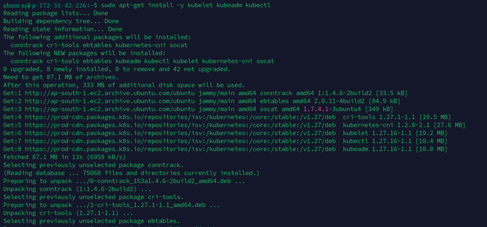

## Day 34

## Kubernetes Cluster Setup Guide

## 1. Prepare the Nodes

### Log in to Control Node

- Ensure you have access to the control plane node. 


## Install Packages on All Nodes (Control Plane and Workers)

### 1. Log in to the control plane node.


### 2. Create the Configuration File for containerd:

```
cat <<EOF | sudo tee /etc/modules-load.d/containerd.conf
overlay
br_netfilter
EOF
```
### 3. Load the Modules:

```
sudo modprobe overlay
sudo modprobe br_netfilter
```
### 4. Set the System Configurations for Kubernetes Networking:

```
cat <<EOF | sudo tee /etc/sysctl.d/99-kubernetes-cri.conf
net.bridge.bridge-nf-call-iptables = 1
net.ipv4.ip_forward = 1
net.bridge.bridge-nf-call-ip6tables = 1
EOF
```
### Apply the New Settings:

```
sudo sysctl --system
```


### Add Docker Repository:


- **Add Docker's GPG Key:**

```    
curl -fsSL https://download.docker.com/linux/ubuntu/gpg | sudo apt-key add -
```

- **Add Docker Repository:**

```
sudo add-apt-repository "deb [arch=amd64] https://download.docker.com/linux/ubuntu $(lsb_release -cs) stable"
```


### 7. Install containerd:

```
sudo apt-get update && sudo apt-get install -y containerd.io
```


### 8. Create the Default Configuration File for containerd:

```
sudo mkdir -p /etc/containerd
```


### 9. Generate the Default containerd Configuration and Save It:

```
sudo containerd config default | sudo tee /etc/containerd/config.toml
```


### 10. Restart containerd:

```
sudo systemctl restart containerd
```
### 11. Verify that containerd is Running:

```
sudo systemctl status containerd
```


### 12. Disable Swap:

```
sudo swapoff -a
```

### 13. Install Dependency Packages:

```
sudo apt-get update && sudo apt-get install -y apt-transport-https curl
```


### 14. Download and Add the Kubernetes GPG Key:

```
curl -fsSL https://pkgs.k8s.io/core:/stable:/v1.27/deb/Release.key | sudo gpg --dearmor -o /etc/apt/keyrings/kubernetes-apt-keyring.gpg
```
### 15. Add Kubernetes to the Repository List:

```
cat <<EOF | sudo tee /etc/apt/sources.list.d/kubernetes.list
deb [signed-by=/etc/apt/keyrings/kubernetes-apt-keyring.gpg] https://pkgs.k8s.io/core:/stable:/v1.27/deb/ /
EOF
```
### 16. Update the Package Listings:

```
sudo apt-get update
```


### 17. Install Kubernetes Packages:

```
sudo apt-get install -y kubelet kubeadm kubectl
```


### 18. Turn Off Automatic Updates:

```
sudo apt-mark hold kubelet kubeadm kubectl
```


## 2. Initialize the Cluster

### 1. On the Control Plane Node, Initialize the Kubernetes Cluster:

```
sudo kubeadm init --pod-network-cidr 192.168.0.0/16 --kubernetes-version 1.27.11
```


### 2. Set kubectl Access:

```
mkdir -p $HOME/.kube
sudo cp -i /etc/kubernetes/admin.conf $HOME/.kube/config
sudo chown $(id -u):$(id -g) $HOME/.kube/config
```


### 3. Test Access to the Cluster:

```
kubectl get nodes
```


## 3. Install the Calico Network Add-On

### 1. On the Control Plane Node, Install Calico Networking:

```
kubectl apply -f https://raw.githubusercontent.com/projectcalico/calico/v3.25.0/manifests/calico.yaml
```


### 2. Check the Status of the Control Plane Node:

```
kubectl get nodes
```


