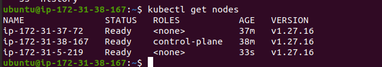
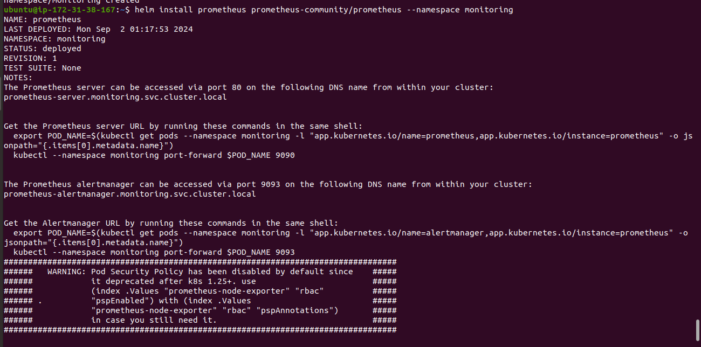
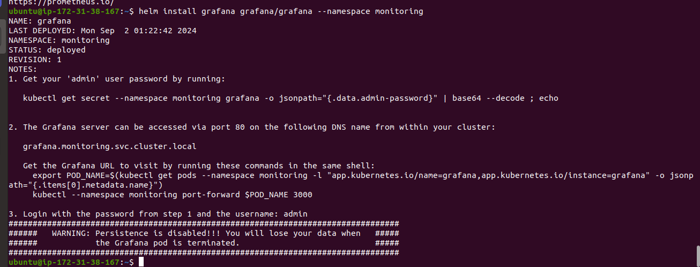
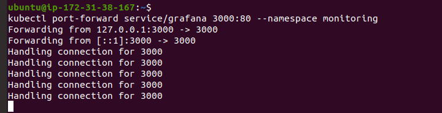
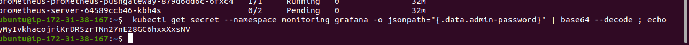
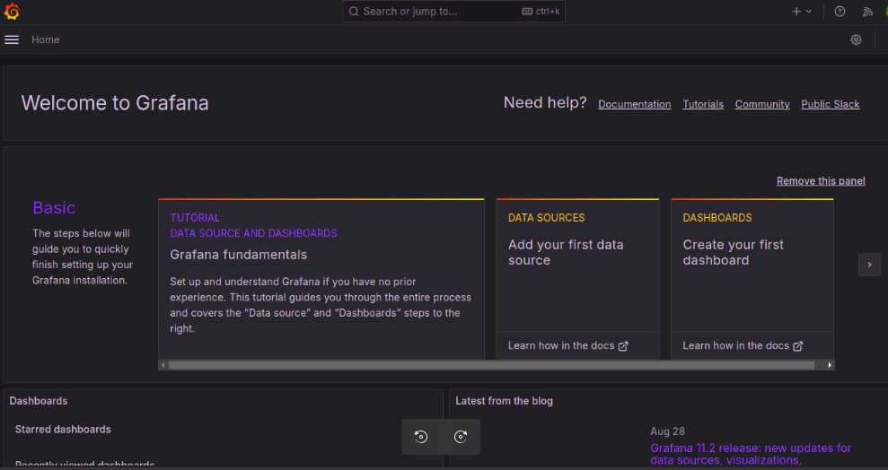
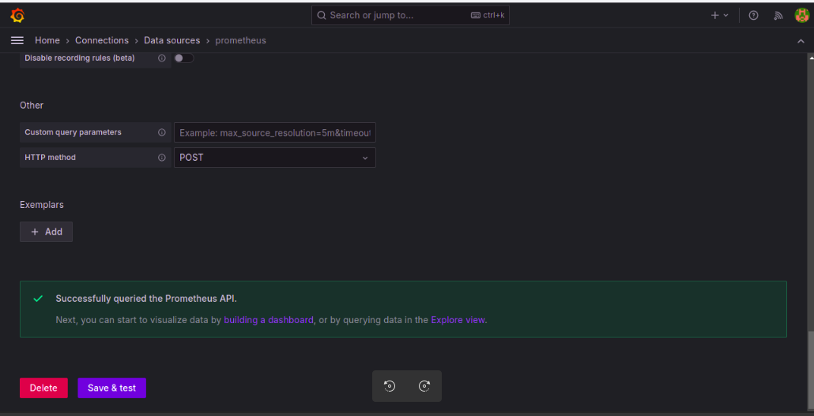

## Day 35 

## Kubernetes Cluster Setup Guide

## 1. Prepare the Nodes

## Log in to Control Node
- Ensure you have access to the control plane node.

## Install Packages on All Nodes (Control Plane and Workers)

### 1. Log in to the control plane node.

### 2. Create the Configuration File for containerd:

```
cat <<EOF | sudo tee /etc/modules-load.d/containerd.conf
overlay
br_netfilter
EOF
```
### 3. Load the Modules:

```
sudo modprobe overlay
sudo modprobe br_netfilter
```

### 4. Set the System Configurations for Kubernetes Networking:

```
cat <<EOF | sudo tee /etc/sysctl.d/99-kubernetes-cri.conf
net.bridge.bridge-nf-call-iptables = 1
net.ipv4.ip_forward = 1
net.bridge.bridge-nf-call-ip6tables = 1
EOF
```

### 5. Apply the New Settings:

```
sudo sysctl --system
```

### 6. Add Docker Repository:

- **Add Docker's GPG Key:**

```
curl -fsSL https://download.docker.com/linux/ubuntu/gpg | sudo apt-key add -
```

- **Add Docker Repository:**

```
sudo add-apt-repository "deb [arch=amd64] https://download.docker.com/linux/ubuntu $(lsb_release -cs) stable"
```

### 7. Install containerd:

```
sudo apt update -y ; sudo apt-get install containerd -y
```
### 8. Create the Default Configuration File for containerd:

```
sudo mkdir -p /etc/containerd
```
### 9. Generate the Default containerd Configuration and Save It:

```
sudo sed -i "s/SystemdCgroup = false/SystemdCgroup = true/g" /etc/containerd/config.toml
```

### 10. Restart containerd:

```
sudo systemctl restart containerd
```

### 11. Verify that containerd is Running:

```
sudo systemctl status containerd
```

### 12. Disable Swap:

```
sudo swapoff -a
```

### 13. Install Dependency Packages:

```
sudo apt-get update && sudo apt-get install -y apt-transport-https curl
```

### 14. Download and Add the Kubernetes GPG Key:

```
curl -fsSL https://pkgs.k8s.io/core:/stable:/v1.27/deb/Release.key | sudo gpg --dearmor -o /etc/apt/keyrings/kubernetes-apt-keyring.gpg
```

### 15. Add Kubernetes to the Repository List:

```
cat <<EOF | sudo tee /etc/apt/sources.list.d/kubernetes.list
deb [signed-by=/etc/apt/keyrings/kubernetes-apt-keyring.gpg] https://pkgs.k8s.io/core:/stable:/v1.27/deb/ /
EOF
```

### 16. Update the Package Listings:

```
sudo apt-get update
```

### 17. Install Kubernetes Packages:

```
sudo apt-get install -y kubelet kubeadm kubectl
```

### 18. Turn Off Automatic Updates:

```
sudo apt-mark hold kubelet kubeadm kubectl
```

## 2. Initialize the Cluster

1. **On the Control Plane Node, Initialize the Kubernetes Cluster:**

```
sudo kubeadm init --pod-network-cidr 192.168.0.0/16 --kubernetes-version 1.27.11
```

2. **Set kubectl Access:**

```
mkdir -p $HOME/.kube
sudo cp -i /etc/kubernetes/admin.conf $HOME/.kube/config
sudo chown $(id -u):$(id -g) $HOME/.kube/config
```

3. **Test Access to the Cluster:**

```
kubectl get nodes
```

## 3. Install the Calico Network Add-On

1. **On the Control Plane Node, Install Calico Networking:**

```
kubectl apply -f https://raw.githubusercontent.com/projectcalico/calico/v3.25.0/manifests/calico.yaml
```

2. **Check the Status of the Control Plane Node:**

```
kubectl get nodes
```



## Deploy Prometheus and Grafana on Kubernetes using Helm Charts:

## 1. Add Helm Repositories
- First, you need to add the Helm repositories that contain the charts for Prometheus and Grafana.

```
helm repo add prometheus-community https://prometheus-community.github.io/helm-charts
helm repo add grafana https://grafana.github.io/helm-charts
```
- Optional Steps to search for helm packages :

```
helm search hub Prometheus
```
- Or else you can go to the Artifact Hub repository and search for the Prometheus helm chart.

- Update your Helm repositories to ensure you have the latest charts.

```
helm repo update
```

## 2. Install Prometheus

- Create a namespace for Prometheus (optional but recommended).

```
kubectl create namespace monitoring
```

- Install Prometheus using Helm.

```
helm install prometheus prometheus-community/prometheus --namespace monitoring
```

 
## output:

```
NOTES:
The Prometheus server can be accessed via port 80 on the following DNS name from within your cluster:
prometheus-server.monitoring.svc.cluster.local


Get the Prometheus server URL by running these commands in the same shell:
  export POD_NAME=$(kubectl get pods --namespace monitoring -l "app.kubernetes.io/name=prometheus,app.kubernetes.io/instance=prometheus" -o jsonpath="{.items[0].metadata.name}")
  kubectl --namespace monitoring port-forward $POD_NAME 9090


The Prometheus alertmanager can be accessed via port 9093 on the following DNS name from within your cluster:
prometheus-alertmanager.monitoring.svc.cluster.local


Get the Alertmanager URL by running these commands in the same shell:
  export POD_NAME=$(kubectl get pods --namespace monitoring -l "app.kubernetes.io/name=alertmanager,app.kubernetes.io/instance=prometheus" -o jsonpath="{.items[0].metadata.name}")
  kubectl --namespace monitoring port-forward $POD_NAME 9093
#################################################################################
######   WARNING: Pod Security Policy has been disabled by default since    #####
######            it deprecated after k8s 1.25+. use                        #####
######            (index .Values "prometheus-node-exporter" "rbac"          #####
###### .          "pspEnabled") with (index .Values                         #####
######            "prometheus-node-exporter" "rbac" "pspAnnotations")       #####
######            in case you still need it.                                #####
#################################################################################


The Prometheus PushGateway can be accessed via port 9091 on the following DNS name from within your cluster:
prometheus-prometheus-pushgateway.monitoring.svc.cluster.local


Get the PushGateway URL by running these commands in the same shell:
  export POD_NAME=$(kubectl get pods --namespace monitoring -l "app=prometheus-pushgateway,component=pushgateway" -o jsonpath="{.items[0].metadata.name}")
  kubectl --namespace monitoring port-forward $POD_NAME 9091
  ```

## 3. Install Grafana

- Install Grafana using Helm.

```
helm install grafana grafana/grafana --namespace monitoring
```



## Output:

```
NOTES:
1. Get your 'admin' user password by running:

   kubectl get secret --namespace monitoring grafana -o jsonpath="{.data.admin-password}" | base64 --decode ; echo


2. The Grafana server can be accessed via port 80 on the following DNS name from within your cluster:

   grafana.monitoring.svc.cluster.local

   Get the Grafana URL to visit by running these commands in the same shell:
     export POD_NAME=$(kubectl get pods --namespace monitoring -l "app.kubernetes.io/name=grafana,app.kubernetes.io/instance=grafana" -o jsonpath="{.items[0].metadata.name}")
     kubectl --namespace monitoring port-forward $POD_NAME 3000

3. Login with the password from step 1 and the username: admin
#################################################################################
######   WARNING: Persistence is disabled!!! You will lose your data when   #####
######            the Grafana pod is terminated.                            #####
#################################################################################
```

## 4. Access Grafana Dashboard
- To access the Grafana dashboard, you need to set up port forwarding.

```
kubectl port-forward service/grafana 3000:80 --namespace monitoring
```


 

- Open your browser and navigate to http://localhost:3000. The default username is admin, and the password can be retrieved with the following command:

```
kubectl get secret --namespace monitoring grafana -o jsonpath="{.data.admin-password}" | base64 --decode ; echo
```



## 5.Configure Grafana to Use Prometheus as a Data Source

1. Log in to Grafana.
2. Click on the gear icon (⚙️) to go to Configuration and select Data Sources.
3. Click on Add data source.
4. Choose Prometheus from the list.
5. In the HTTP section, set the URL to http://prometheus-server.monitoring.svc.cluster.local.
6. Click Save & Test to verify the connection.

