# Project 01: Dockerized WordPress Deployment


## Objectives:

- Create and manage Docker volumes for data persistence.
- Set up a Docker network for container communication.
- Use Docker Compose to manage multi-container applications.
- View and manage Docker logs.
- Deploy the application using Docker Swarm.

## Project Outline:

- Create Docker Volumes
- Create a Docker Network
- Write a Docker Compose File
- Deploy the Application with Docker Compose
- Manage Docker Logs
- Deploy the Application Using Docker Swarm

Step-by-Step Guide

### 1. Create Docker Volumes

Docker volumes are used to persist data generated by and used by Docker containers.

```
docker volume create wordpress_data
```
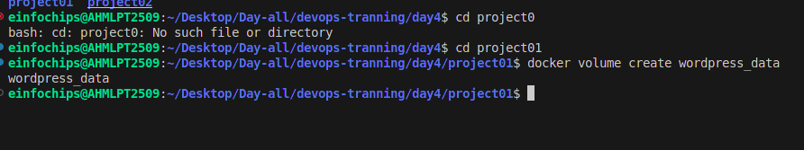

```
docker volume create mysql_data
```
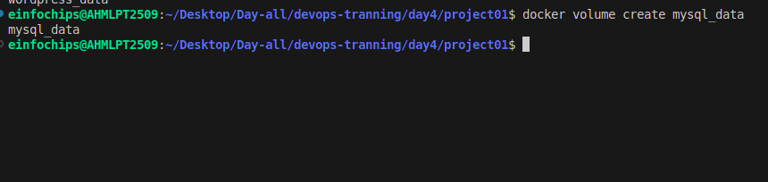


### 2. Create a Docker Network

Create a custom network for the containers to communicate.

```
docker network create wordpress_network
```
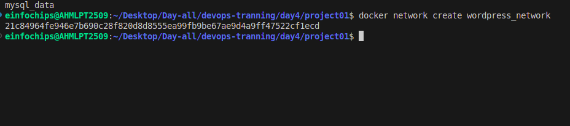

### 3. Write a Docker Compose File

Create a docker-compose.yml file to define and manage the services.

```yaml
version: '3.3'
services:
  db:
    image: mysql:5.7
    volumes:
      - mysql_data:/var/lib/mysql
    networks:
      - wordpress_network
    environment:
      MYSQL_ROOT_PASSWORD: example
      MYSQL_DATABASE: wordpress
      MYSQL_USER: wordpress
      MYSQL_PASSWORD: wordpress
  wordpress:
    image: wordpress:latest
    volumes:
      - wordpress_data:/var/www/html
    networks:
      - wordpress_network
    ports:
      - "8000:80"
    environment:
      WORDPRESS_DB_HOST: db:3306
      WORDPRESS_DB_USER: wordpress
      WORDPRESS_DB_PASSWORD: wordpress
      WORDPRESS_DB_NAME: wordpress
volumes:
  mysql_data:
  wordpress_data:
networks:
  wordpress_network:
```


### 4. Deploy the Application with Docker Compose

Run the following command to start the services defined in the docker-compose.yml file.

```
docker-compose up -d
```
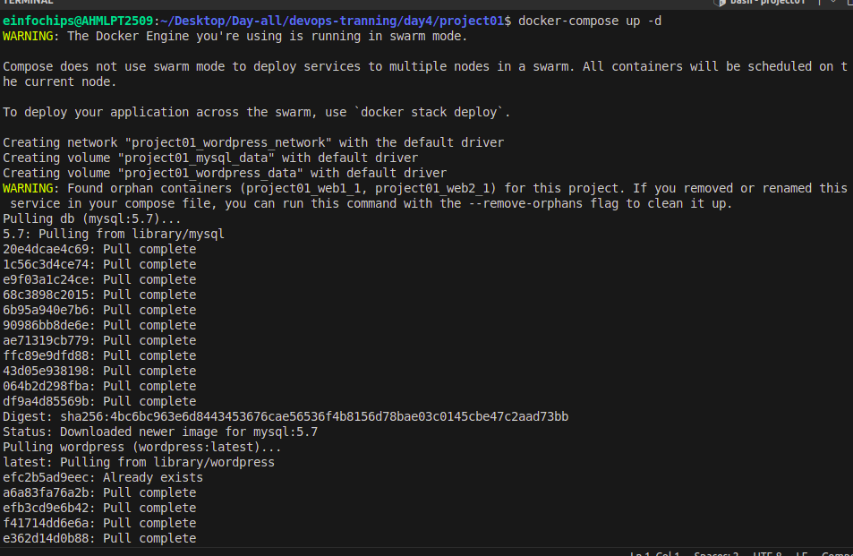


Verify that the containers are running.

```
docker-compose ps
```
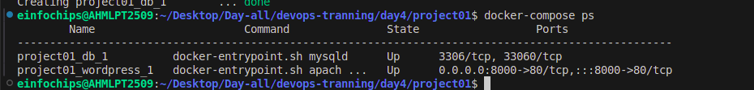


Access the WordPress setup by navigating to http://localhost:8000.

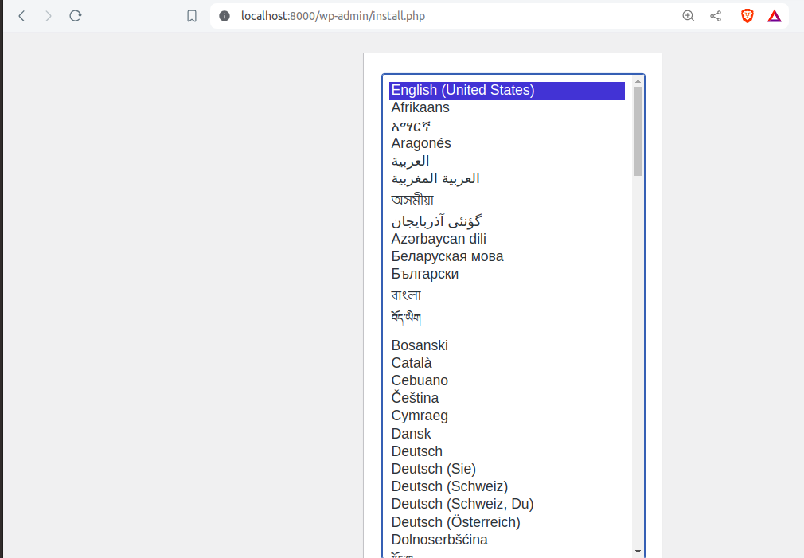


### 5. Manage Docker Logs

View logs for a specific service.

```
docker-compose logs wordpress
```

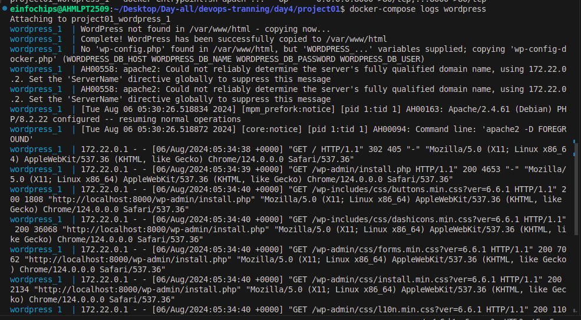


Follow logs for real-time updates.

```
docker-compose logs -f wordpress
```

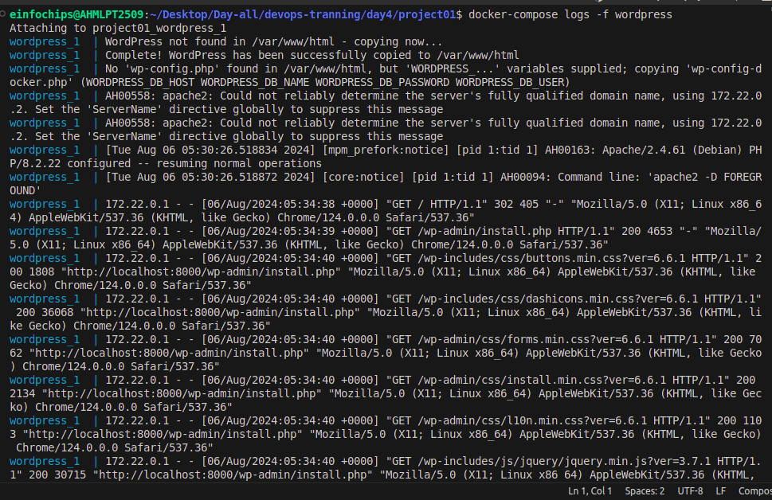


### 6. Deploy the Application Using Docker Swarm

Docker Swarm is a native clustering and orchestration tool for Docker.

Initialize Docker Swarm.

```
docker swarm init
```

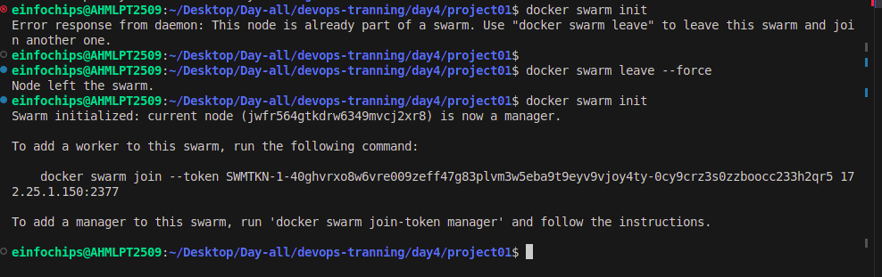


Convert the Docker Compose file to a Docker Stack file, docker-stack.yml.

```yaml
version: '3.3'

services:
  db:
    image: mysql:5.7
    volumes:
      - mysql_data:/var/lib/mysql
    networks:
      - wordpress_network
    environment:
      MYSQL_ROOT_PASSWORD: example
      MYSQL_DATABASE: wordpress
      MYSQL_USER: wordpress
      MYSQL_PASSWORD: wordpress
    deploy:
      replicas: 1
  wordpress:
    image: wordpress:latest
    volumes:
      - wordpress_data:/var/www/html
    networks:
      - wordpress_network
    ports:
      - "8000:80"
    environment:
      WORDPRESS_DB_HOST: db:3306
      WORDPRESS_DB_USER: wordpress
      WORDPRESS_DB_PASSWORD: wordpress
      WORDPRESS_DB_NAME: wordpress
    deploy:
      replicas: 1
volumes:
  mysql_data:
  wordpress_data:
networks:
  wordpress_network:
```


Deploy the stack using Docker Swarm.

```
docker stack deploy -c docker-stack.yml wordpress_stack
```

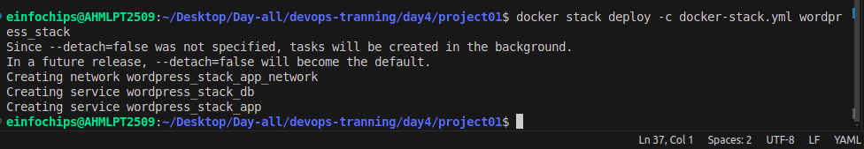


Verify the stack is running.

```
docker stack services wordpress_stack
```

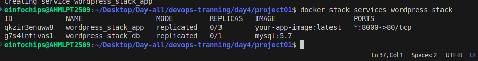
