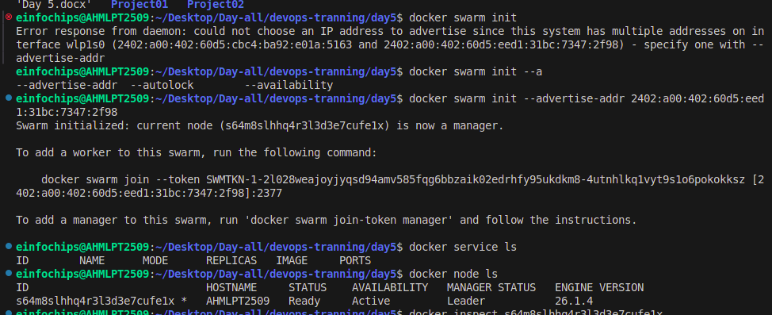

# Day 5 

# Project 01 

## Deploying a Scalable Web Application with Persistent Storage and Advanced Automation

### Objective:
Deploy a scalable web application using Docker Swarm and Kubernetes, ensuring data persistence using a single shared volume, and automate the process using advanced shell scripting.

### Overview:
1. Step 1: Set up Docker Swarm and create a service.

2. Step 2: Set up Kubernetes using Minikube.

3. Step 3: Deploy a web application using Docker Compose.

4. Step 4: Use a single shared volume across multiple containers.

5. Step 5: Automate the entire process using advanced shell scripting.

## Step 1: Set up Docker Swarm and Create a Service

### 1.1 Initialize Docker Swarm

```
# Initialize Docker Swarm
docker swarm init
```
Choose the appropriate IP address from the output, then initialize Docker Swarm with that IP address.

```
docker swarm init --advertise-addr 2402:a00:402:60d5:eed1:31bc:7347:2f98
```

**List the Running Services:**

```
docker service ls
```
```
docker node ls
```
The docker node ls command shows the status of nodes in the Docker Swarm cluster. Here's a brief explanation of the columns in the output:



### 1.2 Create a Docker Swarm Service

### Create a simple Nginx service in Docker Swarm

```
docker service create --name nginx-service --publish 8080:80 nginx
```

This command will create a new service named nginx-service and publish it on port 8080 of your Docker Swarm node, mapping it to port 80 of the Nginx container.


### Verify the Service:

**1. List the Running Services:**

```
docker service ls
```

**2. Check Detailed Information About the Service Tasks:**

```
docker service ps nginx-service
```


### Step 2: Set up Kubernetes Using Minikube

### 2.1 Start Minikube

### Start Minikube

```
minikube start
```


### 2.2 Deploy a Web App on Kubernetes

Create a deployment file named `webapp-deployment.yaml:`

```
apiVersion: apps/v1
kind: Deployment
metadata:
  name: webapp
spec:
  replicas: 3
  selector:
    matchLabels:
      app: webapp
  template:
    metadata:
      labels:
        app: webapp
    spec:
      containers:
      - name: webapp
        image: nginx
        ports:
        - containerPort: 80
```

Apply the deployment:

```
kubectl apply -f webapp-deployment.yaml
```


### 2.3 Expose the Deployment

```
kubectl expose deployment webapp --type=NodePort --port=80
```


### Step 3: Deploy a Web Application Using Docker Compose

### 3.1 Create a **docker-compose.yml File

```
version: '3'
services:
  web:
    image: nginx
    ports:
      - "8081:80"
    volumes:

- webdata:/usr/share/nginx/html

volumes:
  webdata:
```

### 3.2 Deploy the Web Application

### Deploy using Docker Compose

```
docker-compose up –d
```


### Step 4: Use a Single Shared Volume Across Multiple Containers

#### 4.1 Update docker-compose.yml to Use a Shared Volume

```
version: '3'
services:
  web1:
    image: nginx
    ports:
      - "8081:80"
    volumes:
      - shareddata:/usr/share/nginx/html
  web2:
    image: nginx
    ports:
      - "8082:80"
    volumes:
      - shareddata:/usr/share/nginx/html

volumes:
  shareddata:
```
### 4.2 Deploy with Docker Compose

#### Deploy using Docker Compose

```
docker-compose up –d
```


### Step 5: Automate the Entire Process Using Advanced Shell Scripting

### 5.1 Create a Shell Script deploy.sh

```
#!/bin/bash

# Initialize Docker Swarm
docker swarm init

# Create Docker Swarm Service
docker service create --name nginx-service --publish 8080:80 nginx

# Start Minikube
minikube start

# Create Kubernetes Deployment
kubectl apply -f webapp-deployment.yaml

# Expose the Deployment
kubectl expose deployment webapp --type=NodePort --port=80

# Deploy Web App Using Docker Compose
docker-compose -f docker-compose-single-volume.yml up -d

echo "Deployment completed successfully!"
```
### 5.2 Make the Script Executable

#### Make the script executable

```
chmod +x deploy.sh
```


### 5.3 Run the Script

### Run the deployment script

```
./deploy.sh
```


