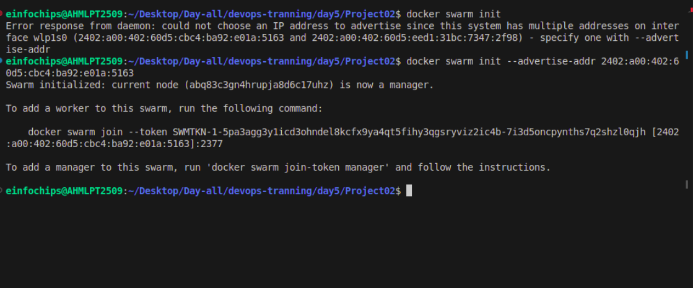
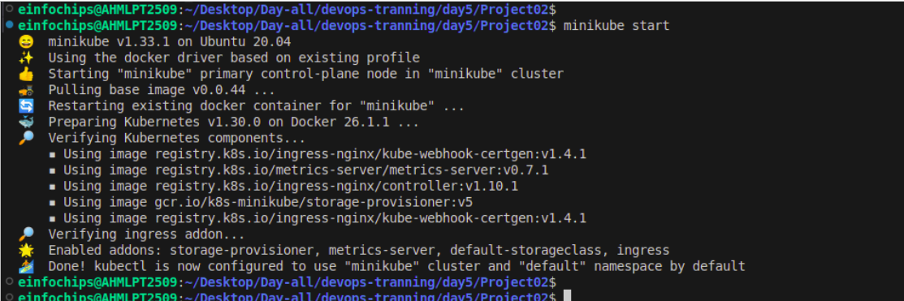
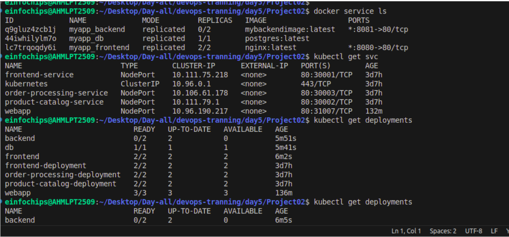
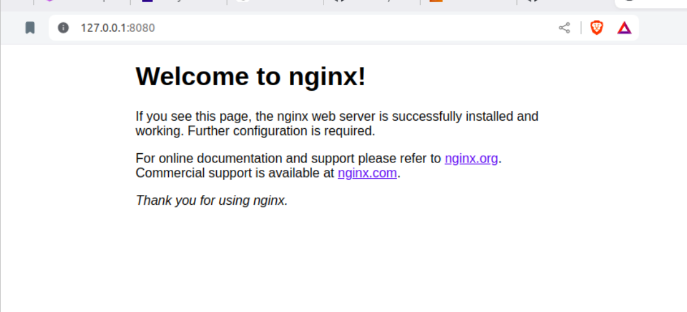

# Day 5 

## Project 02 

## Comprehensive Deployment of a Multi-Tier Application with CI/CD Pipeline

### Objective:

Deploy a multi-tier application (frontend, backend, and database) using Docker Swarm and Kubernetes, ensuring data persistence using a single shared volume across multiple containers, and automating the entire process using advanced shell scripting and CI/CD pipelines.

Overview:

Step 1: Set up Docker Swarm and create a multi-tier service.
Step 2: Set up Kubernetes using Minikube.
Step 3: Deploy a multi-tier application using Docker Compose.
Step 4: Use a single shared volume across multiple containers.
Step 5: Automate the deployment process using advanced shell scripting.


### Step 1: Set up Docker Swarm and Create a Multi-Tier Service

### 1.1 Initialize Docker Swarm

### Initialize Docker Swarm

```
docker swarm init
```

```
docker swarm init --advertise-addr 2402:a00:402:60d5:cbc4:ba92:e01a:5163
```



### 1.2 Create a Multi-Tier Docker Swarm Service

Create a `docker-compose-swarm.yml` file:

```yaml
version: '3.7'
services:
  frontend:
    image: nginx
    ports:
      - "8080:80"
    deploy:
      replicas: 2
    volumes:
      - shareddata:/usr/share/nginx/html
  backend:
    image: mybackendimage
    ports:

   - "8081:80"
    deploy:
      replicas: 2
    volumes:
      - shareddata:/app/data
  db:
    image: postgres
    environment:
      POSTGRES_DB: mydb
      POSTGRES_USER: user
      POSTGRES_PASSWORD: password
    deploy:
      replicas: 1
    volumes:
      - dbdata:/var/lib/postgresql/data
volumes:
  shareddata:
  dbdata:
```  

## Deploy the stack:

### Deploy the stack using Docker Swarm

```
docker stack deploy -c docker-compose-swarm.yml myapp
```


### Step 2: Set up Kubernetes Using Minikube

### 2.1 Start Minikube

## Start Minikube

```
minikube start
```


### 2.2 check docker services

```
docker service ls
```


### 2.3 Create Kubernetes Deployment Files

Create `frontend-deployment.yaml:`

```yaml
apiVersion: apps/v1
kind: Deployment
metadata:
  name: frontend
spec:
  replicas: 2
  selector:
    matchLabels:
      app: frontend
  template:
    metadata:
      labels:
        app: frontend
    spec:
      containers:
      - name: frontend
        image: nginx
        ports:
        - containerPort: 80
        volumeMounts:
        - name: shareddata
          mountPath: /usr/share/nginx/html
      volumes:
      - name: shareddata
        persistentVolumeClaim:
          claimName: shared-pvc
```

Create `backend-deployment.yaml:`

```yaml
apiVersion: apps/v1
kind: Deployment
metadata:
  name: backend
spec:
  replicas: 2
  selector:
    matchLabels:
      app: backend
  template:
    metadata:
      labels:
        app: backend
    spec:
      containers:
      - name: backend
image: mybackendimage
        ports:
        - containerPort: 80
        volumeMounts:
        - name: shareddata
          mountPath: /app/data
      volumes:
      - name: shareddata
        persistentVolumeClaim:
          claimName: shared-pvc
```


Create `db-deployment.yaml:`

```yaml
apiVersion: apps/v1
kind: Deployment
metadata:
  name: db
spec:
  replicas: 1
  selector:
    matchLabels:
      app: db
  template:
    metadata:
      labels:
        app: db
spec:
      containers:
      - name: db
        image: postgres
        env:
        - name: POSTGRES_DB
          value: mydb
        - name: POSTGRES_USER
          value: user
        - name: POSTGRES_PASSWORD
          value: password
        volumeMounts:
        - name: dbdata
          mountPath: /var/lib/postgresql/data
      volumes:
- name: dbdata
        persistentVolumeClaim:
          claimName: db-pvc
```

create `shared-pvc.yaml:`

```yaml
apiVersion: v1
kind: PersistentVolumeClaim
metadata:
  name: shared-pvc
spec:
  accessModes:
  - ReadWriteMany
  resources:
    requests:
      storage: 1Gi
Create db-pvc.yaml:
apiVersion: v1
kind: PersistentVolumeClaim
metadata:
  name: db-pvc
spec:
  accessModes:
  - ReadWriteOnce
  resources:
    requests:
      storage: 1Gi
```

Apply the deployments:

- kubectl apply -f shared-pvc.yaml
- kubectl apply -f db-pvc.yaml
- kubectl apply -f frontend-deployment.yaml
- kubectl apply -f backend-deployment.yaml
- kubectl apply -f db-deployment.yaml




### Step 3: Deploy a Multi-Tier Application Using Docker Compose

### 3.1 Create a docker-compose.yml File

```yaml
version: '3'
services:
  frontend:
    image: nginx
    ports:
      - "8080:80"
    volumes:
      - shareddata:/usr/share/nginx/html
  backend:
    image: mybackendimage
    ports:
      - "8081:80"
    volumes:
      - shareddata:/app/data
  db:
    image: postgres
    environment:
      POSTGRES_DB: mydb
      POSTGRES_USER: user
      POSTGRES_PASSWORD: password
    volumes:
      - dbdata:/var/lib/postgresql/data
volumes:
  shareddata:
  dbdata:
```

### 3.2 Deploy the Application

### Deploy using Docker Compose

```
docker-compose up –d
```
```
docker stack deploy --compose-file docker-compose.yml myapp
```


### Step 4: Use a Single Shared Volume Across Multiple Containers

Update docker-compose.yml as shown in Step 3.1 to use the shareddata volume across the frontend and backend services.


