# Day 6 

# Project 02 

## Deploying a Python Flask App Using Minikube Kubernetes

## Overview
This project guides you through deploying a Python Flask application using Minikube Kubernetes. You'll use Git for version control, explore branching and fast-forward merges, and set up Kubernetes services and deployment pods, including ClusterIP and NodePort service types.

## Prerequisites
- Minikube installed
- kubectl installed
- Git installed
- Python installed

## Project Steps

### 1. Set Up Git Version Control

#### 1.1. Initialize a Git Repository
Create a new directory for your project:

```bash
mkdir flask-k8s-project
cd flask-k8s-project
```
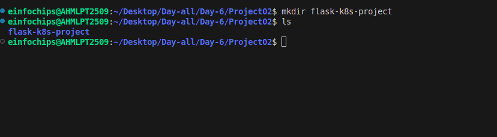
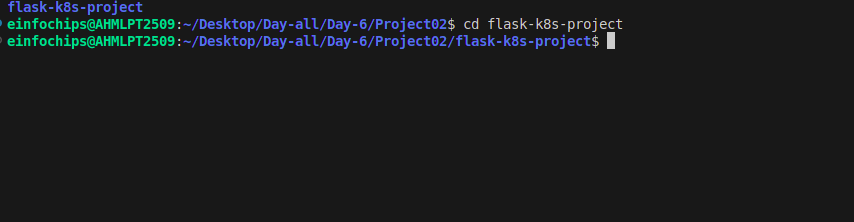

### 1.2. Initialize a Git Repository

```bash
git init
```
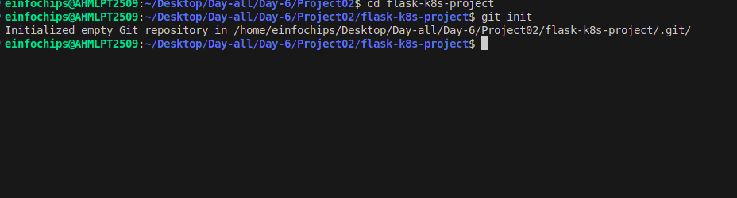

### 1.3. Install Python 3 if Not Already Installed

```bash
sudo apt update
sudo apt install python3
sudo apt install python3-venv
```

### 1.4. Create a Python Flask Application

Create a virtual environment:

```bash
python -m venv venv
source venv/bin/activate
```

### 1.5. Install Flask

```bash
pip install Flask
```
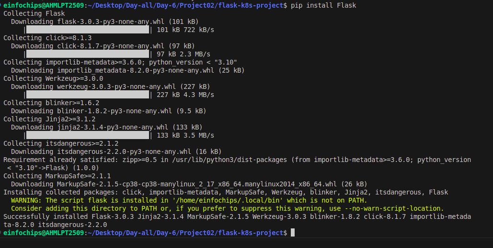

### 1.6. Create an app.py File with the Following Content:

```python
from flask import Flask
app = Flask(__name__)

@app.route('/')
def hello_world():
    return 'Hello, Kubernetes!'

if __name__ == '__main__':
    app.run(host='0.0.0.0', port=5000)
```
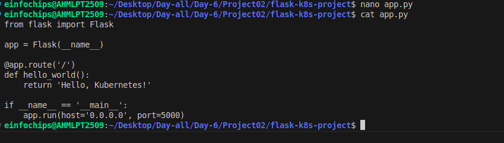

### 1.7. Create requirements.txt

Create a requirements.txt file to list the dependencies:

Flask

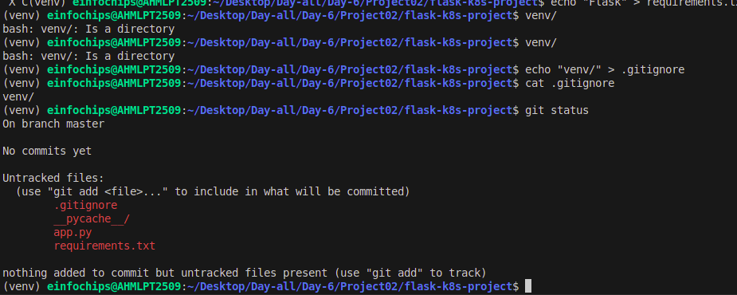

### 1.8. Create a .gitignore File to Ignore venv:

```bash
echo "venv" > .gitignore
```
### 1.9. Commit the Initial Code

Add files to Git:

```bash
git add .
```

Commit the changes:

```bash
git commit -m "Initial commit with Flask app"
```
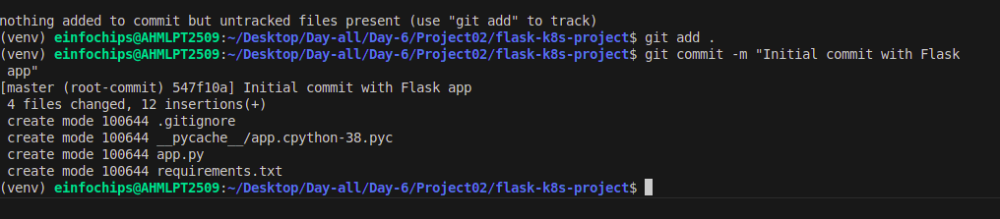

## 2. Branching and Fast-Forward Merge

### 2.1. Create a New Branch

Create and switch to a new branch feature/add-route:

```bash
git checkout -b feature/add-route
```
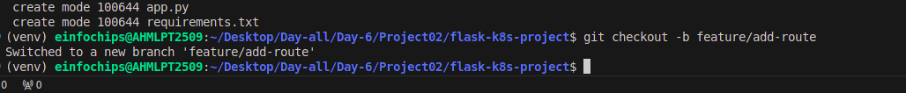

### 2.2. Implement a New Route

Modify app.py to add a new route:

```python
@app.route('/newroute')
def new_route():
    return 'This is a new route!'
```
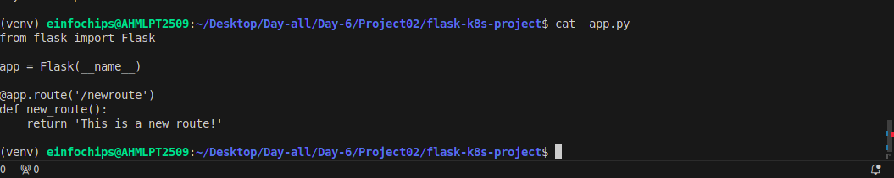

Commit the changes:

```bash
git add .
git commit -m "Add new route"
```
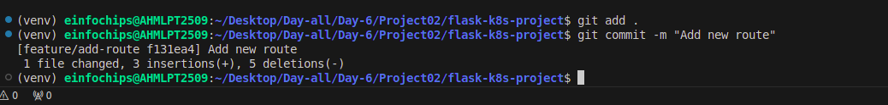

### 2.3. Merge the Branch Using Fast-Forward

Switch back to the main branch:

```bash
git checkout main
```
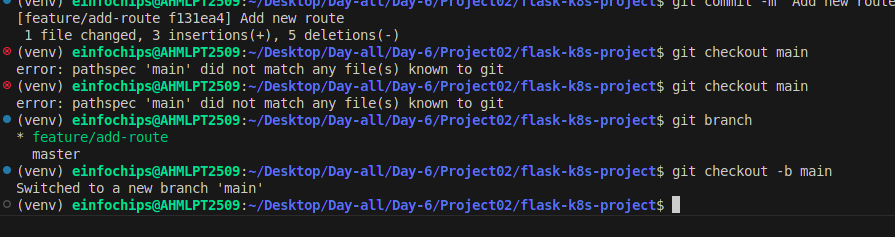

Merge the feature/add-route branch using fast-forward:

```bash
git merge --ff-only feature/add-route
```
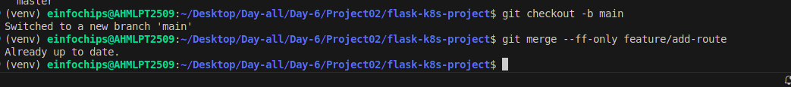

Delete the feature branch:

```bash
git branch -d feature/add-route
```
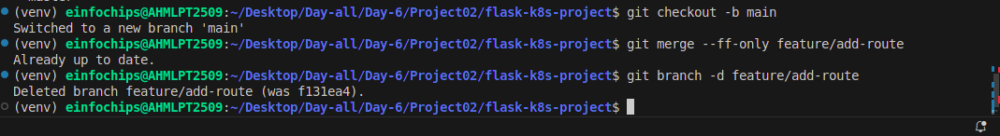

## 3. Containerize the Flask Application

### 3.1. Create a Dockerfile

Create a Dockerfile with the following content:

```dockerfile
FROM python:3.8-slim
WORKDIR /app
COPY requirements.txt requirements.txt
RUN pip install -r requirements.txt
COPY . .
EXPOSE 5000
CMD ["python", "app.py"]
```
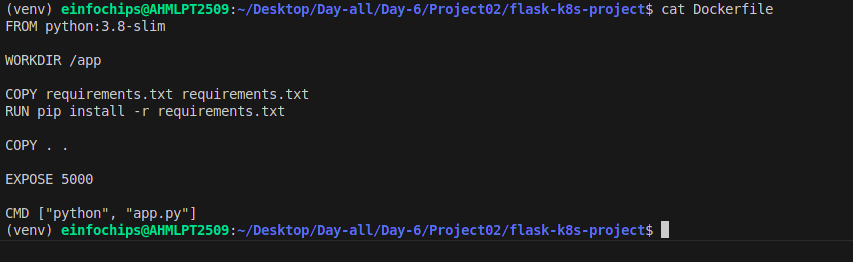

### 3.2. Build and Test the Docker Image

Build the Docker image:

```bash
docker build -t flask-k8s-app .
```
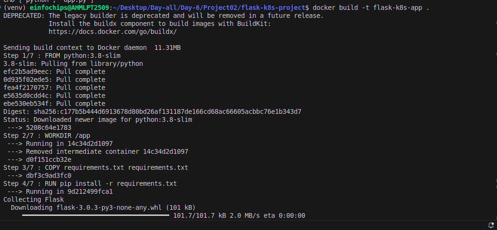

Run the Docker container to test:

```bash
docker run -p 5000:5000 flask-k8s-app
```
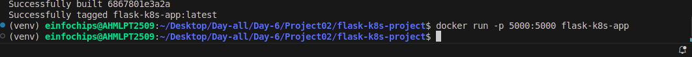

1. Access http://localhost:5000 to see the app running.

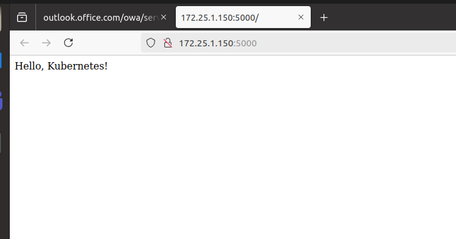

## 4. Deploying to Minikube Kubernetes

### 4.1. Start Minikube

Start Minikube:

```bash
minikube start
```
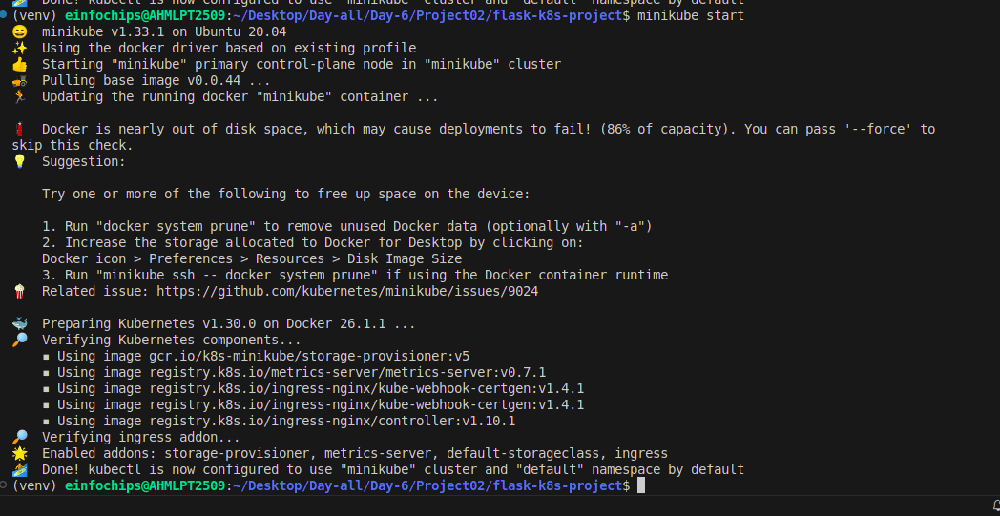

### 4.2. Create Kubernetes Deployment and Service Manifests

Create a deployment.yaml file:

```yaml
apiVersion: apps/v1
kind: Deployment
metadata:
  name: flask-app
spec:
  replicas: 2
  selector:
    matchLabels:
      app: flask-app
  template:
    metadata:
      labels:
        app: flask-app
    spec:
      containers:
      - name: flask-app
        image: flask-k8s-app:latest
        ports:
        - containerPort: 5000
```

Create a service.yaml file for ClusterIP:

```yaml
apiVersion: v1
kind: Service
metadata:
  name: flask-service
spec:
  selector:
    app: flask-app
  ports:
  - protocol: TCP
    port: 80
    targetPort: 5000
  type: ClusterIP
```

Create a service-nodeport.yaml file for NodePort:

```yaml
apiVersion: v1
kind: Service
metadata:
  name: flask-service-nodeport
spec:
  selector:
    app: flask-app
  ports:
  - protocol: TCP
    port: 80
    targetPort: 5000
    nodePort: 30001
  type: NodePort
```

### 4.3. Apply Manifests to Minikube

Apply the deployment:

```bash
kubectl apply -f deployment.yaml
```
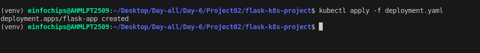

Apply the ClusterIP service:

```bash
kubectl apply -f service.yaml
```
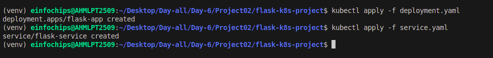

Apply the NodePort service:

```bash
kubectl apply -f service-nodeport.yaml
```
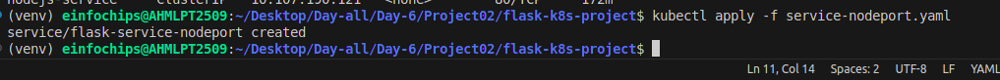

### 4.4. Access the Application

Get the Minikube IP:

```bash
minikube ip
```

3. Access the application using the NodePort:

```bash
curl http://<minikube-ip>:30001
```

## 5. Clean Up

### 5.1. Stop Minikube

```bash
minikube stop
```

### 5.2. Delete Minikube Cluster

```bash
minikube delete
```

## 6. Making Changes to the Flask Application

### 6.1. Create a New Branch for Changes

Create and switch to a new branch feature/update-message:

```bash
git checkout -b feature/update-message
```

### 6.2. Update the Application

Modify app.py to change the message:

```python
@app.route('/')
def hello_world():
    return 'Hello, Kubernetes! Updated version.'
@app.route('/newroute')
def new_route():
    return 'This is a new route!'
```

### 6.3. Commit the Changes

Add and commit the changes:

```bash
git add .
git commit -m "Update main route message"
```

## 7. Merge the Changes and Rebuild the Docker Image

### 7.1. Merge the Feature Branch

Switch back to the main branch:

```bash
git checkout main
```

Merge the feature/update-message branch:

```bash
git merge --ff-only feature/update-message
```

Delete the feature branch:

```bash
git branch -d feature/update-message
```

### 7.2. Rebuild the Docker Image

Rebuild the Docker image with a new tag:

```bash
docker build -t flask-k8s-app:v2 .
```

## 8. Update Kubernetes Deployment

### 8.1. Update the Deployment Manifest

Modify deployment.yaml to use the new image version:

```yaml
apiVersion: apps/v1
kind: Deployment
metadata:
  name: flask-app
spec:
  replicas: 2
  selector:
    matchLabels:
      app: flask-app
  template:
    metadata:
      labels:
        app: flask-app
    spec:
      containers:
      - name: flask-app
        image: flask-k8s-app:v2
        ports:
        - containerPort: 5000
```

### 8.2. Apply the Updated Manifest

Apply the updated deployment:

```bash
kubectl apply -f deployment.yaml
```

### 8.3. Verify the Update

Check the status of the deployment:

```bash
kubectl rollout status deployment/flask-app 
```

## 9. Access the Updated Application

### 9.1. Access Through ClusterIP Service

Forward the port to access the ClusterIP service:

```bash
kubectl port-forward service/flask-service 8080:80
```

4. Open your browser and navigate to http://localhost:8080 to see the updated message.

### 9.2. Access Through NodePort Service

5. Access the application using the NodePort:

```bash
curl http://<minikube-ip>:30001
```