# Day 7

# Project 01: Deploying a Node.js App Using Minikube Kubernetes

## Project Steps

### 1. Setup Minikube and Git Repository

#### 1.1 Start Minikube

```bash
minikube start
```

**1.2 Set Up Git Repository**

Create a new directory for your project:

```bash
mkdir nodejs-k8s-project
cd nodejs-k8s-project
```


Initialize Git repository:


```bash
git init
```
Create a .gitignore file:

```bash
node_modules/
.env
nano .gitignore
# Ignore node_modules directory
node_modules/
 
# Ignore environment variables file
.env

OR
echo -e "node_modules/\n.env" > .gitignore

```

Add and commit initial changes:

```bash
git add .
git commit -m "Initial commit"
```
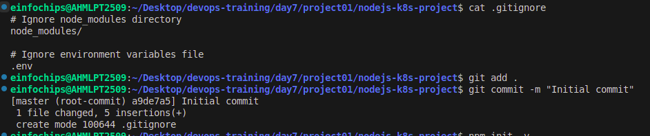

## 2. Develop a Node.js Application

#### 2.1 Create the Node.js App

Initialize the Node.js project:

```bash
npm init -y
```
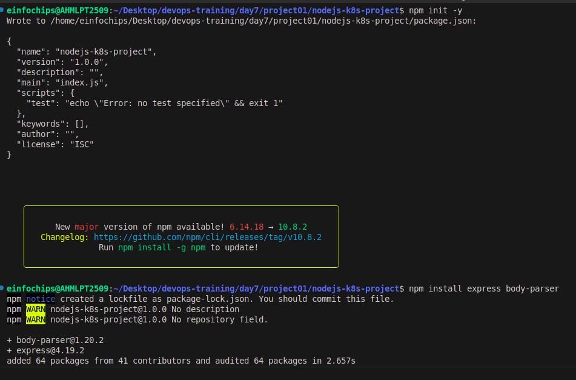

Install necessary packages:

```bash
npm install express body-parser
```

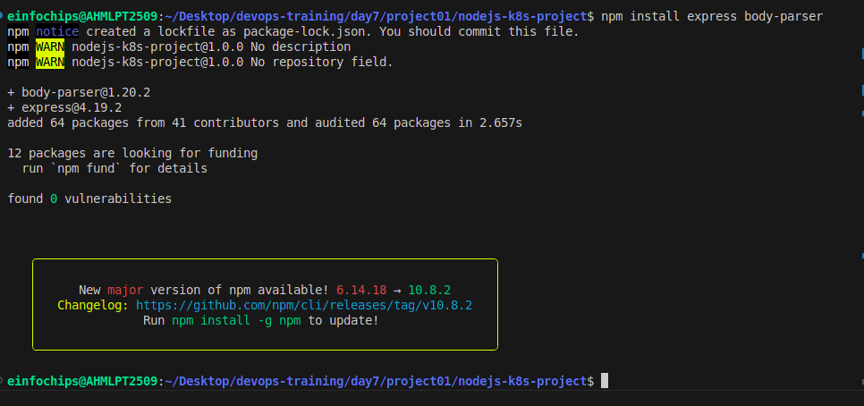

Create app.js:

```javascript
const express = require('express');
const bodyParser = require('body-parser');
const app = express();
const PORT = process.env.PORT || 3000;

app.use(bodyParser.json());

app.get('/', (req, res) => {
  res.send('Hello, World!');
});

app.listen(PORT, () => {
  console.log(`Server is running on port ${PORT}`);
});

Update package.json to include a start script:

json

"scripts": {
  "start": "node app.js"
}
```


#### 2.2 Commit the Node.js Application

Add and commit changes:

```bash
git add .
git commit -m "Add Node.js application code"
```

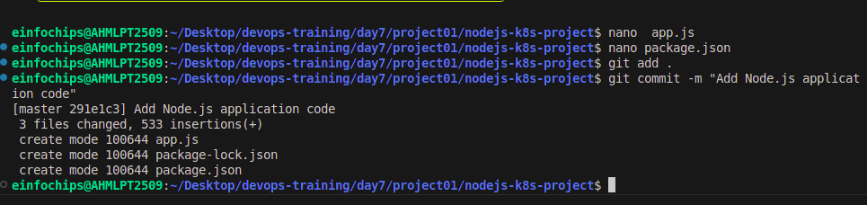


## 3. Create Dockerfile and Docker Compose

#### 3.1 Create a Dockerfile

Add Dockerfile:

```Dockerfile
FROM node:18

# Set the working directory
WORKDIR /usr/src/app

# Copy package.json and package-lock.json
COPY package*.json ./

# Install dependencies
RUN npm install

# Copy the rest of the application code
COPY . .

# Expose the port on which the app runs
EXPOSE 3000

# Command to run the application
CMD [ "npm", "start" ]
```

Create a .dockerignore file:

```bash
echo -e "node_modules\n.npm" > .dockerignore
```

#### 3.2 Create docker-compose.yml (optional for local testing)

Add docker-compose.yml:

```yaml

version: '3'
services:
  app:
    build: .
    ports:
      - "3000:3000"
```

Add and commit changes:

```bash
git add Dockerfile docker-compose.yml
git commit -m "Add Dockerfile and Docker Compose configuration"
```

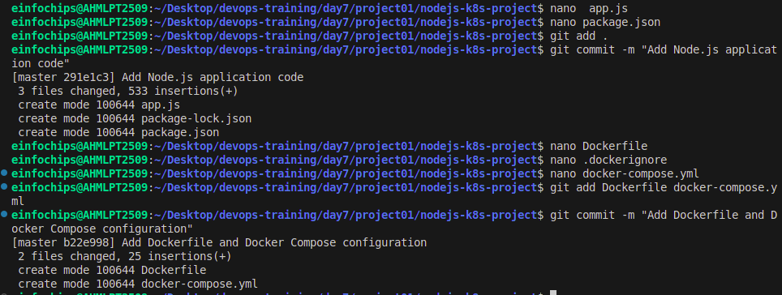

## 4. Build and Push Docker Image

#### 4.1 Build Docker Image

Build the Docker image:

```bash
docker build -t nodejs-app:latest .
```

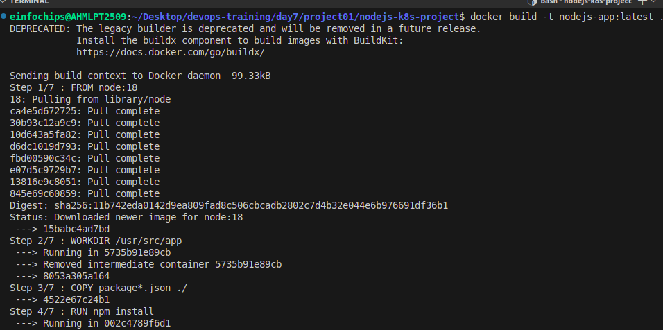


#### 4.2 Push Docker Image to Docker Hub

Tag and push the image:

```bash
docker tag nodejs-app:latest your-dockerhub-username/nodejs-app:latest
docker push your-dockerhub-username/nodejs-app:latest
```

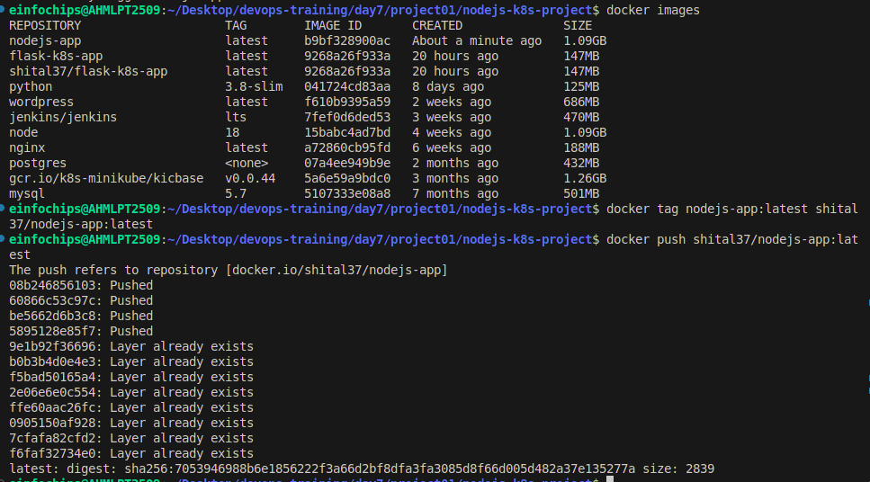

Add and commit changes:

```bash
git add .
git commit -m "Build and push Docker image"
```


## 5. Create Kubernetes Configurations

#### 5.1 Create Kubernetes Deployment

Create kubernetes/deployment.yaml:

```yaml
apiVersion: apps/v1
kind: Deployment
metadata:
  name: nodejs-app-deployment
spec:
  replicas: 2
  selector:
    matchLabels:
      app: nodejs-app
  template:
    metadata:
      labels:
        app: nodejs-app
    spec:
      containers:
      - name: nodejs-app
        image: your-dockerhub-username/nodejs-app:latest
        ports:
        - containerPort: 3000
        env:
        - name: PORT
          valueFrom:
            configMapKeyRef:
              name: app-config
              key: PORT
        - name: NODE_ENV
          valueFrom:
            secretKeyRef:
              name: app-secrets
              key: NODE_ENV
```

#### 5.2 Create ConfigMap and Secret

Create kubernetes/configmap.yaml:

```yaml
apiVersion: v1
kind: ConfigMap
metadata:
  name: app-config
data:
  PORT: "3000"
```

Create kubernetes/secret.yaml:

```yaml
apiVersion: v1
kind: Secret
metadata:
  name: app-secrets
type: Opaque
data:
  NODE_ENV: cHJvZHVjdGlvbmFs # Base64 encoded value for "production"
```

Add and commit Kubernetes configurations:

```bash
git add kubernetes/
git commit -m "Add Kubernetes deployment, configmap, and secret"
```

#### 5.3 Apply Kubernetes Configurations

Apply the ConfigMap and Secret:

```bash
kubectl apply -f kubernetes/configmap.yaml
kubectl apply -f kubernetes/secret.yaml
```

Apply the Deployment:

```bash
kubectl apply -f kubernetes/deployment.yaml
```
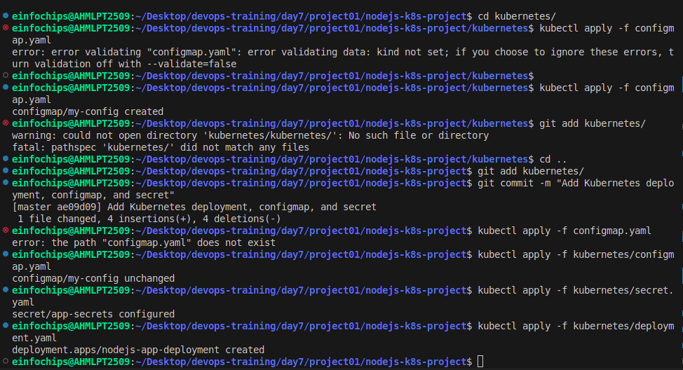

## 6. Implement Autoscaling

#### 6.1 Create Horizontal Pod Autoscaler

Create kubernetes/hpa.yaml:

```yaml
apiVersion: autoscaling/v2
kind: HorizontalPodAutoscaler
metadata:
  name: nodejs-app-hpa
spec:
  scaleTargetRef:
    apiVersion: apps/v1
    kind: Deployment
    name: nodejs-app
  minReplicas: 1
  maxReplicas: 10
  metrics:
    - type: Resource
      resource:
        name: cpu
        target:
          type: Utilization
          averageUtilization: 50
```

Apply the HPA:

```bash
kubectl apply -f kubernetes/hpa.yaml
```

#### 6.2 Create Vertical Pod Autoscaler

Create kubernetes/vpa.yaml:

```yaml
apiVersion: autoscaling.k8s.io/v1beta2
kind: VerticalPodAutoscaler
metadata:
  name: nodejs-app-vpa
spec:
  targetRef:
    apiVersion: apps/v1
    kind: Deployment
    name: nodejs-app-deployment
  updatePolicy:
    updateMode: "Auto"
```

Apply the VPA:

```bash
kubectl apply -f kubernetes/vpa.yaml
```

## 7. Test the Deployment

#### 7.1 Check the Status of Pods, Services, and HPA

Verify the Pods:

```bash
kubectl get pods
```

Verify the Services:

```bash
kubectl get svc
```
Verify the HPA:

```bash
kubectl get hpa
```

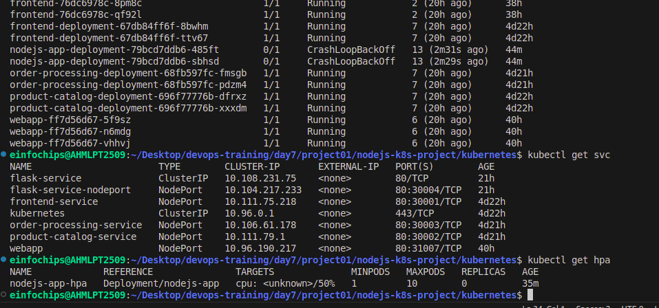

#### 7.2 Access the Application

Expose the Service:

```bash
kubectl expose deployment nodejs-app-deployment --type=NodePort --name=nodejs-app-service
```

Get the Minikube IP and Service Port:

```bash
minikube service nodejs-app-service --url
```
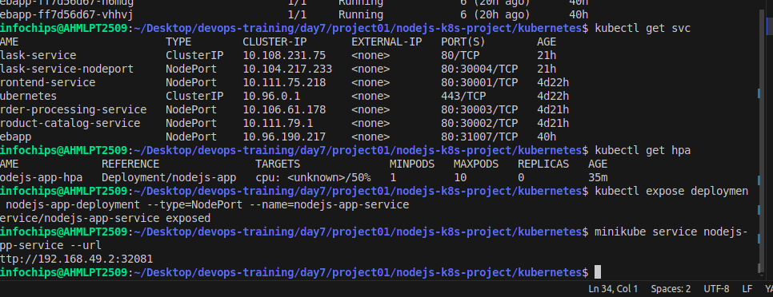

Access the application in your browser using the URL obtained from the previous command.

## 8. Git Version Control

#### 8.1 Create a New Branch for New Features

Create and switch to a new branch:

```bash
git remote –v
git remote add origin https://github.com/cshital/repository.git
git remote -v
git checkout -b feature/new-feature
git checkout feature/new-feature
```

Make changes and commit:

```bash
git add .
git commit -m "Add new feature"
```

Push the branch to the remote repository:

```bash
git push origin feature/new-feature
```

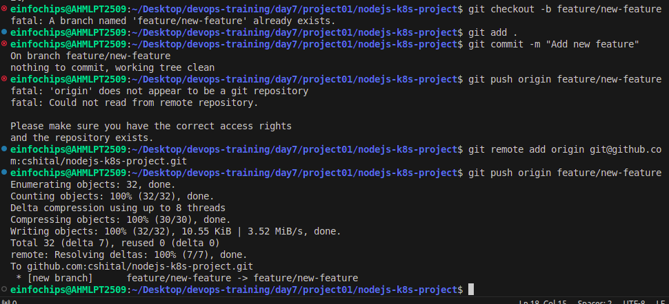


#### 8.2 Rebase Feature Branch on Main Branch

Switch to the main branch and pull the latest changes:

```bash
git branch -a
git checkout master
git checkout main
git pull origin main
```

Rebase the feature branch:

```bash
git checkout feature/new-feature
git rebase main
```

Resolve conflicts if any, and continue the rebase:

```bash
git add .
git rebase --continue
```

Push the rebased feature branch:

```bash
git push origin feature/new-feature --force
```

# 9. Final Commit and Cleanup

#### 9.1 Merge Feature Branch to Main

Merge feature branch to main:

```bash
git checkout main
git merge feature/new-feature
```

Push the changes to the main branch:

```bash
git push origin main
```

#### 9.2 Clean Up

Clean up the feature branch:

```bash
git branch -d feature/new-feature
git push origin --delete feature/new-feature
```

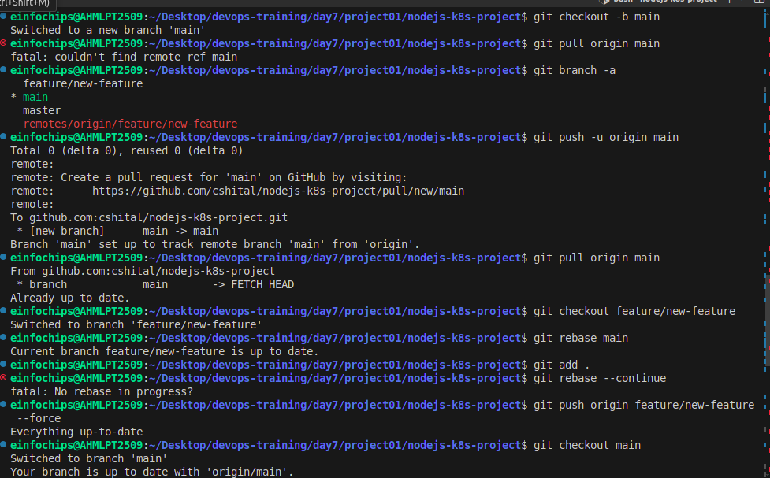
 