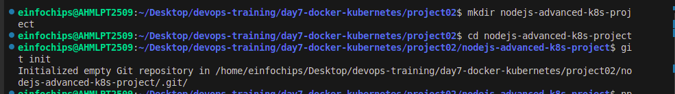
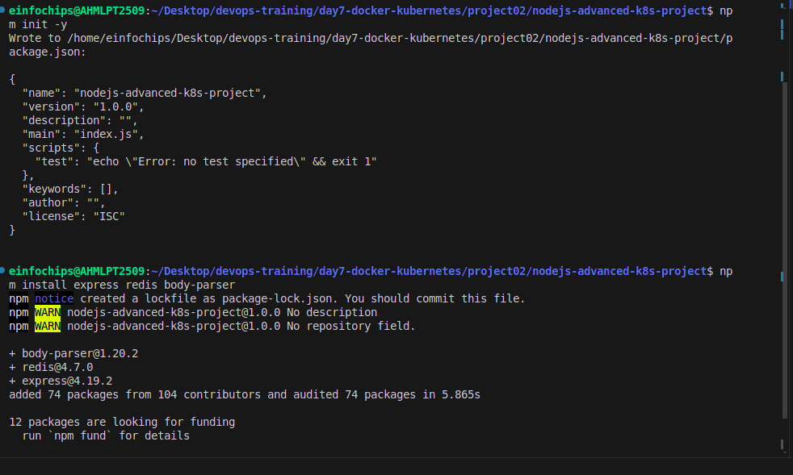
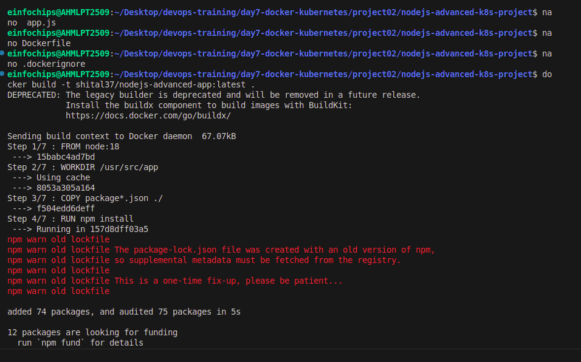
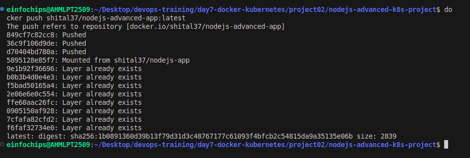
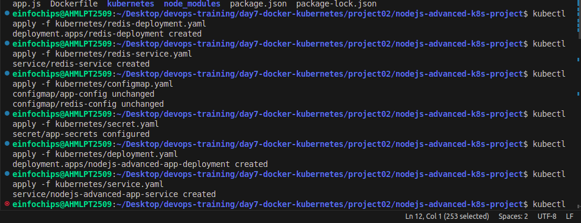
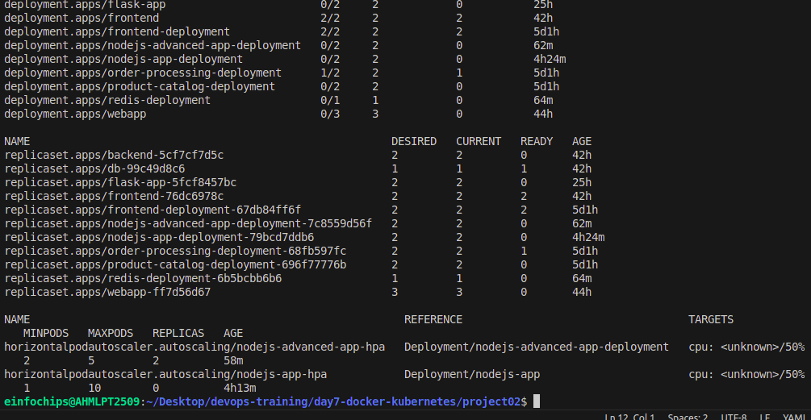
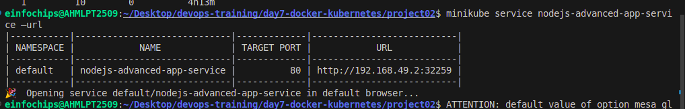
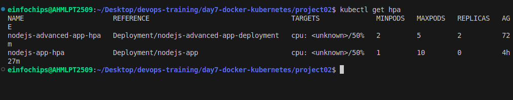

# Day 7

# Project 02: Advanced Node.js Application with Kubernetes

## Project Setup

# 1. Initialize a Git Repository

## 1.1 Create a new directory for your project and initialize Git:

```bash
mkdir nodejs-advanced-k8s-project
cd nodejs-advanced-k8s-project
git init
```



### 1.2 Create Initial Files:

Initialize the Node.js project:

```bash
npm init -y
npm install express redis body-parser
```



Create app.js:

```javascript
const express = require('express');
const bodyParser = require('body-parser');
const redis = require('redis');
const app = express();
const PORT = process.env.PORT || 3000;

// Connect to Redis
const redisClient = redis.createClient({
  url: `redis://${process.env.REDIS_HOST}:${process.env.REDIS_PORT}`
});
redisClient.on('error', (err) => console.error('Redis Client Error', err));

app.use(bodyParser.json());

app.get('/', async (req, res) => {
  const visits = await redisClient.get('visits');
  if (visits) {
    await redisClient.set('visits', parseInt(visits) + 1);
  } else {
    await redisClient.set('visits', 1);
  }
  res.send(`Hello, World! You are visitor number ${visits || 1}`);
});

app.listen(PORT, () => {
  console.log(`Server is running on port ${PORT}`);
});
```

Create Dockerfile:

```dockerfile

FROM node:18

WORKDIR /usr/src/app

COPY package*.json ./

RUN npm install

COPY . .

EXPOSE 3000

CMD ["npm", "start"]
```

Create .dockerignore:

```plaintext
node_modules
.npm
```

#### 2. Build and Push Docker Image

```bash
docker build -t shital37/nodejs-advanced-app:latest .
```



```
docker push shital37/nodejs-advanced-app:latest
```



## Advanced Kubernetes Configuration

#### 2.1 Deployment Configuration

Create kubernetes/deployment.yaml:

```
mkdir kubernetes
```

```
nano deployment.yaml
```

```yaml
apiVersion: apps/v1
kind: Deployment
metadata:
  name: nodejs-advanced-app-deployment
spec:
  replicas: 2
  selector:
    matchLabels:
      app: nodejs-advanced-app
  template:
    metadata:
      labels:
        app: nodejs-advanced-app
    spec:
      containers:
      - name: nodejs-advanced-app
        image: shital37/nodejs-advanced-app:latest
        ports:
        - containerPort: 3000
        env:
        - name: PORT
          valueFrom:
            configMapKeyRef:
              name: app-config
              key: PORT
        - name: REDIS_HOST
          valueFrom:
            configMapKeyRef:
              name: redis-config
              key: REDIS_HOST
        - name: REDIS_PORT
          valueFrom:
            configMapKeyRef:
              name: redis-config
              key: REDIS_PORT
        - name: NODE_ENV
          valueFrom:
            secretKeyRef:
              name: app-secrets
              key: NODE_ENV
      - name: redis
        image: redis:latest
        ports:
        - containerPort: 6379
```

#### 2.2 ConfigMap for Application and Redis

Create kubernetes/configmap.yaml:

```
nano configmap.yaml
```

```yaml
apiVersion: v1
kind: ConfigMap
metadata:
  name: app-config
data:
  PORT: "3000"
---
apiVersion: v1
kind: ConfigMap
metadata:
  name: redis-config
data:
  REDIS_HOST: "redis"
  REDIS_PORT: "6379"
```

#### 2.3 Secret for Sensitive Data

Create kubernetes/secret.yaml:

```
nano  secret.yaml
```

```yaml
apiVersion: v1
kind: Secret
metadata:
  name: app-secrets
type: Opaque
data:
  NODE_ENV: cHJvZHVjdGlvbg== # Base64 encoded value for "production"
```

#### 2.4 Service Configuration

Create kubernetes/service.yaml:

```
nano service.yaml
```

```yaml
apiVersion: v1
kind: Service
metadata:
  name: nodejs-advanced-app-service
spec:
  selector:
    app: nodejs-advanced-app
  ports:
  - protocol: TCP
    port: 80
    targetPort: 3000
  type: LoadBalancer
```

#### 2.5 Horizontal Pod Autoscaler with Scale-Up and Scale-Down Policies

Create kubernetes/hpa.yaml:

```
nano hpa.yaml
```

```yaml
apiVersion: autoscaling/v2beta2
kind: HorizontalPodAutoscaler
metadata:
  name: nodejs-advanced-app-hpa
spec:
  scaleTargetRef:
    apiVersion: apps/v1
    kind: Deployment
    name: nodejs-advanced-app-deployment
  minReplicas: 2
  maxReplicas: 5
  metrics:
  - type: Resource
    resource:
      name: cpu
      target:
        type: Utilization
        averageUtilization: 50
  - type: Resource
    resource:
      name: memory
      target:
        type: Utilization
        averageUtilization: 70
  behavior:
    scaleUp:
      stabilizationWindowSeconds: 30
      selectPolicy: Max
      policies:
      - type: Pods
        value: 2
        periodSeconds: 30
      - type: Resource
        resource: cpu
        value: 2
        periodSeconds: 30
    scaleDown:
      stabilizationWindowSeconds: 30
      selectPolicy: Min
      policies:
      - type: Pods
        value: 1
        periodSeconds: 30
      - type: Resource
        resource: memory
        value: 1
        periodSeconds: 30
```

#### 2.6 Vertical Pod Autoscaler Configuration

Create kubernetes/vpa.yaml:

```
nano vpa.yaml
```

```yaml
apiVersion: autoscaling.k8s.io/v1beta2
kind: VerticalPodAutoscaler
metadata:
  name: nodejs-advanced-app-vpa
spec:
  targetRef:
    apiVersion: apps/v1
    kind: Deployment
    name: nodejs-advanced-app-deployment
  updatePolicy:
    updateMode: "Auto"
```

#### 2.7 Redis Deployment

Create kubernetes/redis-deployment.yaml:

```
nano redis-deployment.yaml
```

```yaml
apiVersion: apps/v1
kind: Deployment
metadata:
  name: redis-deployment
spec:
  replicas: 1
  selector:
    matchLabels:
      app: redis
  template:
    metadata:
      labels:
        app: redis
    spec:
      containers:
      - name: redis
        image: redis:latest
        ports:
        - containerPort: 6379
```

Add Redis service configuration to kubernetes/redis-service.yaml:

Create kubernetes/redis-service.yaml:

```
nano  redis-service.yaml
```

```yaml
apiVersion: v1
kind: Service
metadata:
  name: redis-service
spec:
  selector:
    app: redis
  ports:
  - protocol: TCP
    port: 6379
    targetPort: 6379
  type: ClusterIP
```

#### 2.8 Apply Kubernetes Configurations

```bash
kubectl apply -f kubernetes/redis-deployment.yaml
kubectl apply -f kubernetes/redis-service.yaml
kubectl apply -f kubernetes/configmap.yaml
kubectl apply -f kubernetes/secret.yaml
kubectl apply -f kubernetes/deployment.yaml
kubectl apply -f kubernetes/service.yaml
kubectl apply -f kubernetes/hpa.yaml
kubectl apply -f kubernetes/vpa.yaml
```



#### 2.9 Verify Deployments and Services

```bash
kubectl get all
```


Access the application via Minikube:

```
minikube service nodejs-advanced-app-service –url
```


#### 2.10 Testing Scaling

Simulate load on the application to test the HPA:

```bash
kubectl run -i --tty --rm load-generator --image=busybox --restart=Never -- /bin/sh
```


Inside the pod, run the following command to generate load:

```bash
while true; do wget -q -O- http://nodejs-advanced-app-service; done
```

#### 2.11 Validate Autoscaling Behavior

Observe the HPA behavior:

```bash
kubectl get hpa
```



Watch the scaling events and verify that the application scales up and down based on the policies you configured.

## 3. Project Wrap-Up

#### 3.1 Review and Clean Up

After completing the project, review the configurations and clean up the Minikube environment if needed:

```bash
minikube delete
```
