# Day 9

## Project Overview

## Stage 1: Setting Up the Kubernetes Cluster and Static Web App

**Set Up Minikube:** Ensure Minikube is installed and running on the local Ubuntu machine. Verify the Kubernetes cluster is functioning correctly.

```
minikube start
```

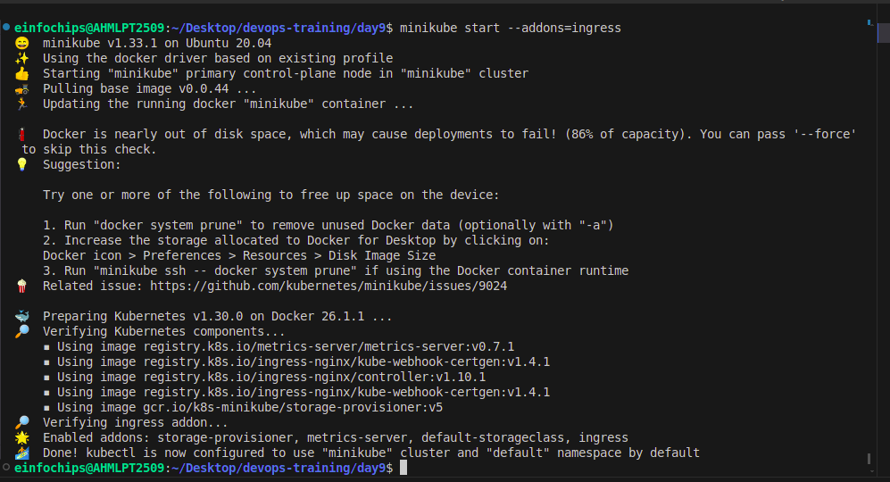

### Deploy Static Web App:

• Create a Dockerfile for a simple static web application (e.g., an HTML page served by Nginx).

• Build a Docker image for the static web application.

**Create index.html**

```
nano index.html
```

```
<!doctype html>
<html>
<body>
    <head>
     <title> Static web</title>
    </head>
    <body>
     <p> Welcome to my Static web site!<p>
        </body>
</html>
```

**Create Dockerfile**

```
FROM nginx:1.10.1-alpine
COPY index.html /usr/share/nginx/html
EXPOSE 80
CMD ["nginx", "-g", "daemon off;"]
```

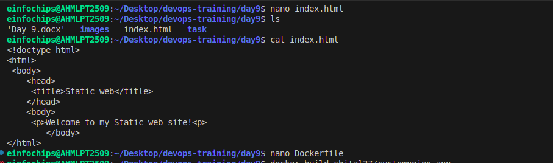

**Build image:**

```
docker build -t shital37/customnginx-app .
```
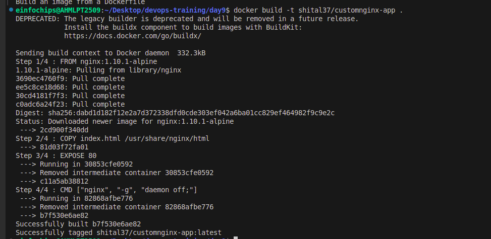

**Push the Docker image to Docker Hub or a local registry.**

```
docker push shital37/customnginx-app:latest
```
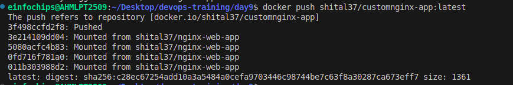

## Kubernetes Deployment:

• Write a Kubernetes deployment manifest to deploy the static web application.

• Write a Kubernetes service manifest to expose the static web application within the cluster.

• Apply the deployment and service manifests to the Kubernetes cluster.

**Create frontend-delpoyment.yml**

```
nano frontend-delpoyment.yml   
```

```
apiVersion: apps/v1
kind: Deployment
metadata:
  name: frontend
  labels:
    app: nginx
spec:
  replicas: 1 
  selector:
    matchLabels:
      app: nginx
  template:
    metadata:
      labels:
        app: nginx
    spec:
      containers:
        - name: nginx
          image: shital37/customnginx-app:latest
          ports:
            - containerPort: 80
          resources:
            limits:
              cpu: 50m
            requests:
              cpu: 20m
 
---
apiVersion: v1
kind: Service
metadata:
  name: nginx-service
spec:
  selector:
    app: nginx  
  ports:
    - protocol: TCP
      port: 80  
      targetPort: 80  
  type: NodePort
```

**Create backtend-delpoyment.yml**

```
nano backtend-delpoyment.yml
```

```

apiVersion: apps/v1
kind: Deployment
metadata:
  name: backend
spec:
  replicas: 1
  selector:
    matchLabels:
      app: backend
  template:
    metadata:
      labels:
        app: backend
    spec:
      containers:
      - name: backend
        image: hashicorp/http-echo
        args:
          - "-text= This is test message from backend"
        ports:
        - containerPort: 5678
---
apiVersion: v1
kind: Service
metadata:
  name: backend-service
spec:
  selector:
    app: backend
  ports:
    - protocol: TCP
      port: 80
      targetPort: 5678
```

**Apply the deployment and service manifests to the Kubernetes cluster.**

```
kubectl apply -f frontend-delpoyment.yml
```

``` 
kubectl apply -f backend-delpoyment.yml
```
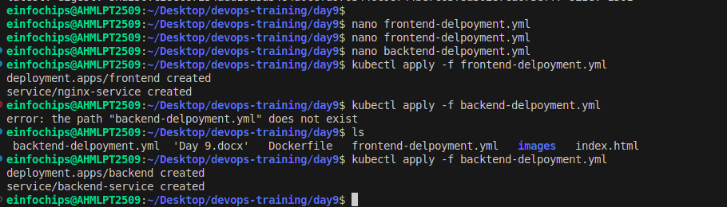

## Stage 2: Configuring Ingress Networking

Install and Configure Ingress Controller:

```
minikube start --addons=ingress
```
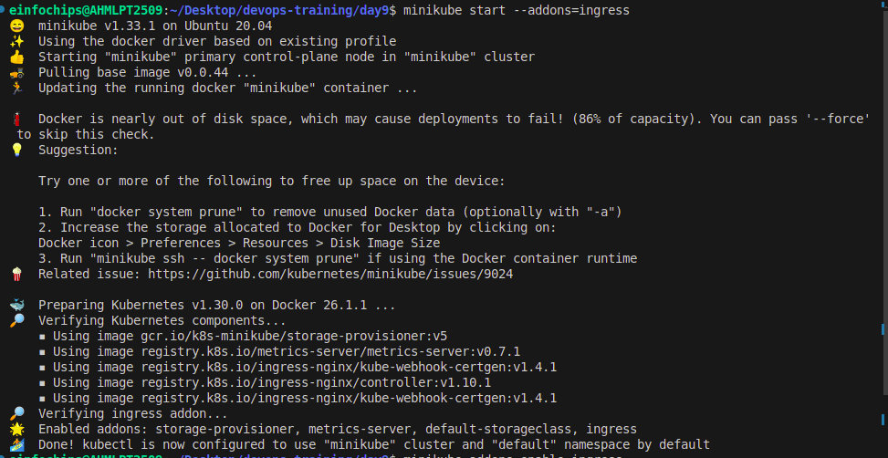

Install an ingress controller (e.g., Nginx Ingress Controller) in the Minikube cluster. Verify the ingress controller is running and accessible.

**minikube addons enable ingress**
 
```
kubectl get pods -n kube-system
```

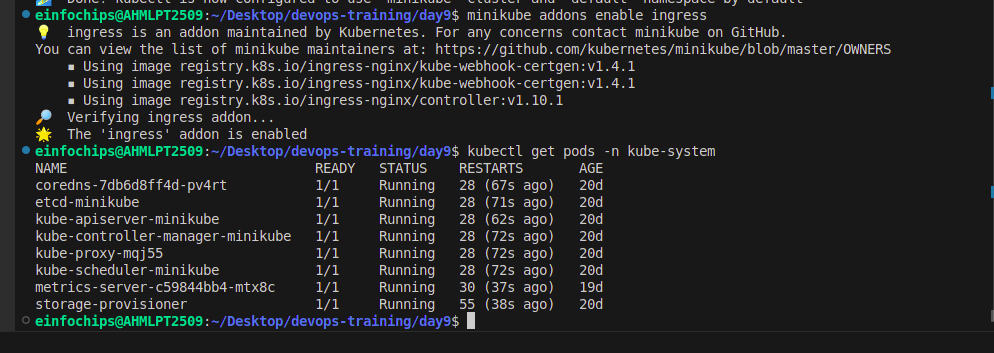

#### Create Ingress Resource:
• Write an ingress resource manifest to route external traffic to the static web application.

• Configure advanced ingress rules for path-based routing and host-based routing (use at least two different hostnames and paths).

• Implement TLS termination for secure connections.

• Configure URL rewriting in the ingress resource to modify incoming URLs before they reach the backend services.

• Enable sticky sessions to ensure that requests from the same client are directed to the same backend pod.

**create ingress-resource.yaml**

```
nano ingress-resource.yaml
```

```
apiVersion: networking.k8s.io/v1
kind: Ingress
metadata:
  name: static-web-app-ingress
  annotations:
    nginx.ingress.kubernetes.io/rewrite-target: /
    nginx.ingress.kubernetes.io/ssl-redirect: "true"
    nginx.ingress.kubernetes.io/affinity: "cookie"
    nginx.ingress.kubernetes.io/session-cookie-name: "route"
spec:
  rules:
    - host: myapp.com
      http:
        paths:
          - path: /home
            pathType: Prefix
            backend:
              service:
                name: nginx-service
                port:
                  number: 80
          - path: /page
            pathType: Prefix
            backend:
              service:
                name: backend-service
                port:
                  number: 80
  tls:
    - hosts:
        - myapp.com
      secretName: tls-secret
```

**Apply the ingress-resource.yaml**

```
kubectl apply -f ingress-resource.yaml
```
**Update /etc/hosts**

```
sudo nano /etc/hosts
```

**Add the following line (replace with the actual Minikube IP):**

```
<minikube-ip> myapp.com

192.168.49.2  myapp.com
```

**Get the Minikube IP using:**

```
minikube ip
```

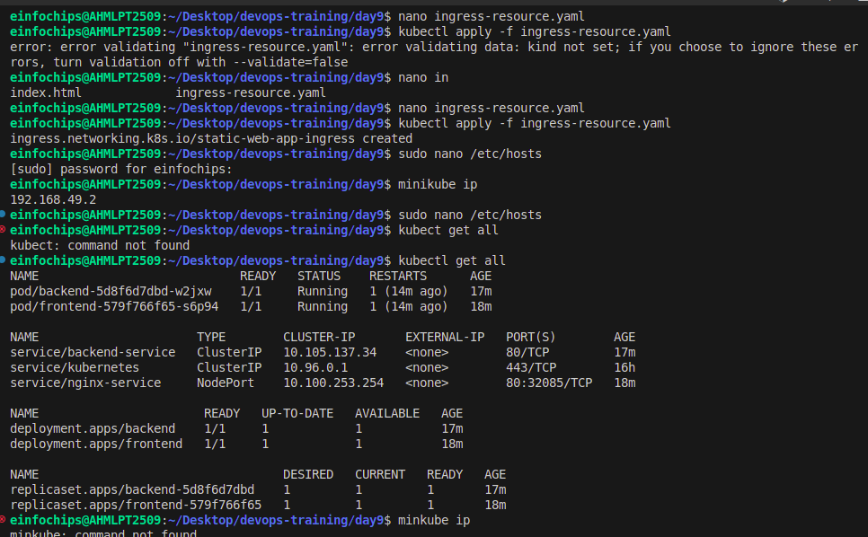

**Check all resources**

```
kubectl get all
```

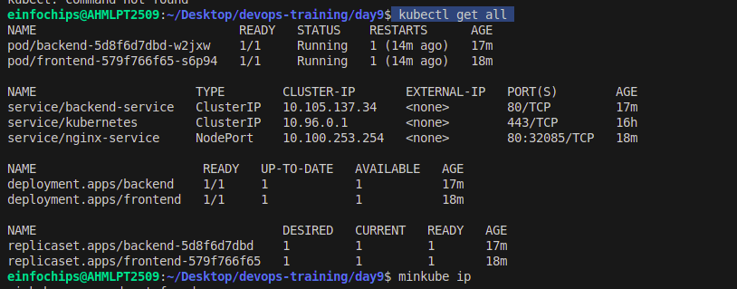

**Check ingress** 

```
kubectl get pods -n ingress-nginx
```

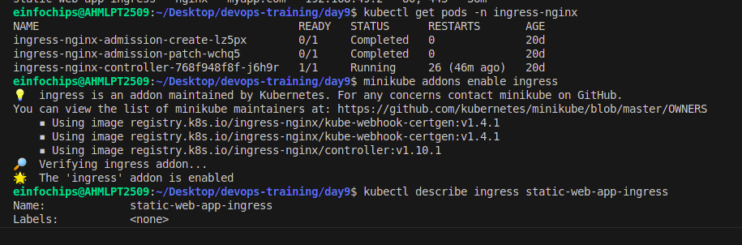

**Generating a Self-Signed SSL/TLS Certificate**

```
openssl req -x509 -nodes -days 365 -newkey rsa:2048 -keyout tls.key -out tls.crt -subj "/CN=myapp.com/O=myapp"
```

**Creating a Kubernetes Secret**

```
kubectl create secret tls tls-secret --cert=tls.crt --key=tls.key
```

**Verifying the Secret**

```
kubectl get secret tls-secret
```

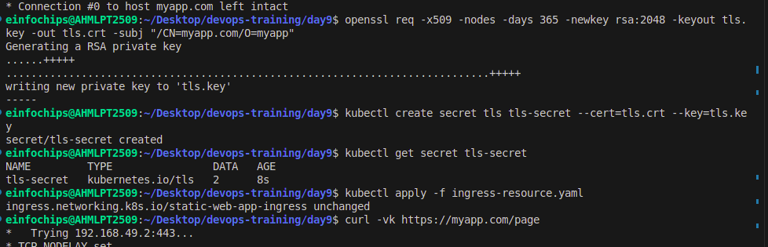

**Check output using**

https://myapp.com/home

https://myapp.com/page


**Results:**

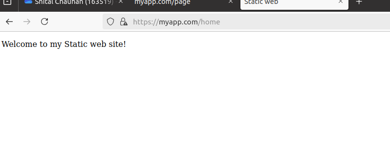

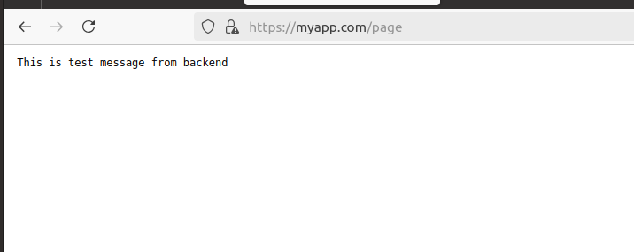

## Stage 3: Implementing Horizontal Pod Autoscaling

• Configure Horizontal Pod Autoscaler:

• Write a horizontal pod autoscaler (HPA) manifest to automatically scale the static web application pods based on CPU utilization.

• Set thresholds for minimum and maximum pod replicas.

## Stress Testing:

• Perform stress testing to simulate traffic and validate the HPA configuration.

• Monitor the scaling behavior and ensure the application scales up and down based on the load. Deliverables:

• Horizontal pod autoscaler YAML file

**Create hpa.yaml**

```
nano hpa.yaml
```

```
apiVersion: autoscaling/v2
kind: HorizontalPodAutoscaler
metadata:
  name: nginx-app-hpa
spec:
  scaleTargetRef:
    apiVersion: apps/v1
    kind: Deployment
    name: frontend
  minReplicas: 1
  maxReplicas: 5
  metrics:
  - type: Resource
    resource:
      name: cpu
      target:
        type: Utilization
        averageUtilization: 5
```

**Apply hpa.yaml**

```
kubectl apply -f hpa.yaml
```

Documentation or screenshots of the stress testing process and scaling behavior

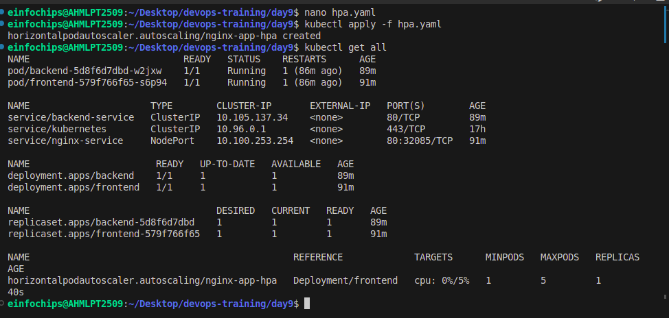
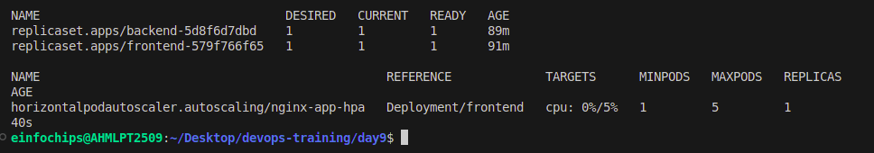

## Stage 4: Final Validation and Cleanup

### Final Validation:

Validate the ingress networking, URL rewriting, and sticky sessions configurations by accessing the web application through different hostnames and paths.

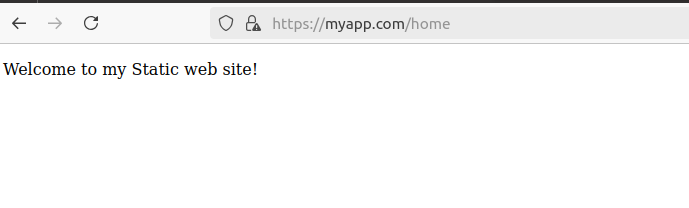
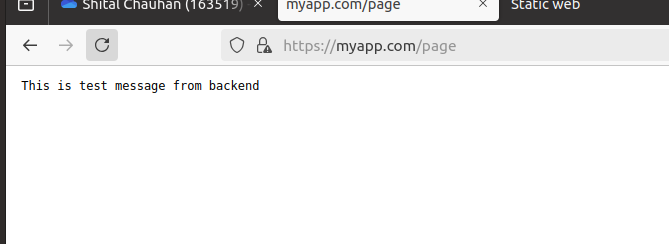

Verify the application's availability and performance during different load conditions.

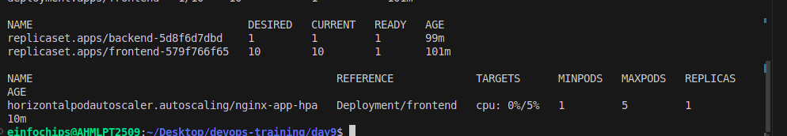

### Cleanup:

Provide commands or scripts to clean up the Kubernetes resources created during the project (deployments, services, ingress, HPA). Delete deployments:

```
kubectl delete deployment frontend
```
```
kubectl delete deployment backend
```

**Delete Services:**

```
kubectl delete service frontend-service
```

```
kubectl delete service backend-service
```

**Delete ingress:**

```
kubectl delete ingress static-web-app-ingress
```

**Delete hpa:**

```
kubectl delete hpa nginx-app-hpa
```
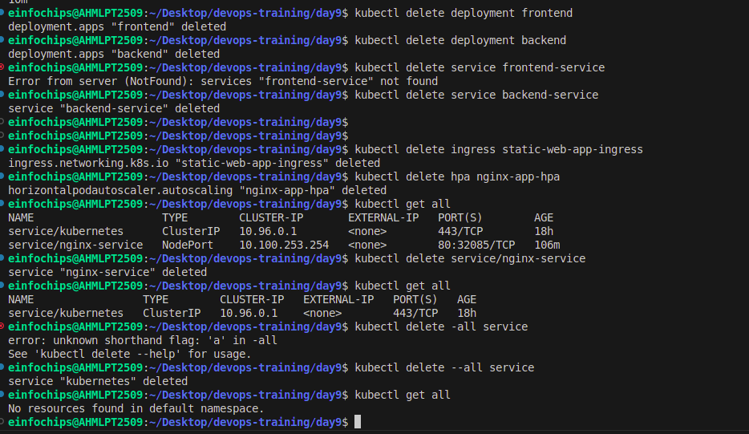


